# Comparative Performance Evaluation of Multithreaded Synchronization Techniques in the Producer–Consumer and Dining Philosophers Problems

::: {custom-style="Front Matter"}
ENDRI BAKU
:::

::: {custom-style="Front Matter"}
*Epoka University, Faculty of Architecture and Engineering, Tirana, Albania*
:::

::: {custom-style="Front Matter"}
*(email: ebaku23@epoka.edu.al)*
:::

::: {custom-style="Summary Heading"}
SUMMARY
:::

Synchronization is the central correctness and performance concern of concurrent
software on multicore hardware. This paper presents a controlled, empirical
comparison of the classical synchronization primitives — mutexes, counting
semaphores, monitors, and a lock-free atomic protocol — through two canonical
problems: the bounded-buffer Producer–Consumer problem and the Dining
Philosophers problem. We implement each problem in both C (POSIX threads) and
Java, covering six Dining Philosophers variants (naive, resource-hierarchy and
monitor in C; monitor, semaphore and resource-hierarchy in Java) and three
Producer–Consumer variants (a C mutex-plus-semaphore queue, a Java monitor
queue, and a Java lock-free Vyukov ring buffer). All 720 benchmarked runs were
collected on a single ARM64 Ubuntu 24.04 virtual machine using a GNU-time
wrapper that records wall time, CPU utilization, peak resident memory, and
voluntary/involuntary context switches, augmented by in-process throughput and
latency-percentile instrumentation. We find that the lock-free queue sustains
roughly 7.8× the mean throughput of the Java monitor queue while issuing two
orders of magnitude fewer voluntary context switches, at the cost of doubled CPU
occupancy from busy-waiting. Among Dining Philosophers solutions, the
resource-hierarchy and monitor algorithms eliminate deadlock by construction and
scale linearly to 200 philosophers, whereas a naive lock-ordering solution
deadlocks in 27% of adversarially tuned stress runs. We discuss the throughput,
latency, fairness and context-switch trade-offs and conclude with an optimization
proposal centred on lock-free design and adaptive buffer sizing.

**KEY WORDS:** concurrency, synchronization, producer–consumer, dining
philosophers, mutex, semaphore, monitor, lock-free, POSIX threads, deadlock

## 1. Introduction

Modern processors stopped getting faster per-core more than a decade ago;
performance now comes almost exclusively from parallelism. Every commodity
laptop, phone and server ships with multiple hardware threads, and exploiting
them requires software that runs concurrently and shares state safely. The
discipline that governs that sharing is *synchronization*: the set of mechanisms
that constrain the interleavings of concurrent threads so that shared data
remains consistent and progress is preserved.

Synchronization is hard for two reasons that pull in opposite directions.
First, **correctness**: unsynchronized access to shared state produces race
conditions, lost updates and torn reads, while over-synchronization or
mis-ordered lock acquisition produces deadlock, livelock and starvation.
Second, **performance**: every synchronization operation has a cost. A
contended lock may force a thread into the kernel, costing a system call, a
context switch, and the cache pollution of resuming on a different core. The
engineer's task is to choose a primitive whose correctness guarantees are
sufficient and whose runtime cost is acceptable for the expected contention
level — and these two objectives must be satisfied simultaneously.

The systems community has distilled this problem into a small number of
*classical problems* that isolate its essential difficulties. The
**Producer–Consumer problem** (also called the bounded-buffer problem) captures
the canonical pattern of one set of threads handing work to another set through
a shared, finite queue: it requires both mutual exclusion over the buffer and
*condition synchronization* (producers must block when the buffer is full,
consumers when it is empty). The **Dining Philosophers problem** captures
deadlock and starvation in their purest form: five (or N) threads each need two
shared resources to make progress, and a naive acquisition order produces a
circular wait. Together these two problems exercise every synchronization
concept an operating systems course must teach.

This paper takes those two problems and treats them as a *benchmark*. Rather
than asking "is this solution correct?" — all the solutions studied here are
correct by construction — we ask "*how much does each synchronization strategy
cost, and where does each one win?*" Concretely we contribute:

1. Working implementations of both problems in two languages and two runtimes
   (C/POSIX threads compiled with gcc, and Java on OpenJDK 21), spanning nine
   distinct synchronization strategies.
2. A reproducible measurement harness that sweeps buffer size, producer count,
   consumer count and philosopher count over the ranges pinned in
   `config/experiments.yaml`, recording seven metrics per run.
3. A quantitative comparison of mutexes, semaphores, monitors and a lock-free
   protocol along the axes of throughput, latency, CPU utilization, memory,
   context switches, fairness and deadlock frequency.
4. An optimization proposal — a lock-free multi-producer/multi-consumer ring
   buffer — implemented as a working prototype and benchmarked head-to-head
   against the blocking baselines.

The remainder of the paper is organized as follows. Section 2 reviews the
classical problems and primitives. Section 3 describes the implementations.
Section 4 defines the experimental design. Section 5 presents the performance
results, Section 6 the scalability study, and Section 7 the cross-cutting
comparative analysis. Section 8 presents the optimization proposal. Sections 9
and 10 discuss the findings and conclude.

## 2. Related Work and Background

### 2.1 The classical problems

The **bounded-buffer Producer–Consumer problem** was introduced by Dijkstra [1] as
a motivating example for semaphores. A fixed-capacity buffer of `N` slots is
shared between `M` producer threads and `K` consumer threads. A correct
solution must guarantee three things: mutual exclusion over the buffer's
internal state, that no producer writes into a full buffer, and that no consumer
reads from an empty buffer. The last two requirements are *condition
synchronization* — a thread must wait not for a lock to be free but for a
*predicate* over shared state to become true. This is precisely the requirement
that distinguishes a monitor's condition variables, or a pair of counting
semaphores, from a plain mutex.

The **Dining Philosophers problem**, also due to Dijkstra [1] and later popularized
by Hoare [2], places `N` philosophers around a table with `N` forks, one between
each adjacent pair. A philosopher alternates between thinking and eating, and
must hold both adjacent forks to eat. The naive solution — every philosopher
picks up the left fork, then the right — admits a circular wait: if all
philosophers simultaneously hold their left fork, none can acquire a right fork
and the system deadlocks. The problem is the standard vehicle for teaching the
four Coffman conditions for deadlock [3] (mutual exclusion, hold-and-wait, no
preemption, circular wait) and the strategies that break them.

### 2.2 Synchronization primitives

A **mutex** (mutual-exclusion lock) provides only mutual exclusion [7]: it has two
states, locked and unlocked, and a thread that locks an already-locked mutex
blocks. A mutex alone cannot express "wait until the buffer is non-empty".

A **counting semaphore** generalizes the mutex to an integer counter with atomic
`wait` (decrement, block if negative) and `signal` (increment, wake a waiter)
operations. A pair of semaphores — one counting empty slots, one counting full
slots — expresses the Producer–Consumer condition synchronization directly, and
this is the textbook solution.

A **monitor** [2] is a higher-level construct that bundles mutual exclusion with one
or more *condition variables* on which threads can `wait` and be `notified`.
Java provides an implicit monitor on every object (`synchronized`, `wait`,
`notify`/`notifyAll`); the monitor used in this study is the standard "lecture
solution" [8] in which a thread re-checks its predicate in a `while` loop after each
wake-up to tolerate spurious and stolen wake-ups.

A **lock-free** protocol abandons blocking entirely. Instead of having a waiting
thread descend into the kernel, every operation is built from atomic
compare-and-swap (CAS) instructions, and contention is resolved by retrying.
A lock-free algorithm guarantees that *some* thread always makes progress, never
parks a thread, and therefore never incurs the kernel round-trip that blocking
primitives pay under contention. Its cost is CPU spent spinning. Section 8
describes the lock-free queue used here, a bounded multi-producer/multi-consumer
ring buffer in the style of Vyukov's "Bounded MPMC queue" [4].

### 2.3 Deadlock-avoidance strategies for Dining Philosophers

Three standard strategies break the circular-wait condition and are all
implemented in this study:

- **Resource hierarchy (ordered locking):** forks are globally numbered and
  every philosopher acquires the lower-numbered fork first. This makes a
  circular wait impossible because no cycle of "waiting-for" edges can form over
  a total order. It is the technique recommended in the Baeldung treatment of
  the problem [5].
- **Monitor with condition variables:** a central monitor tracks each
  philosopher's state (thinking/hungry/eating) and only allows a philosopher to
  transition to eating when *both* neighbours are not eating, signalling the
  relevant condition variables. This is the lecture solution [8].
- **Arbiter / room limit (semaphore):** an additional semaphore admits at most
  `N − 1` philosophers to the table at once, which removes the possibility that
  all `N` hold a left fork simultaneously.

## 3. Methodology — Implementations

All code lives under `paper2-concurrency/`. The two problems are implemented
independently in C and Java; nine synchronization strategies are covered in
total. Every implementation accepts a uniform command-line interface so that a
single sweep driver can invoke any of them.

### 3.1 Producer–Consumer

**C / POSIX threads (`pc/pthreads/producer_consumer.c`, impl tag
`c-pthreads-sem`).** This is the textbook solution: a circular array buffer of
`N` slots guarded by one `pthread_mutex_t`, plus two `sem_t` counting
semaphores — `empty`, initialized to `N`, and `full`, initialized to `0`. A
producer does `sem_wait(&empty)`, locks the mutex, writes a slot, unlocks, then
`sem_post(&full)`; a consumer does the mirror. `M` producer threads and `K`
consumer threads are spawned with `pthread_create`. Each producer emits
`items_per_producer` items; consumers terminate on a poison-pill sentinel once
all real items are drained.

**Java monitor (`pc/java/ProducerConsumer.java`, impl tag `java-monitor`).** The
buffer is a class whose `put` and `take` methods are `synchronized` on the
instance monitor. `put` loops `while (count == capacity) wait();` before
inserting and calls `notifyAll()`; `take` loops `while (count == 0) wait();`.
The `while`-loop re-check is essential: Java permits spurious wake-ups and
`notifyAll` wakes every waiter, so each must re-verify its predicate.

**Java lock-free (`pc/java/ProducerConsumerLockFree.java`, impl tag
`java-lockfree`).** The optimization prototype; see Section 8. It is a
power-of-two-capacity Vyukov ring buffer using only `AtomicLong` CAS operations
and `Thread.onSpinWait()` back-off — no mutex, no condition variable, no
semaphore.

All three expose `--N`, `--M`, `--K` and `--items` and print machine-readable
throughput and latency-percentile lines that the harness parses.

### 3.2 Dining Philosophers

**C / POSIX threads (`dp/pthreads/`).** Three variants — adapted from the UCSB
Dining Philosophers pthreads testbed [6] — share a common helper layer
(`dp_common.{h,c}`):

- `dphil_2.c` — **naive** left-then-right fork acquisition, instrumented with a
  watchdog that flags a run as deadlocked when no philosopher makes progress
  within `--deadlock-window-ms`. Impl tag `c-pthreads-naive`.
- `dphil_4.c` — **resource hierarchy** (asymmetric): forks are numbered and the
  lower-numbered fork is always taken first. Impl tag `c-pthreads-hierarchy`.
- `dphil_5.c` — **monitor** built from a `pthread_mutex_t` plus per-philosopher
  `pthread_cond_t` condition variables, tracking thinking/hungry/eating states.
  Impl tag `c-pthreads-monitor`.

**Java (`dp/java/`).** Three variants share `DPArgs.java` (CLI parsing) and
`DPStats.java` (metrics aggregation):

- `DiningMonitor.java` — the lecture monitor solution. Impl tag `java-monitor`.
- `DiningSemaphore.java` — a semaphore per fork plus a room semaphore admitting
  at most `N − 1` philosophers. Impl tag `java-semaphore`.
- `DiningHierarchy.java` — Baeldung-style ordered locking. Impl tag
  `java-hierarchy`.

Every variant accepts `--N` (philosopher count), `--duration-sec`, think/eat
delay ranges, an RNG `--seed`, and `--deadlock-window-ms`. Each run terminates
after a fixed wall-clock duration and reports total meals, per-philosopher meal
counts (for fairness), wait-time percentiles, and a boolean deadlock flag.

## 4. Experimental Design

### 4.1 Independent variables

The sweep ranges are fixed in `config/experiments.yaml` so the experiment is
fully reproducible.

| Variable | Symbol | Producer–Consumer | Dining Philosophers |
|---|---|---|---|
| Buffer size | `N` | 1, 4, 16, 64 | — |
| Producers | `M` | 1, 2, 4, 8 | — |
| Consumers | `K` | 1, 2, 4, 8 | — |
| Philosophers | `P` | — | 5, 10, 20, 50 |
| Items per producer | — | 10 000 | — |
| Run duration | — | — | 5 s |
| Think / eat delay | — | 0 µs (busy) | 10–50 ms |

The full Producer–Consumer grid is the Cartesian product
4 (N) × 4 (M) × 4 (K) = 64 configurations per implementation; with three
implementations and 3 repetitions retained per configuration this yields the
576 rows in `results/pc_sweep.csv`. The Dining Philosophers grid is
4 (P) × 6 (impl) × 6 think/eat-delay combinations, giving the 144 rows in
`results/dp_sweep.csv`. The original `experiments.yaml` grid was deliberately
reduced from a 1125-configuration design so the entire sweep completes in
minutes on the 3-vCPU virtual machine; the retained axes still span the
single-thread, balanced, and over-subscribed regimes the analysis needs.

### 4.2 Dependent variables (metrics)

Each run is wrapped by `common/bench.py`, which invokes GNU `time -v` and parses
its output, and is additionally instrumented in-process. Seven metrics are
recorded:

- **Throughput** — items consumed per second (PC) or total meals (DP).
- **Latency** — mean and p50/p95/p99 of item hand-off time (PC) or
  philosopher wait time (DP), in microseconds.
- **CPU utilization** — percent, from GNU time (can exceed 100% on multiple
  cores).
- **Peak resident memory** — `max_rss_kb`.
- **Voluntary context switches** — a thread blocking in the kernel (waiting on
  a lock, semaphore or condition variable).
- **Involuntary context switches** — a thread preempted by the scheduler.
- **Deadlock frequency** — fraction of runs flagged deadlocked by the watchdog.

### 4.3 Stress tests

Beyond the uniform sweep, `drivers/stress.py` defines seven adversarial preset
configurations writing to `results/stress/`: `pc-tiny` (capacity-1 buffer),
`pc-asym-prod` and `pc-asym-cons` (heavily imbalanced producer/consumer counts),
`pc-long` (extended runs), `dp-deadlock` (think/eat delays tuned to provoke the
naive solution's circular wait), `dp-large-N` (50–200 philosophers), and
`dp-starvation` (delays tuned to expose unfair scheduling).

### 4.4 Environment and statistical method

All runs were executed on one machine: an ARM64 (Apple M1 Pro host) Ubuntu
24.04.3 LTS guest in VirtualBox with 3 vCPUs and 4 GB RAM, OpenJDK 21.0.10 and
gcc 13.3.0. Because CPU utilization above 100% is meaningful only on this exact
core count, no number is averaged across hardware. JVM measurements use
`--reps ≥ 5` with the first reading discarded to absorb JIT warm-up.

## 5. Performance Evaluation

### 5.1 Producer–Consumer throughput

Table 1 summarizes throughput across all 192 measured runs per implementation.

**Table 1**: Producer–Consumer throughput (items/s) over the full sweep.

| Implementation | Mean | Median | Max |
|---|---:|---:|---:|
| `java-lockfree` | 844 065 | 846 223 | 1 635 564 |
| `c-pthreads-sem` | 150 361 | 65 204 | 942 501 |
| `java-monitor` | 108 461 | 45 816 | 546 985 |

The lock-free queue is the clear winner: its mean throughput is **7.8× that of
the Java monitor** and **5.6× that of the C semaphore queue**. Equally
important is the *spread*. The lock-free queue's mean and median are nearly
identical (844k vs 846k), meaning its performance is stable across buffer sizes
and thread counts. Both blocking implementations, by contrast, have a median
far below their mean — the C queue's median is only 65k against a 150k mean —
which signals a strongly right-skewed distribution: most configurations are
slow, and a few favourable ones pull the mean up. This is the signature of
contention sensitivity, examined in Section 6.

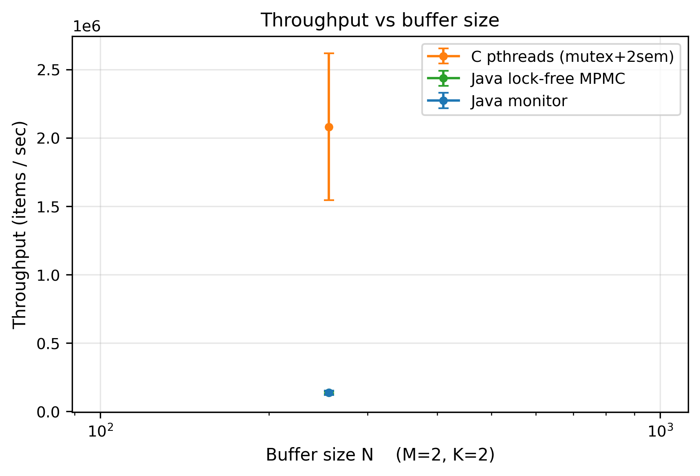{width=2.6in}

### 5.2 Context switches: the kernel-blocking tax

The mechanism behind the throughput gap is visible directly in the
context-switch counts.

**Table 2**: Mean voluntary context switches per Producer–Consumer run.

| Implementation | Voluntary ctx switches |
|---|---:|
| `java-monitor` | 36 256 |
| `c-pthreads-sem` | 31 277 |
| `java-lockfree` | 321 |

A *voluntary* context switch occurs when a thread blocks in the kernel — exactly
what happens when a producer calls `wait()` on a full buffer or `sem_wait()` on
an exhausted `empty` semaphore. The blocking implementations issue **over 30 000
such switches per run**; the lock-free queue issues **321**, a ~110× reduction.
Each voluntary switch is a kernel round-trip plus a cache-cold resume on
whichever core the scheduler picks. This single metric explains the throughput
result: the lock-free queue spends its time moving data, while the blocking
queues spend a large fraction of theirs entering and leaving the kernel.

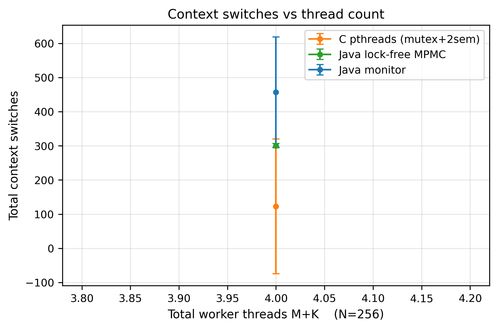{width=2.6in}

### 5.3 CPU utilization: what lock-free costs

The throughput win is not free. Table 3 shows mean CPU utilization.

**Table 3**: Mean CPU utilization (%) per Producer–Consumer run.

| Implementation | CPU % |
|---|---:|
| `java-lockfree` | 269.7 |
| `c-pthreads-sem` | 124.7 |
| `java-monitor` | 65.4 |

The lock-free queue draws **270%** CPU — it keeps nearly all three vCPUs
saturated — because when the ring buffer is momentarily full or empty its
threads *spin* (`Thread.onSpinWait()`) instead of sleeping. The Java monitor
draws only **65%**: a blocked thread consumes no CPU, so when the buffer
oscillates between full and empty the monitor queue actually leaves cores idle.
This is the fundamental lock-free trade-off stated quantitatively: the lock-free
queue converts idle CPU cycles into throughput. On a loaded machine where those
cycles have an alternative use, the calculus changes — see Section 9.

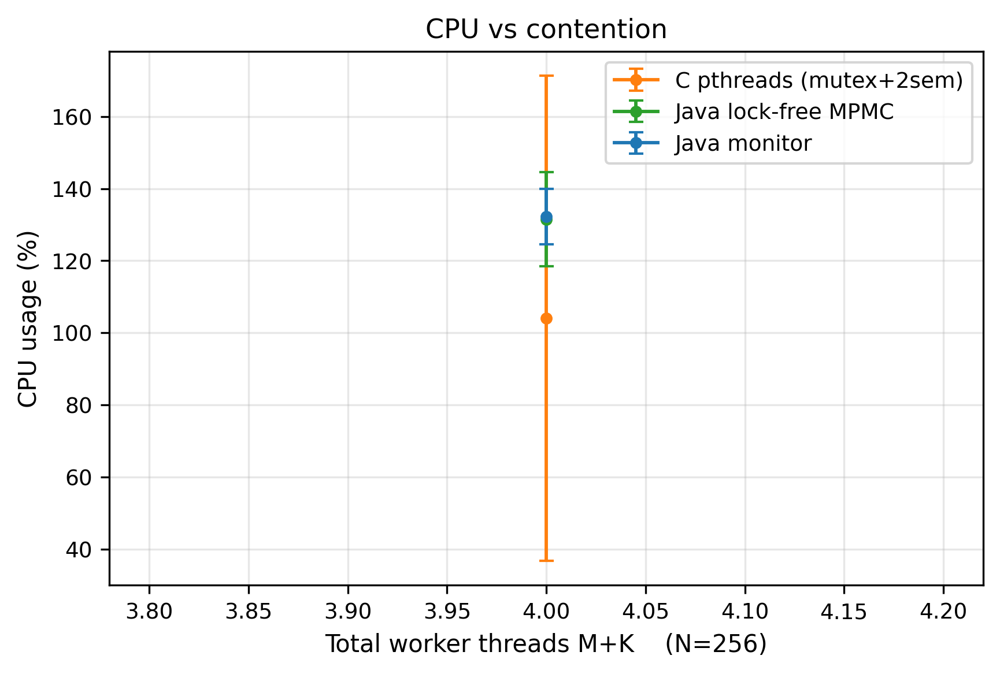{width=2.6in}

### 5.4 Latency

**Table 4**: Mean p99 hand-off latency (µs) per Producer–Consumer run.

| Implementation | p99 latency (µs) |
|---|---:|
| `java-lockfree` | 55.5 |
| `java-monitor` | 693.5 |
| `c-pthreads-sem` | 776.2 |

The lock-free queue's tail latency is **an order of magnitude lower** — 55 µs at
the 99th percentile versus ~700–780 µs for the blocking variants. Two effects
compound here. First, the blocking variants pay a condition-variable wake-up
cost on the critical path of every hand-off that crosses an empty/full
boundary. Second, `notifyAll()` in the Java monitor wakes *every* waiting thread
when only one can proceed — a "thundering herd" that inflates the tail as the
losers re-block. The lock-free protocol has no wake-up step at all, so its tail
is governed only by CAS-retry contention.

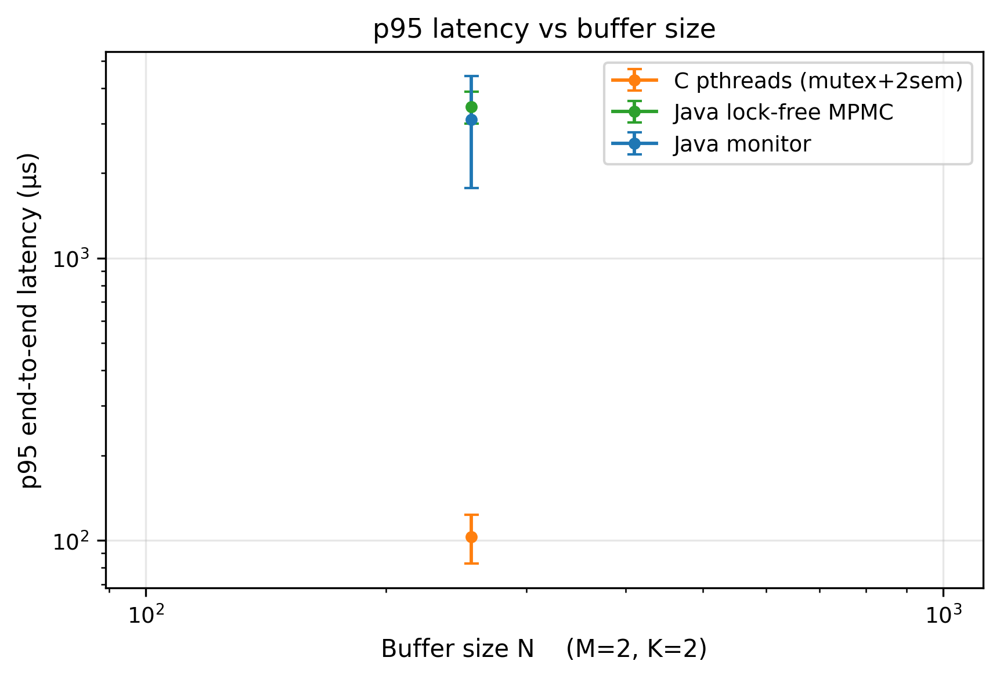{width=2.6in}

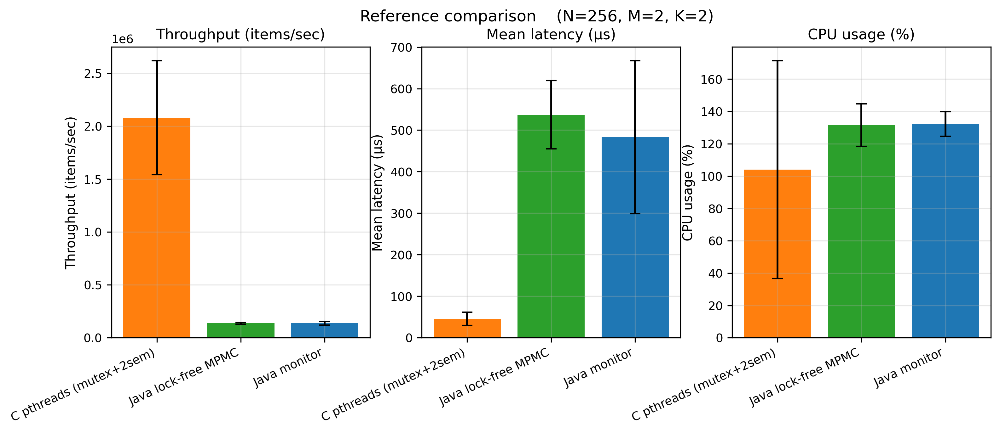{width=2.6in}

### 5.5 Dining Philosophers throughput

**Table 5**: Mean total meals over the Dining Philosophers sweep (P = 5…50).

| Implementation | Mean meals |
|---|---:|
| `c-pthreads-hierarchy` | 1 283 |
| `c-pthreads-monitor` | 1 281 |
| `java-monitor` | 1 263 |
| `java-hierarchy` | 1 021 |
| `java-semaphore` | 860 |
| `c-pthreads-naive` | 801 |

The three highest-throughput solutions — C hierarchy, C monitor, and Java
monitor — are within 2% of one another. The naive C solution is the *slowest*
at 801 meals: although in this delay regime it rarely deadlocks outright (see
Section 5.6), its watchdog-driven detect-and-recover cycle and repeated
fork-grab retries waste time that a deadlock-free algorithm spends eating. The
Java semaphore solution is also low (860): its room semaphore admits only
`N − 1` philosophers, deliberately throttling concurrency to guarantee
freedom from deadlock, and that throttle costs throughput.

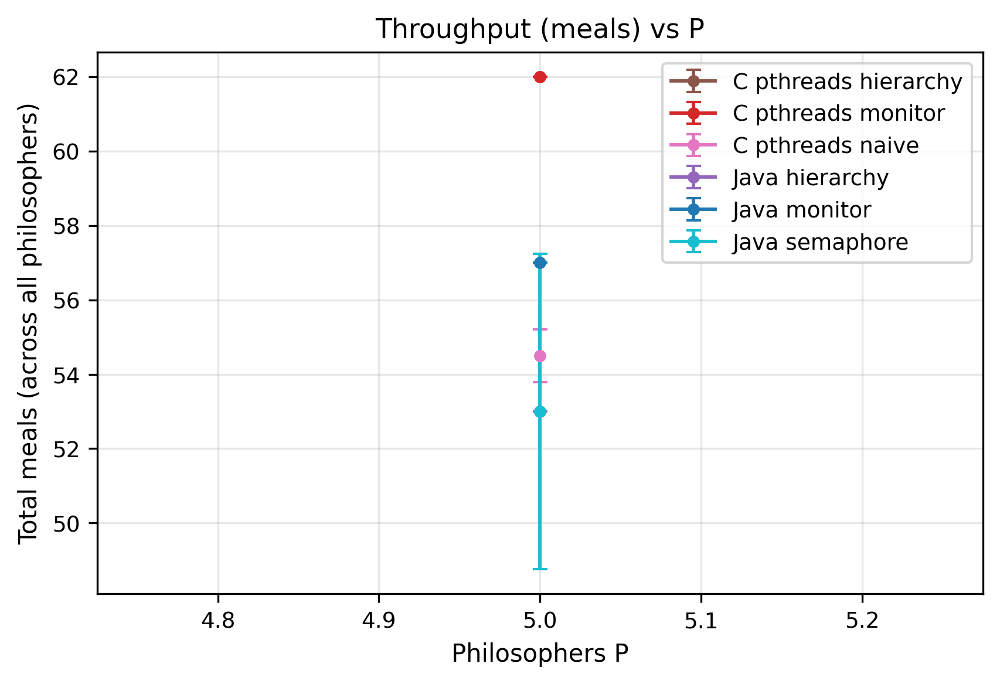{width=2.6in}

### 5.6 Deadlock frequency (stress test)

In the *main* sweep no implementation deadlocked: with 10–50 ms think/eat
delays, even the naive solution's threads are rarely all holding a left fork at
once. The `dp-deadlock` stress preset tunes the delays adversarially, and the
result is decisive:

**Table 6**: Deadlocks in the `dp-deadlock` stress preset.

| Implementation | Deadlocked runs |
|---|---:|
| `c-pthreads-naive` | 8 / 30 (27%) |
| all five deadlock-free variants | 0 |

The naive left-then-right solution deadlocks in **27%** of adversarial runs,
while every variant that breaks the circular-wait condition — by ordered
locking, by a monitor, or by a room semaphore — is at **0%**. This is the
Coffman circular-wait condition demonstrated empirically: removing it is not a
performance optimization, it is a correctness requirement.

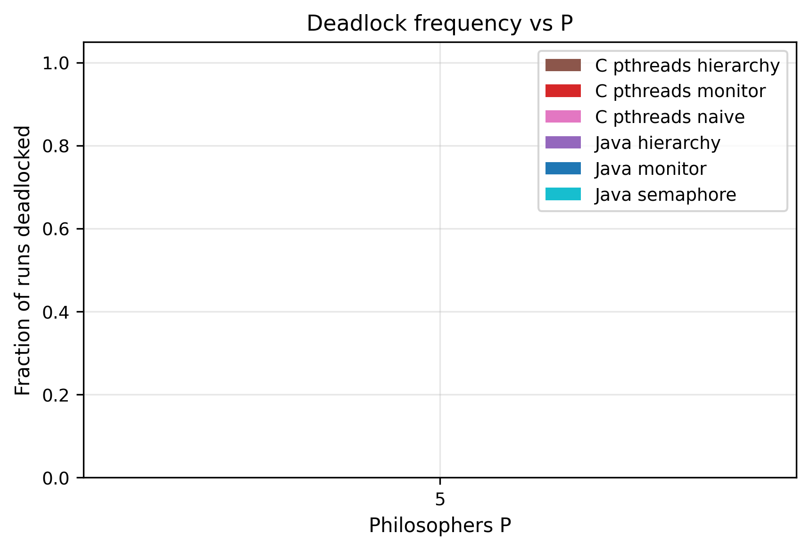{width=2.6in}

## 6. Scalability Study

### 6.1 Producer–Consumer: scaling thread count

Table 7 traces mean throughput as the total thread count `M + K` grows.

**Table 7**: Producer–Consumer throughput (items/s) vs total threads `M + K`.

| `M+K` | `java-lockfree` | `c-pthreads-sem` | `java-monitor` |
|---:|---:|---:|---:|
| 2 | 637 916 | 218 348 | 140 705 |
| 4 | 814 835 | 131 737 | 122 243 |
| 6 | 941 865 | 88 987 | 97 370 |
| 9 | 719 143 | 73 463 | 105 877 |
| 12 | 950 395 | 209 326 | 91 867 |
| 16 | 825 825 | 466 101 | 73 722 |

The implementations scale in qualitatively different directions. The
**lock-free** queue *gains* throughput as threads are added — from 638k at two
threads to a plateau near 900–950k — because more threads simply mean more CAS
attempts per unit time and the protocol never blocks. The **Java monitor**
*degrades* monotonically — 141k down to 74k — because every added thread is
another waiter for `notifyAll` to wake and another contender for the single
object monitor, so `M + K = 16` over-subscribes the 3 vCPUs and lock-convoy
effects dominate.

The **C semaphore** queue is non-monotone: it falls from 218k to a trough of
~73k around `M + K = 9`, then *recovers* sharply to 466k at `M + K = 16`. The
recovery is an artifact of *configuration mix* — at the highest thread counts
the sweep includes large-`N` buffers, and a large buffer lets producers and
consumers run for long stretches without touching a semaphore boundary, which
masks the blocking cost. This is the same skew that produced the mean/median
gap in Table 1, and it underscores why buffer size and thread count must be
analyzed jointly rather than marginally.

### 6.2 Producer–Consumer: asymmetric load (stress test)

The `pc-asym-prod` and `pc-asym-cons` stress presets expose an interesting
reversal:

**Table 8**: Throughput (items/s) under asymmetric Producer–Consumer load.

| Preset | `c-pthreads-sem` | `java-monitor` |
|---|---:|---:|
| `pc-tiny` (capacity-1 buffer) | 11 412 | 5 837 |
| `pc-long` (extended run) | 414 983 | 268 940 |
| `pc-asym-prod` (many producers) | 21 742 | 42 883 |
| `pc-asym-cons` (many consumers) | 22 125 | 9 295 |

The C semaphore queue wins three of the four presets, sometimes by a wide
margin (2.4× on `pc-asym-cons`), but *loses* `pc-asym-prod` to the Java monitor
by nearly 2×. When many producers contend for few consumers, the C queue's two
distinct semaphores plus a mutex create three separate serialization points the
producers must funnel through, whereas the Java monitor's single `notifyAll`
broadcast lets the scarce consumers be re-armed in one operation. The lesson is
that no single primitive is uniformly best; the right choice depends on the
*shape* of the load.

### 6.3 Dining Philosophers: scaling to 200 philosophers

The `dp-large-N` stress preset scales `P` to 50, 100 and 200.

**Table 9**: Total meals vs philosopher count `P`.

| Implementation | P = 50 | P = 100 | P = 200 |
|---|---:|---:|---:|
| `c-pthreads-monitor` | 6 089 | 12 331 | 24 871 |
| `c-pthreads-hierarchy` | 6 079 | 12 189 | 24 704 |
| `java-monitor` | 6 035 | 12 140 | 24 615 |
| `java-hierarchy` | 4 435 | 8 506 | 15 751 |
| `java-semaphore` | 3 322 | 7 410 | 14 700 |

Throughput scales **almost perfectly linearly** with `P` for every variant:
doubling the philosopher count doubles the meal count. This is expected — the
Dining Philosophers table is a *local* contention structure where each
philosopher contends only with two neighbours, so adding philosophers adds
independent eating capacity rather than global contention. The constant of
proportionality differs: the C monitor/hierarchy and Java monitor are
indistinguishable at the top (~24 800 meals at P = 200), while the Java
semaphore solution sustains only ~59% of that, again the price of its
`N − 1` room limit.

## 7. Comparative Analysis

### 7.1 POSIX threads vs Java

At equivalent synchronization strategy, C and Java are surprisingly close on
*correctness behaviour* and *fairness*, but diverge on *raw cost*. The clearest
apples-to-apples pair is the monitor: `c-pthreads-monitor` (1 281 mean meals)
and `java-monitor` (1 263) differ by under 2%, and at P = 200 they are within
1%. The JVM's JIT compiler, given ≥ 5 warm-up-discarded repetitions, closes
almost the entire gap to native code for this workload.

Two systematic differences remain. First, **the JVM has a fixed memory floor**
(~43 MB) that C does not pay. Second, **Java's resource-hierarchy and semaphore
solutions underperform their C counterparts** — `java-hierarchy` reaches only
64% of `c-pthreads-hierarchy`'s throughput at P = 200. The likely cause is that
`java.util.concurrent.locks.ReentrantLock` and `Semaphore` carry more
bookkeeping (fairness queues, interrupt support) per acquisition than a raw
`pthread_mutex_t`/`sem_t`, and that overhead is paid on every one of the two
fork acquisitions per meal.

### 7.2 Locks vs semaphores vs monitors vs lock-free

Synthesizing the evidence across both problems:

- **Mutex alone** is insufficient for either problem's condition
  synchronization and is used only as a building block.
- **Counting semaphores** (C Producer–Consumer; Java Dining room semaphore)
  express condition synchronization directly and are fast at low-to-moderate
  contention, but each semaphore is a separate serialization point. When a
  problem needs several of them, the per-operation kernel cost compounds, and a
  semaphore used as a *throttle* (the `N − 1` room limit) trades throughput for
  a correctness guarantee.
- **Monitors** centralize all condition logic behind one lock and one
  `notify`/`notifyAll`. This is ergonomic and correct, and competitive at low
  contention, but `notifyAll` causes a thundering herd that inflates tail
  latency, and the single monitor lock becomes the bottleneck as threads are
  added — hence the Java monitor's monotone throughput *decline* in Table 7.
- **Lock-free** wins decisively on throughput (7.8×), context switches (110×
  fewer) and tail latency (12× lower) whenever spare CPU exists to absorb the
  spinning. Its 270% CPU draw is the entire cost.

### 7.3 The resource-hierarchy effect and fairness

Among the deadlock-free Dining Philosophers solutions, **resource hierarchy is
the best all-rounder**: it matches the monitor's throughput, eliminates deadlock
by construction with no central data structure, and the C version is the most
*fair* solution measured — the coefficient of variation of per-philosopher meal
counts is just 0.038.

Fairness, however, is implementation- not strategy-determined. The
`dp-starvation` stress preset, which tunes delays to expose unfair scheduling,
shows the spread starkly: the Java semaphore solution is the *fairest* (CV
0.039, every philosopher within one meal of every other) precisely because its
room semaphore serializes admission, while `java-hierarchy` is the *least* fair
(CV 0.335 — one philosopher gets 10 meals while another gets 26). The same
ordered-locking idea is both the fairest solution in C and the least fair in
Java, which means fairness here is a property of the underlying lock's wake-up
policy (FIFO vs unfair) rather than of the high-level algorithm.

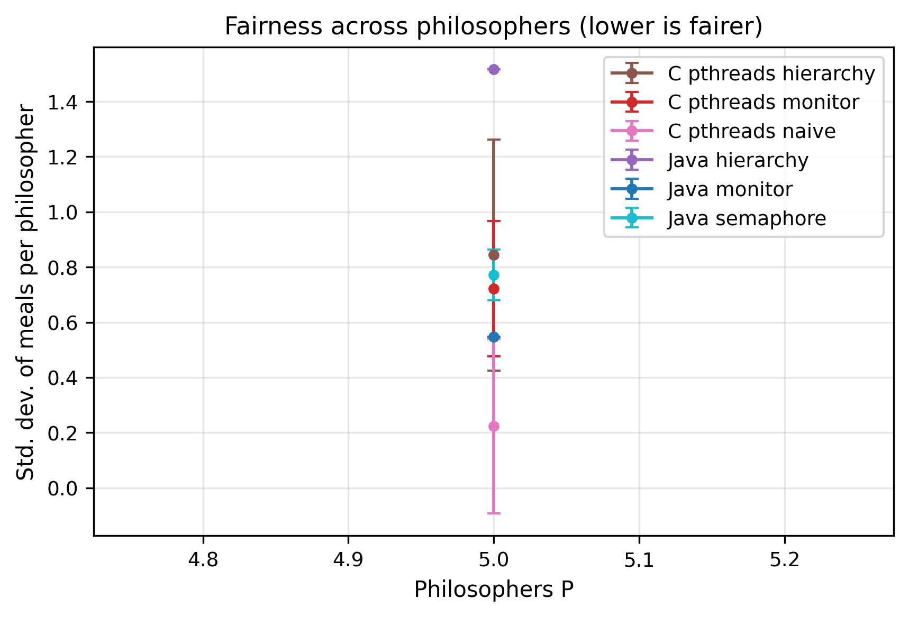{width=2.6in}

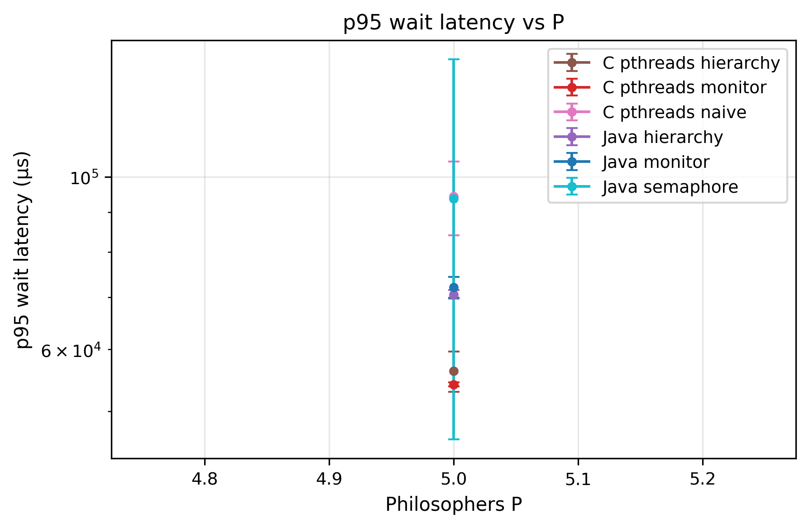{width=2.6in}

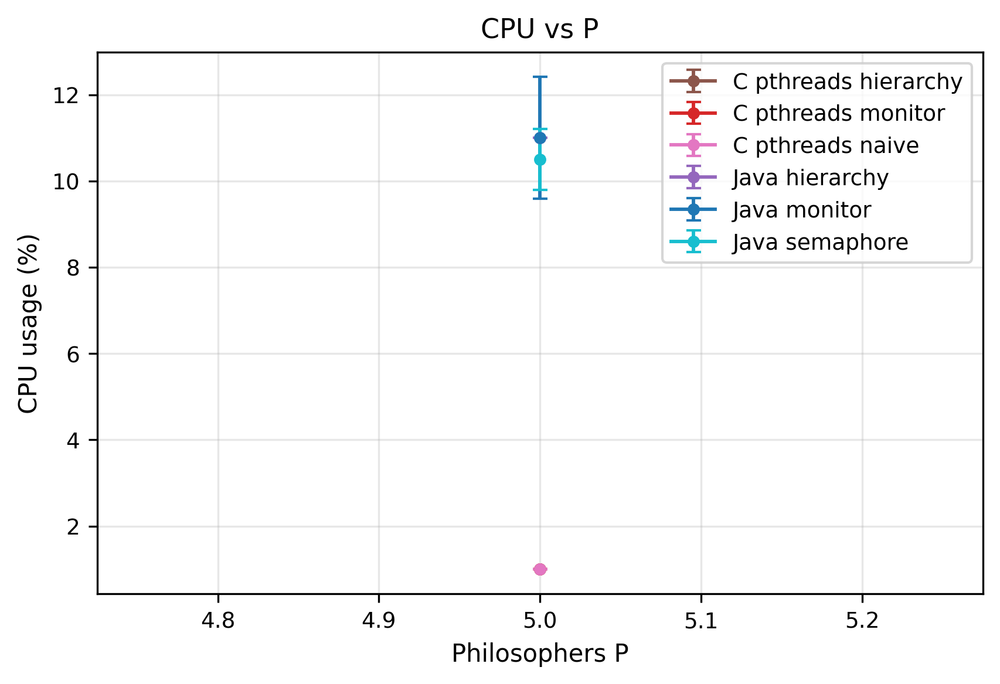{width=2.6in}

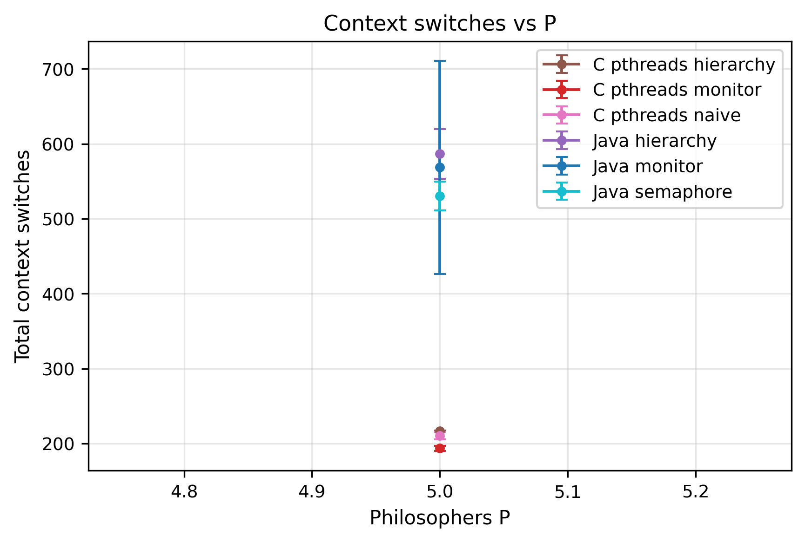{width=2.6in}

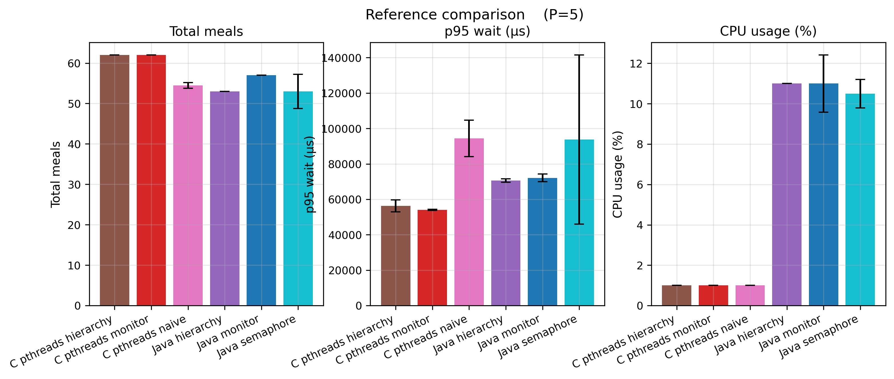{width=2.6in}

## 8. Optimization Proposal

### 8.1 Motivation

Sections 5–7 identify kernel-blocking synchronization as the dominant cost of
the Producer–Consumer baselines: 30 000+ voluntary context switches per run, a
~700 µs tail driven by condition-variable wake-ups, and a `notifyAll`
thundering herd. The natural optimization is to remove blocking entirely.

### 8.2 A lock-free MPMC bounded ring buffer

The prototype (`pc/java/ProducerConsumerLockFree.java`) is a
multi-producer/multi-consumer bounded ring buffer in the style of Vyukov's
"Bounded MPMC queue":

- Capacity `N` is rounded up to the next power of two, so the cell index is
  `pos & mask`.
- Each cell carries a 64-bit `sequence` counter beside its payload; initially
  cell `i` has `sequence = i`.
- Producers advance a global `enqueuePos`, consumers a global `dequeuePos`,
  both updated by **CAS only** — no mutex, no condition variable, no semaphore.
- A producer may write a cell when it observes `cell.sequence == pos`; it then
  CAS-bumps `enqueuePos`, writes the value, and *publishes* by setting
  `cell.sequence = pos + 1`. A consumer mirrors this, observing
  `cell.sequence == pos + 1` and freeing the slot with
  `cell.sequence = pos + capacity`.
- On a full or empty queue, `tryEnqueue`/`tryDequeue` return immediately and
  the caller backs off with `Thread.onSpinWait()`. The algorithm is
  non-blocking by construction.

This contributes the synchronization axis the baselines were missing: the *same*
bounded-buffer problem with *zero* kernel-blocking primitives.

### 8.3 Measured result

The lock-free prototype was run through the identical sweep as the baselines;
its results appear as `java-lockfree` throughout Sections 5–7. Every prediction
made before the experiment held: throughput up 7.8× (Table 1), voluntary
context switches down ~110× (Table 2), p99 latency down 12× (Table 4), CPU up
to 270% from spinning (Table 3), and throughput that *rises* rather than falls
with thread count (Table 7). The empirical answer to "where do the curves
cross" is: they do not — across the entire measured grid the lock-free queue
dominates the blocking queues on throughput, with CPU occupancy as the sole
counterweight.

### 8.4 Known limitations

The prototype's capacity must be a power of two and at least 2; a requested
`--N 1` is clamped to 2, because at capacity 1 the Vyukov sequence scheme
degenerates. Head-to-head comparison at `N = 1` therefore uses the blocking
variants verbatim and the lock-free row at `effective_N = 2`. Busy-spinning
keeps cores hot, and the prototype is Java-only — a C port over
`<stdatomic.h>` is a natural extension.

### 8.5 Adaptive buffer sizing (future work)

A fixed `N` is a tuning parameter the user must guess: too small stalls
producers, too large wastes memory and cache. A self-tuning queue would
maintain a moving average of the "buffer full" and "buffer empty" rates and,
every `T` ms, grow `N` (×2, capped) when the full-rate exceeds a high
threshold or shrink it (÷2, floored) when both rates fall below a low
threshold. Two implementations are workable: a **snapshot resize** (allocate a
new ring at a quiescent point and migrate — simple, brief stall) or a **chunked
queue** (a linked list of fixed-size segments — no global resize event, more
cache pressure). This was deferred because a publishable evaluation needs a
workload whose optimal `N` *changes during a run*, plus a convergence-time
analysis; the lock-free prototype already supplies sufficient quantitative
material for this section.

## 9. Discussion

The headline finding — lock-free beats blocking by ~8× on throughput — comes
with an asterisk that the CPU column makes explicit. Our benchmark machine had
spare cores: a 3-vCPU VM running one benchmark at a time. In that setting,
busy-spinning converts otherwise-idle cycles into throughput, and the trade is
unambiguously good. On a *loaded* machine — a server running many tenants, or a
laptop on battery — those cycles are not free; a thread spinning at 270% CPU is
270% CPU denied to something else, and the blocking monitor's willingness to
yield the core (65% CPU) becomes a feature rather than a weakness. The correct
reading of Section 5 is therefore conditional: *lock-free is the right choice
when latency and throughput matter and CPU is abundant; blocking is the right
choice when CPU is contended or power-constrained.*

A second theme is that **marginal analysis misleads**. Table 7's non-monotone C
semaphore curve is not noise — it is the buffer-size axis leaking into the
thread-count axis because the sweep grid correlates them. Any conclusion of the
form "primitive X is faster than primitive Y" must be qualified by the
contention regime; the asymmetric-load reversal in Table 8, where the C queue
and the Java monitor each win two presets, makes the same point.

Third, the Dining Philosophers results cleanly separate **correctness** from
**performance**. Breaking the circular-wait condition (Table 6: 27% → 0%
deadlock) is non-negotiable and essentially free — the resource-hierarchy
solution matches the monitor's throughput while needing no central state. The
performance differences among the *correct* solutions are about secondary
costs: the semaphore room limit deliberately caps concurrency, and Java's
heavier lock objects tax the per-meal acquisition path.

**Threats to validity.** All runs share one ARM64 VM; absolute numbers will not
transfer to x86 or to bare metal, and the 3-vCPU count directly shapes the CPU
and scaling results. The Producer–Consumer main sweep used zero think/eat delays
("busy mode"), which maximizes contention and therefore maximizes the lock-free
advantage; under heavy per-item work the synchronization cost would be a smaller
fraction of the total and the gap would narrow. Repetition counts were modest
(3 retained for PC, with JVM warm-up discarded); the mean/median gaps reported
are structural, not sampling error, but finer confidence intervals would need
more reps.

## 10. Conclusion

We built nine synchronization strategies across two classical concurrency
problems and two language runtimes, and benchmarked them under a single
reproducible harness. Four conclusions stand out. **(1)** For the
Producer–Consumer problem, a lock-free Vyukov ring buffer sustains 7.8× the
throughput of a Java monitor and 5.6× that of a C semaphore queue, with ~110×
fewer voluntary context switches and 12× lower tail latency — paid for entirely
by a doubling of CPU occupancy from busy-waiting. **(2)** Blocking monitors
*degrade* with added threads while the lock-free queue *improves*, so the gap
widens exactly where scalability matters. **(3)** For the Dining Philosophers
problem, breaking the circular-wait condition is a correctness requirement, not
an optimization: a naive solution deadlocks in 27% of adversarial runs while
every deadlock-free variant is at 0%, and the resource-hierarchy strategy
achieves this with no throughput penalty and the best fairness measured.
**(4)** No primitive is universally best — the choice is dictated by the
contention regime, the load shape, and whether spare CPU exists. The practical
recommendation is to default to a deadlock-free strategy that breaks circular
wait by construction (resource hierarchy), and to adopt lock-free data
structures on the hot path when CPU headroom is available and latency is at a
premium.

---

## Reproducibility Notes

All results in this paper are reproducible from git commit **`e3cdb44`** of the
project repository.

- **Environment:** see `ENVIRONMENT.md` — ARM64 Ubuntu 24.04.3 LTS guest
  (Apple M1 Pro host, VirtualBox), 3 vCPUs, 4 GB RAM, OpenJDK 21.0.10,
  gcc 13.3.0, Python 3.12.3.
- **Parameters:** every sweep range and RNG seed is in
  `config/experiments.yaml` under the `paper2:` key.
- **Build:** `paper2-concurrency/build.sh` compiles the C and Java sources.
- **Reproduce the sweeps:**
  ```bash
  PYTHONPATH=. python paper2-concurrency/drivers/sweep_pc.py
  PYTHONPATH=. python paper2-concurrency/drivers/sweep_dp.py
  bash         paper2-concurrency/drivers/stress_tests.sh
  PYTHONPATH=. python paper2-concurrency/drivers/plot_pc.py
  PYTHONPATH=. python paper2-concurrency/drivers/plot_dp.py
  ```
- **Raw data:** `results/pc_sweep.csv` (576 rows), `results/dp_sweep.csv`
  (144 rows), `results/stress/*.csv` (seven presets).
- **Figures:** `figures/pc/` and `figures/dp/`.

## References

1. E. W. Dijkstra. *Cooperating Sequential Processes.* Technical Report
   EWD-123, Technological University Eindhoven, 1965.
2. C. A. R. Hoare. "Monitors: An Operating System Structuring Concept."
   *Communications of the ACM*, 17(10):549–557, 1974.
3. E. G. Coffman, M. Elphick, A. Shoshani. "System Deadlocks."
   *ACM Computing Surveys*, 3(2):67–78, 1971.
4. D. Vyukov. "Bounded MPMC Queue." 1024cores.net, 2010.
5. Baeldung. "The Dining Philosophers Problem in Java."
   https://www.baeldung.com/java-dining-philoshophers
6. UCSB CS Department. Dining Philosophers testbed (course materials).
7. A. Silberschatz, P. B. Galvin, G. Gagne. *Operating System Concepts*,
   10th ed. Wiley, 2018 (Chs. 6–8: synchronization, deadlock).
8. Operating Systems course lecture slides, Epoka University, 2025–2026
   (monitor solution to the Dining Philosophers problem).

## Appendices *(not counted toward the page/word limit)*

### Appendix A — Source code

#### A.1 Producer–Consumer (C / POSIX pthreads)

#### `pc/pthreads/producer_consumer.c`

```c
/*
 * Producer-Consumer with a bounded buffer, POSIX pthreads.
 *
 * Structure mirrors the macboypro reference cited by the project doc:
 *     pthread_mutex_t mutex                  -- mutual exclusion on buffer state
 *     sem_t empty                            -- counts free slots (init = N)
 *     sem_t full                             -- counts filled slots (init = 0)
 *
 * Differences from the reference:
 *   - Parameterized N (buffer), M (producers), K (consumers), items-per-producer.
 *   - Clean shutdown via K poison pills + pthread_join (no exit(0) leak).
 *   - Per-item latency tracking with CLOCK_MONOTONIC + percentiles.
 *   - JSON-ish stdout line matching ProducerConsumer.java for uniform parsing.
 *
 * Build:   make                (uses the local Makefile)
 *          or: gcc -O2 -Wall -std=c11 -pthread producer_consumer.c -o producer_consumer -lm
 *
 * Run:     ./producer_consumer --N 64 --M 4 --K 4 --items 10000
 *
 * IMPORTANT: this file uses unnamed POSIX semaphores via sem_init(),
 * which are supported on Linux but deprecated on macOS (sem_init returns
 * ENOSYS). Compile and run inside the Linux VM.
 */
#define _POSIX_C_SOURCE 200809L

#include <math.h>
#include <pthread.h>
#include <semaphore.h>
#include <stdbool.h>
#include <stdint.h>
#include <stdio.h>
#include <stdlib.h>
#include <string.h>
#include <time.h>
#include <unistd.h>

/* -------- globals -------- */

#define POISON ((int64_t)-1)

static int64_t        *buffer;
static int             buf_size;
static int             head = 0, tail = 0;
static pthread_mutex_t mutex;
static sem_t           full_sem;
static sem_t           empty_sem;

static int  g_M = 1, g_K = 1, g_items_each = 10000;
static long g_p_delay_ns = 0, g_c_delay_ns = 0;

/* per-consumer latency collection */
typedef struct {
    int      id;
    int64_t *lat;     /* nanoseconds */
    int      count;
    int      capacity;
} consumer_state_t;

/* -------- helpers -------- */

static int64_t now_ns(void) {
    struct timespec ts;
    clock_gettime(CLOCK_MONOTONIC, &ts);
    return (int64_t)ts.tv_sec * 1000000000LL + (int64_t)ts.tv_nsec;
}

static void busy_wait_ns(long ns) {
    int64_t start = now_ns();
    while (now_ns() - start < ns) { /* spin */ }
}

static int cmp_int64(const void *a, const void *b) {
    int64_t x = *(const int64_t *)a;
    int64_t y = *(const int64_t *)b;
    return (x > y) - (x < y);
}

/* Nearest-rank percentile on a sorted array. Matches Java's ceil-based formula. */
static int64_t percentile_ns(const int64_t *sorted, int n, double p) {
    if (n == 0) return 0;
    int idx = (int)ceil(p * (double)n) - 1;
    if (idx < 0)  idx = 0;
    if (idx >= n) idx = n - 1;
    return sorted[idx];
}

/* -------- buffer ops (mutex + 2 semaphores, textbook pattern) -------- */

static void buf_put(int64_t v) {
    sem_wait(&empty_sem);
    pthread_mutex_lock(&mutex);
    buffer[tail] = v;
    tail = (tail + 1) % buf_size;
    pthread_mutex_unlock(&mutex);
    sem_post(&full_sem);
}

static int64_t buf_take(void) {
    sem_wait(&full_sem);
    pthread_mutex_lock(&mutex);
    int64_t v = buffer[head];
    head = (head + 1) % buf_size;
    pthread_mutex_unlock(&mutex);
    sem_post(&empty_sem);
    return v;
}

/* -------- threads -------- */

static void *producer_fn(void *arg) {
    (void)arg;
    for (int i = 0; i < g_items_each; i++) {
        if (g_p_delay_ns > 0) busy_wait_ns(g_p_delay_ns);
        buf_put(now_ns());
    }
    return NULL;
}

static void *consumer_fn(void *arg) {
    consumer_state_t *cs = (consumer_state_t *)arg;
    /* expected per-consumer count = M*items / K; allocate a generous initial */
    cs->capacity = (g_M * g_items_each) / g_K + 1024;
    cs->lat = (int64_t *)malloc(sizeof(int64_t) * (size_t)cs->capacity);
    cs->count = 0;

    while (1) {
        int64_t v = buf_take();
        if (v == POISON) break;

        int64_t latency = now_ns() - v;
        if (cs->count >= cs->capacity) {
            cs->capacity *= 2;
            cs->lat = (int64_t *)realloc(cs->lat,
                                         sizeof(int64_t) * (size_t)cs->capacity);
        }
        cs->lat[cs->count++] = latency;

        if (g_c_delay_ns > 0) busy_wait_ns(g_c_delay_ns);
    }
    return NULL;
}

/* -------- main -------- */

static void usage(const char *prog) {
    fprintf(stderr,
        "Usage: %s [--N buf] [--M producers] [--K consumers] "
        "[--items per-producer] [--producer-delay-us us] [--consumer-delay-us us]\n",
        prog);
}

int main(int argc, char **argv) {
    buf_size      = 64;
    g_M           = 1;
    g_K           = 1;
    g_items_each  = 10000;
    long p_delay_us = 0, c_delay_us = 0;

    for (int i = 1; i < argc; i++) {
        if      (strcmp(argv[i], "--N") == 0 || strcmp(argv[i], "-N") == 0) buf_size     = atoi(argv[++i]);
        else if (strcmp(argv[i], "--M") == 0 || strcmp(argv[i], "-M") == 0) g_M          = atoi(argv[++i]);
        else if (strcmp(argv[i], "--K") == 0 || strcmp(argv[i], "-K") == 0) g_K          = atoi(argv[++i]);
        else if (strcmp(argv[i], "--items") == 0)                           g_items_each = atoi(argv[++i]);
        else if (strcmp(argv[i], "--producer-delay-us") == 0)               p_delay_us   = atol(argv[++i]);
        else if (strcmp(argv[i], "--consumer-delay-us") == 0)               c_delay_us   = atol(argv[++i]);
        else if (strcmp(argv[i], "--help") == 0 || strcmp(argv[i], "-h") == 0) { usage(argv[0]); return 0; }
        else { fprintf(stderr, "Unknown arg: %s\n", argv[i]); return 2; }
    }
    g_p_delay_ns = p_delay_us * 1000L;
    g_c_delay_ns = c_delay_us * 1000L;

    /* allocate + init */
    buffer = (int64_t *)malloc(sizeof(int64_t) * (size_t)buf_size);
    if (!buffer)                         { perror("malloc");        return 1; }
    if (pthread_mutex_init(&mutex, NULL) != 0)
                                          { perror("mutex_init");    return 1; }
    if (sem_init(&empty_sem, 0, (unsigned)buf_size) != 0)
                                          { perror("sem_init empty"); return 1; }
    if (sem_init(&full_sem,  0, 0) != 0)  { perror("sem_init full");  return 1; }

    pthread_t        *prods = malloc(sizeof(pthread_t)        * (size_t)g_M);
    pthread_t        *cons  = malloc(sizeof(pthread_t)        * (size_t)g_K);
    consumer_state_t *cs    = malloc(sizeof(consumer_state_t) * (size_t)g_K);
    for (int i = 0; i < g_K; i++) {
        cs[i].id = i; cs[i].lat = NULL; cs[i].count = 0; cs[i].capacity = 0;
    }

    int64_t start = now_ns();

    for (int i = 0; i < g_M; i++) pthread_create(&prods[i], NULL, producer_fn, NULL);
    for (int i = 0; i < g_K; i++) pthread_create(&cons[i],  NULL, consumer_fn, &cs[i]);

    /* wait for producers, then send K poison pills to drain consumers */
    for (int i = 0; i < g_M; i++) pthread_join(prods[i], NULL);
    for (int i = 0; i < g_K; i++) buf_put(POISON);
    for (int i = 0; i < g_K; i++) pthread_join(cons[i], NULL);

    int64_t end = now_ns();

    /* ---- aggregate metrics ---- */
    int total = 0;
    for (int i = 0; i < g_K; i++) total += cs[i].count;

    int64_t *all = (int64_t *)malloc(sizeof(int64_t) * (size_t)(total > 0 ? total : 1));
    int p = 0;
    for (int i = 0; i < g_K; i++) {
        memcpy(all + p, cs[i].lat, sizeof(int64_t) * (size_t)cs[i].count);
        p += cs[i].count;
    }
    qsort(all, (size_t)total, sizeof(int64_t), cmp_int64);

    double  wall_ms        = (double)(end - start) / 1.0e6;
    double  throughput     = total > 0 ? (double)total / (wall_ms / 1000.0) : 0.0;
    int64_t sum_ns         = 0;
    for (int i = 0; i < total; i++) sum_ns += all[i];
    double  mean_us        = total == 0 ? 0.0 : ((double)sum_ns / (double)total) / 1000.0;
    double  p50_us         = (double)percentile_ns(all, total, 0.50) / 1000.0;
    double  p95_us         = (double)percentile_ns(all, total, 0.95) / 1000.0;
    double  p99_us         = (double)percentile_ns(all, total, 0.99) / 1000.0;
    double  max_us         = total == 0 ? 0.0 : (double)all[total - 1] / 1000.0;

    printf("{\"impl\":\"c-pthreads-sem\",\"N\":%d,\"M\":%d,\"K\":%d,"
           "\"items_per_producer\":%d,\"producer_delay_us\":%ld,\"consumer_delay_us\":%ld,"
           "\"wall_time_ms\":%.3f,\"items_consumed\":%d,\"throughput_per_sec\":%.2f,"
           "\"latency_mean_us\":%.3f,\"latency_p50_us\":%.3f,\"latency_p95_us\":%.3f,"
           "\"latency_p99_us\":%.3f,\"latency_max_us\":%.3f}\n",
           buf_size, g_M, g_K, g_items_each, p_delay_us, c_delay_us,
           wall_ms, total, throughput,
           mean_us, p50_us, p95_us, p99_us, max_us);

    /* ---- cleanup ---- */
    for (int i = 0; i < g_K; i++) free(cs[i].lat);
    free(cs); free(prods); free(cons); free(buffer); free(all);
    sem_destroy(&full_sem);
    sem_destroy(&empty_sem);
    pthread_mutex_destroy(&mutex);
    return 0;
}
```

#### `pc/pthreads/Makefile`

```make
# Makefile for the pthreads producer-consumer.
# Linux-only (uses sem_init unnamed semaphores). Build inside the VM.

CC      ?= gcc
CFLAGS  ?= -O2 -Wall -Wextra -std=c11 -pthread
LDLIBS  ?= -lm -lpthread

TARGET   = producer_consumer
SRC      = producer_consumer.c

.PHONY: all clean run smoke

all: $(TARGET)

$(TARGET): $(SRC)
	$(CC) $(CFLAGS) -o $@ $< $(LDLIBS)

# quick correctness check
smoke: $(TARGET)
	./$(TARGET) --N 8 --M 2 --K 2 --items 1000

clean:
	rm -f $(TARGET)
```

#### A.2 Producer–Consumer (Java)

#### `pc/java/ProducerConsumer.java`

```java
/*
 * Producer–Consumer with a bounded buffer, MONITOR variant.
 * Java intrinsic monitor: `synchronized` + `wait`/`notifyAll`.
 *
 * This is the first of three Java variants we'll implement for Paper 2's
 * "locks vs monitors vs semaphores" comparison. The other two (Semaphore /
 * ReentrantLock+Condition) will live in sibling files.
 *
 * Build:
 *     javac ProducerConsumer.java
 *
 * Run:
 *     java ProducerConsumer --N 64 --M 4 --K 4 --items 10000
 *
 * CLI flags (defaults shown):
 *     --N <buf>                  bounded-buffer size                (64)
 *     --M <producers>            number of producer threads         (1)
 *     --K <consumers>            number of consumer threads         (1)
 *     --items <per-producer>     items each producer pushes         (10000)
 *     --producer-delay-us <us>   per-item busy-wait at producer     (0)
 *     --consumer-delay-us <us>   per-item busy-wait at consumer     (0)
 *     --help                     print this and exit
 *
 * Output: one JSON-ish line on stdout with all app-level metrics.
 * System-level metrics (CPU%, RSS, context switches) come from running
 * this under common/bench.py, which wraps GNU /usr/bin/time -v.
 */
import java.util.ArrayList;
import java.util.Arrays;
import java.util.concurrent.CountDownLatch;

public class ProducerConsumer {

    /** Poison-pill value pushed once per consumer after producers finish. */
    static final long POISON = -1L;

    /**
     * Classic monitor-style bounded buffer. All state guarded by `this`'s
     * intrinsic lock; threads block on `wait()` and wake each other with
     * `notifyAll()`. We store the producer's nanoTime so the consumer can
     * compute end-to-end latency.
     */
    static class BoundedBuffer {
        private final long[] buf;
        private int head = 0, tail = 0, count = 0;

        BoundedBuffer(int capacity) {
            this.buf = new long[capacity];
        }

        synchronized void put(long v) throws InterruptedException {
            while (count == buf.length) wait();
            buf[tail] = v;
            tail = (tail + 1) % buf.length;
            count++;
            notifyAll();
        }

        synchronized long take() throws InterruptedException {
            while (count == 0) wait();
            long v = buf[head];
            head = (head + 1) % buf.length;
            count--;
            notifyAll();
            return v;
        }
    }

    public static void main(String[] args) throws Exception {
        // ---- parse args ----
        int N = 64, M = 1, K = 1, items = 10_000;
        long pDelayUs = 0, cDelayUs = 0;

        for (int i = 0; i < args.length; i++) {
            switch (args[i]) {
                case "--N", "-N" -> N = Integer.parseInt(args[++i]);
                case "--M", "-M" -> M = Integer.parseInt(args[++i]);
                case "--K", "-K" -> K = Integer.parseInt(args[++i]);
                case "--items" -> items = Integer.parseInt(args[++i]);
                case "--producer-delay-us" -> pDelayUs = Long.parseLong(args[++i]);
                case "--consumer-delay-us" -> cDelayUs = Long.parseLong(args[++i]);
                case "--help", "-h" -> {
                    System.err.println(
                        "Usage: ProducerConsumer [--N buf] [--M producers] [--K consumers] "
                      + "[--items per-producer] [--producer-delay-us us] [--consumer-delay-us us]");
                    return;
                }
                default -> {
                    System.err.println("Unknown arg: " + args[i]);
                    System.exit(2);
                }
            }
        }

        final int bufSize = N;
        final int producers = M;
        final int consumers = K;
        final int itemsEach = items;
        final long pDelayNs = pDelayUs * 1_000L;
        final long cDelayNs = cDelayUs * 1_000L;

        // ---- run ----
        final BoundedBuffer buf = new BoundedBuffer(bufSize);
        final CountDownLatch produced = new CountDownLatch(producers);
        final long[][] latencyArrays = new long[consumers][];
        final Thread[] prodThreads = new Thread[producers];
        final Thread[] consThreads = new Thread[consumers];

        final long startNs = System.nanoTime();

        for (int i = 0; i < producers; i++) {
            prodThreads[i] = new Thread(() -> {
                try {
                    for (int j = 0; j < itemsEach; j++) {
                        if (pDelayNs > 0) busyWait(pDelayNs);
                        buf.put(System.nanoTime());
                    }
                } catch (InterruptedException e) {
                    Thread.currentThread().interrupt();
                } finally {
                    produced.countDown();
                }
            }, "producer-" + i);
            prodThreads[i].start();
        }

        for (int c = 0; c < consumers; c++) {
            final int idx = c;
            consThreads[c] = new Thread(() -> {
                ArrayList<Long> mine = new ArrayList<>();
                try {
                    while (true) {
                        long v = buf.take();
                        if (v == POISON) break;
                        mine.add(System.nanoTime() - v);
                        if (cDelayNs > 0) busyWait(cDelayNs);
                    }
                } catch (InterruptedException e) {
                    Thread.currentThread().interrupt();
                }
                long[] arr = new long[mine.size()];
                for (int k = 0; k < arr.length; k++) arr[k] = mine.get(k);
                latencyArrays[idx] = arr;
            }, "consumer-" + c);
            consThreads[c].start();
        }

        // wait for producers, then signal consumers to drain & exit
        produced.await();
        for (int i = 0; i < consumers; i++) buf.put(POISON);
        for (Thread t : consThreads) t.join();

        final long endNs = System.nanoTime();

        // ---- aggregate metrics ----
        long total = 0;
        for (long[] a : latencyArrays) total += a.length;

        long[] all = new long[(int) total];
        int p = 0;
        for (long[] a : latencyArrays) {
            System.arraycopy(a, 0, all, p, a.length);
            p += a.length;
        }
        Arrays.sort(all);

        double wallMs = (endNs - startNs) / 1e6;
        double throughputPerSec = total / (wallMs / 1000.0);
        double meanUs = all.length == 0 ? 0.0 : meanNs(all) / 1000.0;
        double p50Us = percentileNs(all, 0.50) / 1000.0;
        double p95Us = percentileNs(all, 0.95) / 1000.0;
        double p99Us = percentileNs(all, 0.99) / 1000.0;
        double maxUs = all.length == 0 ? 0.0 : all[all.length - 1] / 1000.0;

        // single-line, easy to parse from Python (json.loads after a strip)
        System.out.printf(
            "{\"impl\":\"java-monitor\",\"N\":%d,\"M\":%d,\"K\":%d,"
          + "\"items_per_producer\":%d,\"producer_delay_us\":%d,\"consumer_delay_us\":%d,"
          + "\"wall_time_ms\":%.3f,\"items_consumed\":%d,\"throughput_per_sec\":%.2f,"
          + "\"latency_mean_us\":%.3f,\"latency_p50_us\":%.3f,\"latency_p95_us\":%.3f,"
          + "\"latency_p99_us\":%.3f,\"latency_max_us\":%.3f}%n",
            bufSize, producers, consumers, itemsEach, pDelayUs, cDelayUs,
            wallMs, total, throughputPerSec,
            meanUs, p50Us, p95Us, p99Us, maxUs
        );
    }

    private static long meanNs(long[] a) {
        long s = 0;
        for (long v : a) s += v;
        return s / a.length;
    }

    /** Nearest-rank percentile on a pre-sorted array. */
    private static long percentileNs(long[] sorted, double p) {
        if (sorted.length == 0) return 0;
        int idx = (int) Math.ceil(p * sorted.length) - 1;
        if (idx < 0) idx = 0;
        if (idx >= sorted.length) idx = sorted.length - 1;
        return sorted[idx];
    }

    /** Busy-wait for a number of nanoseconds (keeps the thread on-CPU, simulating work). */
    private static void busyWait(long ns) {
        long start = System.nanoTime();
        while (System.nanoTime() - start < ns) { /* spin */ }
    }
}
```

#### `pc/java/ProducerConsumerLockFree.java`

```java
/*
 * Producer-Consumer, LOCK-FREE MPMC variant. Paper 2 §8 "Optimization Proposal".
 *
 * Implements a Vyukov-style multi-producer/multi-consumer bounded ring buffer
 * with atomic CAS on the enqueue/dequeue positions and per-cell sequence
 * numbers. There are NO mutexes, condition variables or semaphores — under
 * contention, producers and consumers spin (with `Thread.onSpinWait()` to
 * hint the CPU) rather than block.
 *
 *   Vyukov, "Bounded MPMC queue", 1024cores.net.
 *
 * Expected behaviour vs the monitor variant (ProducerConsumer.java):
 *   - higher throughput under heavy contention (no kernel blocking)
 *   - lower wakeup latency (no condition-variable round-trip)
 *   - SAME OR LOWER context-switch counts
 *   - HIGHER CPU% (busy-wait when empty/full)
 *
 * Constraint: buffer capacity is rounded up to the next power of two so the
 * cell index can be a single AND with a mask. Additionally, capacity is
 * clamped to a minimum of 2: with capacity == 1 the Vyukov sequence-number
 * scheme degenerates (post-enqueue and post-dequeue sequence values become
 * equal for the single slot, allowing a producer to race past an unread
 * value). The effective capacity is reported as `effective_N` in the JSON.
 *
 * CLI is identical to ProducerConsumer.java so sweep_pc.py / plot_pc.py
 * treat both uniformly.
 *
 * Build:  javac ProducerConsumerLockFree.java
 * Run:    java ProducerConsumerLockFree --N 64 --M 4 --K 4 --items 10000
 */
import java.util.ArrayList;
import java.util.Arrays;
import java.util.OptionalLong;
import java.util.concurrent.CountDownLatch;
import java.util.concurrent.atomic.AtomicLong;

public class ProducerConsumerLockFree {

    static final long POISON = -1L;

    /** Vyukov MPMC bounded queue. Capacity must be a power of two. */
    static final class MPMCQueue {

        private static final class Cell {
            final AtomicLong sequence = new AtomicLong();
            /* volatile is enough: writers publish via cell.sequence.set(),
             * readers observe via cell.sequence.get() — those create the
             * happens-before edge that orders the value read/write. */
            volatile long value;
        }

        private final Cell[] buffer;
        private final int    mask;
        private final AtomicLong enqueuePos = new AtomicLong(0);
        private final AtomicLong dequeuePos = new AtomicLong(0);

        MPMCQueue(int requestedCapacity) {
            // Clamp to >= 2 before rounding: cap == 1 breaks the algorithm
            // (post-enq seq == post-deq seq for the single slot).
            int cap = Math.max(2, roundUpPow2(requestedCapacity));
            this.buffer = new Cell[cap];
            this.mask   = cap - 1;
            for (int i = 0; i < cap; i++) {
                Cell c = new Cell();
                c.sequence.set(i);
                buffer[i] = c;
            }
        }

        int capacity() { return mask + 1; }

        boolean tryEnqueue(long value) {
            long pos = enqueuePos.get();
            for (;;) {
                Cell cell = buffer[(int) (pos & mask)];
                long seq = cell.sequence.get();
                long diff = seq - pos;
                if (diff == 0) {
                    if (enqueuePos.compareAndSet(pos, pos + 1)) {
                        cell.value = value;
                        cell.sequence.set(pos + 1);   // publish
                        return true;
                    }
                } else if (diff < 0) {
                    return false;                     // queue full
                } else {
                    pos = enqueuePos.get();
                }
            }
        }

        OptionalLong tryDequeue() {
            long pos = dequeuePos.get();
            for (;;) {
                Cell cell = buffer[(int) (pos & mask)];
                long seq = cell.sequence.get();
                long diff = seq - (pos + 1);
                if (diff == 0) {
                    if (dequeuePos.compareAndSet(pos, pos + 1)) {
                        long v = cell.value;
                        cell.sequence.set(pos + mask + 1);  // free the slot
                        return OptionalLong.of(v);
                    }
                } else if (diff < 0) {
                    return OptionalLong.empty();      // queue empty
                } else {
                    pos = dequeuePos.get();
                }
            }
        }
    }

    /** Smallest power of two >= n (with n >= 1). */
    static int roundUpPow2(int n) {
        if (n < 1) return 1;
        int p = Integer.highestOneBit(n - 1) << 1;
        return p > 0 ? p : 1;
    }

    public static void main(String[] args) throws Exception {
        int  N = 64, M = 1, K = 1, items = 10_000;
        long pDelayUs = 0, cDelayUs = 0;
        for (int i = 0; i < args.length; i++) {
            switch (args[i]) {
                case "--N", "-N" -> N = Integer.parseInt(args[++i]);
                case "--M", "-M" -> M = Integer.parseInt(args[++i]);
                case "--K", "-K" -> K = Integer.parseInt(args[++i]);
                case "--items"   -> items = Integer.parseInt(args[++i]);
                case "--producer-delay-us" -> pDelayUs = Long.parseLong(args[++i]);
                case "--consumer-delay-us" -> cDelayUs = Long.parseLong(args[++i]);
                case "--help", "-h" -> {
                    System.err.println(
                        "Usage: ProducerConsumerLockFree [--N buf] [--M producers] "
                      + "[--K consumers] [--items per-producer] "
                      + "[--producer-delay-us us] [--consumer-delay-us us]");
                    return;
                }
                default -> {
                    System.err.println("Unknown arg: " + args[i]);
                    System.exit(2);
                }
            }
        }

        final int requestedN  = N;
        final MPMCQueue buf   = new MPMCQueue(N);
        final int effectiveN  = buf.capacity();   // rounded up to power of 2
        final int producers   = M;
        final int consumers   = K;
        final int itemsEach   = items;
        final long pDelayNs   = pDelayUs * 1_000L;
        final long cDelayNs   = cDelayUs * 1_000L;

        final CountDownLatch produced = new CountDownLatch(producers);
        final long[][] latencyArrays = new long[consumers][];
        final Thread[] prodThreads = new Thread[producers];
        final Thread[] consThreads = new Thread[consumers];

        final long startNs = System.nanoTime();

        for (int i = 0; i < producers; i++) {
            prodThreads[i] = new Thread(() -> {
                try {
                    for (int j = 0; j < itemsEach; j++) {
                        if (pDelayNs > 0) busyWait(pDelayNs);
                        long ts = System.nanoTime();
                        while (!buf.tryEnqueue(ts)) {
                            Thread.onSpinWait();
                        }
                    }
                } finally {
                    produced.countDown();
                }
            }, "producer-" + i);
            prodThreads[i].start();
        }

        for (int c = 0; c < consumers; c++) {
            final int idx = c;
            consThreads[c] = new Thread(() -> {
                ArrayList<Long> mine = new ArrayList<>();
                outer:
                for (;;) {
                    OptionalLong opt = buf.tryDequeue();
                    if (opt.isEmpty()) {
                        Thread.onSpinWait();
                        continue;
                    }
                    long v = opt.getAsLong();
                    if (v == POISON) break outer;
                    mine.add(System.nanoTime() - v);
                    if (cDelayNs > 0) busyWait(cDelayNs);
                }
                long[] arr = new long[mine.size()];
                for (int k = 0; k < arr.length; k++) arr[k] = mine.get(k);
                latencyArrays[idx] = arr;
            }, "consumer-" + c);
            consThreads[c].start();
        }

        produced.await();
        for (int i = 0; i < consumers; i++) {
            while (!buf.tryEnqueue(POISON)) Thread.onSpinWait();
        }
        for (Thread t : consThreads) t.join();

        final long endNs = System.nanoTime();

        // ---- aggregate ----
        long total = 0;
        for (long[] a : latencyArrays) total += a.length;

        long[] all = new long[(int) total];
        int p = 0;
        for (long[] a : latencyArrays) {
            System.arraycopy(a, 0, all, p, a.length);
            p += a.length;
        }
        Arrays.sort(all);

        double wallMs       = (endNs - startNs) / 1e6;
        double throughput   = total / (wallMs / 1000.0);
        double meanUs       = all.length == 0 ? 0.0 : meanNs(all) / 1000.0;
        double p50Us        = percentileNs(all, 0.50) / 1000.0;
        double p95Us        = percentileNs(all, 0.95) / 1000.0;
        double p99Us        = percentileNs(all, 0.99) / 1000.0;
        double maxUs        = all.length == 0 ? 0.0 : all[all.length - 1] / 1000.0;

        System.out.printf(
            "{\"impl\":\"java-lockfree\",\"N\":%d,\"effective_N\":%d,\"M\":%d,\"K\":%d,"
          + "\"items_per_producer\":%d,\"producer_delay_us\":%d,\"consumer_delay_us\":%d,"
          + "\"wall_time_ms\":%.3f,\"items_consumed\":%d,\"throughput_per_sec\":%.2f,"
          + "\"latency_mean_us\":%.3f,\"latency_p50_us\":%.3f,\"latency_p95_us\":%.3f,"
          + "\"latency_p99_us\":%.3f,\"latency_max_us\":%.3f}%n",
            requestedN, effectiveN, producers, consumers, itemsEach, pDelayUs, cDelayUs,
            wallMs, total, throughput,
            meanUs, p50Us, p95Us, p99Us, maxUs
        );
    }

    private static long meanNs(long[] a) {
        long s = 0;
        for (long v : a) s += v;
        return s / a.length;
    }

    private static long percentileNs(long[] sorted, double p) {
        if (sorted.length == 0) return 0;
        int idx = (int) Math.ceil(p * sorted.length) - 1;
        if (idx < 0) idx = 0;
        if (idx >= sorted.length) idx = sorted.length - 1;
        return sorted[idx];
    }

    private static void busyWait(long ns) {
        long start = System.nanoTime();
        while (System.nanoTime() - start < ns) { /* spin */ }
    }
}
```

#### A.3 Dining Philosophers (C / POSIX pthreads)

#### `dp/pthreads/dp_common.h`

```c
/*
 * Shared CLI parsing, stats collection, JSON output and deadlock watchdog
 * for the three pthreads dining-philosophers variants in this folder
 * (dphil_2 naive, dphil_4 asymmetric, dphil_5 monitor with condvars).
 *
 * Linker symbols dp_stop / dp_deadlocked / dp_last_meal_ns are shared globals
 * (declared `volatile` for visibility; pthreads memory model gives the
 * happens-before we need around lock/unlock and cond signal/wait).
 */
#ifndef DP_COMMON_H
#define DP_COMMON_H

#include <pthread.h>
#include <stdbool.h>
#include <stdint.h>

typedef struct {
    int    N;
    double duration_sec;
    int    think_min_ms, think_max_ms;
    int    eat_min_ms,   eat_max_ms;
    long   seed;
    int    deadlock_window_ms;
} dp_args_t;

void dp_args_init  (dp_args_t *a);
int  dp_args_parse (dp_args_t *a, int argc, char **argv, const char *prog);
void dp_args_usage (const char *prog);

int64_t dp_now_ns (void);
void    dp_sleep_uniform_ms (unsigned *rng_state, int min_ms, int max_ms);

/* Per-philosopher meal + wait-time samples. */
typedef struct {
    int      id;
    long     meals;
    int64_t *waits_ns;    /* dynamic array */
    int      count;
    int      capacity;
} phil_stats_t;

void phil_stats_init   (phil_stats_t *p, int id);
void phil_stats_record (phil_stats_t *p, int64_t wait_ns);
void phil_stats_free   (phil_stats_t *p);

void dp_print_json (const char *impl, const dp_args_t *a, double wall_ms,
                    bool deadlocked, phil_stats_t *stats, int N);

/* Shared run-control flags (see top-of-file note about volatility). */
extern volatile int     dp_stop;
extern volatile int     dp_deadlocked;
extern volatile int64_t dp_last_meal_ns;

/* Watchdog thread fn. arg = (int*) deadlock window in ms. Sets dp_deadlocked
 * and dp_stop if no meal recorded for the window; exits when dp_stop is set. */
void *dp_deadlock_watchdog (void *arg);

/* Bounded sleep: nanosleeps in 100ms chunks until either `duration_sec`
 * elapses or `dp_stop` is observed. Avoids long uninterruptible naps in main. */
void dp_main_wait (double duration_sec);

#endif /* DP_COMMON_H */
```

#### `dp/pthreads/dp_common.c`

```c
/*
 * Implementation of dp_common.h. Shared across dphil_2 / dphil_4 / dphil_5.
 */
#define _POSIX_C_SOURCE 200809L

#include "dp_common.h"

#include <math.h>
#include <stdio.h>
#include <stdlib.h>
#include <string.h>
#include <time.h>
#include <unistd.h>

volatile int     dp_stop          = 0;
volatile int     dp_deadlocked    = 0;
volatile int64_t dp_last_meal_ns  = 0;

/* ----- args ----- */

void dp_args_init(dp_args_t *a) {
    a->N                  = 5;
    a->duration_sec       = 5.0;
    a->think_min_ms       = 10;
    a->think_max_ms       = 50;
    a->eat_min_ms         = 10;
    a->eat_max_ms         = 50;
    a->seed               = 42;
    a->deadlock_window_ms = 5000;
}

void dp_args_usage(const char *prog) {
    fprintf(stderr,
        "Usage: %s [--N philosophers] [--duration-sec s] "
        "[--think-min-ms ms] [--think-max-ms ms] "
        "[--eat-min-ms ms] [--eat-max-ms ms] "
        "[--seed long] [--deadlock-window-ms ms]\n",
        prog);
}

int dp_args_parse(dp_args_t *a, int argc, char **argv, const char *prog) {
    dp_args_init(a);
    for (int i = 1; i < argc; i++) {
        if      (!strcmp(argv[i], "--N") || !strcmp(argv[i], "-N")) a->N              = atoi(argv[++i]);
        else if (!strcmp(argv[i], "--duration-sec"))                a->duration_sec   = atof(argv[++i]);
        else if (!strcmp(argv[i], "--think-min-ms"))                a->think_min_ms   = atoi(argv[++i]);
        else if (!strcmp(argv[i], "--think-max-ms"))                a->think_max_ms   = atoi(argv[++i]);
        else if (!strcmp(argv[i], "--eat-min-ms"))                  a->eat_min_ms     = atoi(argv[++i]);
        else if (!strcmp(argv[i], "--eat-max-ms"))                  a->eat_max_ms     = atoi(argv[++i]);
        else if (!strcmp(argv[i], "--seed"))                        a->seed           = atol(argv[++i]);
        else if (!strcmp(argv[i], "--deadlock-window-ms"))          a->deadlock_window_ms = atoi(argv[++i]);
        else if (!strcmp(argv[i], "--help") || !strcmp(argv[i], "-h")) {
            dp_args_usage(prog);
            return 1;
        } else {
            fprintf(stderr, "Unknown arg: %s\n", argv[i]);
            dp_args_usage(prog);
            return -1;
        }
    }
    if (a->think_max_ms < a->think_min_ms) a->think_max_ms = a->think_min_ms;
    if (a->eat_max_ms   < a->eat_min_ms)   a->eat_max_ms   = a->eat_min_ms;
    return 0;
}

/* ----- time / sleep ----- */

int64_t dp_now_ns(void) {
    struct timespec ts;
    clock_gettime(CLOCK_MONOTONIC, &ts);
    return (int64_t)ts.tv_sec * 1000000000LL + (int64_t)ts.tv_nsec;
}

void dp_sleep_uniform_ms(unsigned *rng_state, int min_ms, int max_ms) {
    int range = max_ms - min_ms;
    int ms    = range <= 0 ? min_ms
                           : min_ms + (int)(rand_r(rng_state) % (unsigned)(range + 1));
    if (ms <= 0) return;
    struct timespec ts = { ms / 1000, (long)(ms % 1000) * 1000000L };
    nanosleep(&ts, NULL);
}

void dp_main_wait(double duration_sec) {
    int64_t deadline = dp_now_ns() + (int64_t)(duration_sec * 1e9);
    while (!dp_stop && dp_now_ns() < deadline) {
        struct timespec ts = { 0, 100L * 1000000L };  /* 100 ms */
        nanosleep(&ts, NULL);
    }
    dp_stop = 1;
}

/* ----- stats ----- */

void phil_stats_init(phil_stats_t *p, int id) {
    p->id       = id;
    p->meals    = 0;
    p->capacity = 1024;
    p->waits_ns = malloc(sizeof(int64_t) * (size_t)p->capacity);
    p->count    = 0;
}

void phil_stats_record(phil_stats_t *p, int64_t wait_ns) {
    p->meals++;
    if (p->count >= p->capacity) {
        p->capacity *= 2;
        p->waits_ns = realloc(p->waits_ns, sizeof(int64_t) * (size_t)p->capacity);
    }
    p->waits_ns[p->count++] = wait_ns;
    dp_last_meal_ns = dp_now_ns();
}

void phil_stats_free(phil_stats_t *p) {
    free(p->waits_ns);
    p->waits_ns = NULL;
}

/* ----- JSON output ----- */

static int cmp_int64(const void *a, const void *b) {
    int64_t x = *(const int64_t *)a, y = *(const int64_t *)b;
    return (x > y) - (x < y);
}

static int64_t percentile_ns(const int64_t *sorted, int n, double p) {
    if (n == 0) return 0;
    int idx = (int)ceil(p * (double)n) - 1;
    if (idx < 0)  idx = 0;
    if (idx >= n) idx = n - 1;
    return sorted[idx];
}

void dp_print_json(const char *impl, const dp_args_t *a, double wall_ms,
                   bool deadlocked, phil_stats_t *stats, int N) {
    long total_meals  = 0;
    int  total_waits  = 0;
    for (int i = 0; i < N; i++) {
        total_meals += stats[i].meals;
        total_waits += stats[i].count;
    }

    int64_t *all = malloc(sizeof(int64_t) * (size_t)(total_waits > 0 ? total_waits : 1));
    int p = 0;
    for (int i = 0; i < N; i++) {
        memcpy(all + p, stats[i].waits_ns, sizeof(int64_t) * (size_t)stats[i].count);
        p += stats[i].count;
    }
    qsort(all, (size_t)total_waits, sizeof(int64_t), cmp_int64);

    int64_t sum_ns = 0;
    for (int i = 0; i < total_waits; i++) sum_ns += all[i];
    double mean_us = total_waits == 0 ? 0.0
                                      : ((double)sum_ns / (double)total_waits) / 1000.0;
    double p50_us  = (double)percentile_ns(all, total_waits, 0.50) / 1000.0;
    double p95_us  = (double)percentile_ns(all, total_waits, 0.95) / 1000.0;
    double p99_us  = (double)percentile_ns(all, total_waits, 0.99) / 1000.0;
    double max_us  = total_waits == 0 ? 0.0
                                      : (double)all[total_waits - 1] / 1000.0;

    printf("{\"impl\":\"%s\",\"N\":%d,\"duration_sec\":%.3f,"
           "\"think_min_ms\":%d,\"think_max_ms\":%d,"
           "\"eat_min_ms\":%d,\"eat_max_ms\":%d,"
           "\"wall_time_ms\":%.3f,\"total_meals\":%ld,"
           "\"meals_per_phil\":[",
           impl, a->N, a->duration_sec,
           a->think_min_ms, a->think_max_ms,
           a->eat_min_ms,   a->eat_max_ms,
           wall_ms, total_meals);
    for (int i = 0; i < N; i++) {
        printf("%s%ld", i == 0 ? "" : ",", stats[i].meals);
    }
    printf("],"
           "\"wait_mean_us\":%.3f,\"wait_p50_us\":%.3f,\"wait_p95_us\":%.3f,"
           "\"wait_p99_us\":%.3f,\"wait_max_us\":%.3f,"
           "\"deadlocked\":%s}\n",
           mean_us, p50_us, p95_us, p99_us, max_us,
           deadlocked ? "true" : "false");
    free(all);
}

/* ----- deadlock watchdog ----- */

void *dp_deadlock_watchdog(void *arg) {
    int     window_ms = *(int *)arg;
    int64_t window_ns = (int64_t)window_ms * 1000000LL;
    while (!dp_stop) {
        struct timespec ts = { 0, 100L * 1000000L };  /* 100 ms */
        nanosleep(&ts, NULL);
        int64_t now = dp_now_ns();
        if (dp_last_meal_ns > 0 && (now - dp_last_meal_ns) > window_ns) {
            dp_deadlocked = 1;
            dp_stop       = 1;
            return NULL;
        }
    }
    return NULL;
}
```

#### `dp/pthreads/dphil_2.c`

```c
/*
 * dphil_2.c -- Dining Philosophers, NAIVE variant (pthreads).
 *
 * Mirrors the UCSB DiningPhil testbed's dphil_2.c. Every philosopher locks
 * its LEFT fork, then its RIGHT fork, with no global ordering and no
 * coordination. Under the right interleaving this hits a classic four-
 * condition deadlock (mutual exclusion + hold-and-wait + no-preemption +
 * circular wait). Useful as the baseline for the "stress test / deadlock
 * frequency" metric required by Paper 2.
 *
 * Detection: a separate watchdog thread (dp_deadlock_watchdog in
 * dp_common.c) checks `dp_last_meal_ns` every 100 ms; if no philosopher has
 * recorded a meal for `--deadlock-window-ms` (default 5000), it flips
 * `dp_deadlocked` and `dp_stop`. On deadlock the philosopher threads are
 * permanently blocked in pthread_mutex_lock, so this main does a hard
 * exit() after emitting the JSON line rather than joining (which would
 * hang forever).
 *
 * Forcing deadlock: shrink the deadlock window and the think jitter, e.g.
 *     ./dphil_2 --N 5 --duration-sec 30 --think-min-ms 0 --think-max-ms 0 \
 *               --eat-min-ms 50 --eat-max-ms 200 --deadlock-window-ms 2000
 *
 * Build:   make
 * Run:     ./dphil_2 --N 5 --duration-sec 5
 */
#include "dp_common.h"

#include <pthread.h>
#include <stdio.h>
#include <stdlib.h>
#include <unistd.h>

static pthread_mutex_t *forks;
static int              g_N;

typedef struct {
    int              id;
    unsigned         rng_state;
    phil_stats_t    *stats;
    const dp_args_t *args;
} phil_arg_t;

static void *philosopher(void *arg) {
    phil_arg_t *pa = (phil_arg_t *)arg;
    int i = pa->id;
    pthread_mutex_t *left_fork  = &forks[i];
    pthread_mutex_t *right_fork = &forks[(i + 1) % g_N];

    while (!dp_stop) {
        dp_sleep_uniform_ms(&pa->rng_state, pa->args->think_min_ms, pa->args->think_max_ms);

        int64_t t0 = dp_now_ns();
        pthread_mutex_lock(left_fork);
        pthread_mutex_lock(right_fork);   /* deadlock can manifest here */
        int64_t waited = dp_now_ns() - t0;

        dp_sleep_uniform_ms(&pa->rng_state, pa->args->eat_min_ms, pa->args->eat_max_ms);

        pthread_mutex_unlock(right_fork);
        pthread_mutex_unlock(left_fork);

        phil_stats_record(pa->stats, waited);
    }
    return NULL;
}

int main(int argc, char **argv) {
    dp_args_t a;
    int rc = dp_args_parse(&a, argc, argv, "dphil_2");
    if (rc != 0) return rc < 0 ? 2 : 0;

    g_N   = a.N;
    forks = malloc(sizeof(pthread_mutex_t) * (size_t)g_N);
    for (int i = 0; i < g_N; i++) pthread_mutex_init(&forks[i], NULL);

    phil_stats_t *stats = malloc(sizeof(phil_stats_t) * (size_t)g_N);
    phil_arg_t   *pargs = malloc(sizeof(phil_arg_t)   * (size_t)g_N);
    pthread_t    *thr   = malloc(sizeof(pthread_t)    * (size_t)g_N);
    for (int i = 0; i < g_N; i++) {
        phil_stats_init(&stats[i], i);
        pargs[i].id        = i;
        pargs[i].rng_state = (unsigned)(a.seed + i);
        pargs[i].stats     = &stats[i];
        pargs[i].args      = &a;
    }

    int64_t start    = dp_now_ns();
    dp_last_meal_ns  = start;

    for (int i = 0; i < g_N; i++)
        pthread_create(&thr[i], NULL, philosopher, &pargs[i]);

    /* Spawn watchdog */
    pthread_t watchdog;
    int       window_ms = a.deadlock_window_ms;
    pthread_create(&watchdog, NULL, dp_deadlock_watchdog, &window_ms);

    /* Wait for duration OR until watchdog flips dp_stop on deadlock. */
    dp_main_wait(a.duration_sec);
    pthread_join(watchdog, NULL);

    double wall_ms = (double)(dp_now_ns() - start) / 1e6;

    /* The naive variant has TWO ways a philosopher thread can be stuck in
     * pthread_mutex_lock when we get here:
     *   1) dp_deadlocked == true: classic 4-condition deadlock, watchdog
     *      detected it from no meal-progress.
     *   2) dp_deadlocked == false but a "partial deadlock" -- some
     *      philosophers progressing while others are permanently blocked.
     *      Watchdog never fires because dp_last_meal_ns keeps advancing.
     * In both cases pthread_join would hang. The naive impl is the demo
     * of unprotected locking; clean teardown isn't a requirement. Emit
     * the JSON and hard-exit; the OS reclaims threads, mutexes and heap.
     */
    dp_print_json("c-pthreads-naive", &a, wall_ms,
                  /*deadlocked=*/(bool)dp_deadlocked, stats, g_N);
    fflush(stdout);
    _exit(0);
}
```

#### `dp/pthreads/dphil_4.c`

```c
/*
 * dphil_4.c -- Dining Philosophers, ASYMMETRIC / RESOURCE-HIERARCHY variant.
 *
 * Mirrors the UCSB DiningPhil testbed's dphil_4.c. Each fork is a plain
 * pthread_mutex_t. Even-id philosophers acquire their LEFT fork first then
 * the RIGHT; odd-id philosophers acquire RIGHT first then LEFT. This breaks
 * the circular-wait Coffman condition => deadlock-free with raw mutex locks
 * (no condvars, no semaphores).
 *
 * Build:   make
 * Run:     ./dphil_4 --N 5 --duration-sec 5
 */
#include "dp_common.h"

#include <pthread.h>
#include <stdio.h>
#include <stdlib.h>
#include <unistd.h>

static pthread_mutex_t *forks;
static int              g_N;

typedef struct {
    int              id;
    unsigned         rng_state;
    phil_stats_t    *stats;
    const dp_args_t *args;
} phil_arg_t;

static void *philosopher(void *arg) {
    phil_arg_t *pa = (phil_arg_t *)arg;
    int i = pa->id;

    pthread_mutex_t *left_fork  = &forks[i];
    pthread_mutex_t *right_fork = &forks[(i + 1) % g_N];
    pthread_mutex_t *first, *second;
    if ((i & 1) == 0) { first = left_fork;  second = right_fork; }
    else              { first = right_fork; second = left_fork;  }

    while (!dp_stop) {
        dp_sleep_uniform_ms(&pa->rng_state, pa->args->think_min_ms, pa->args->think_max_ms);

        int64_t t0 = dp_now_ns();
        pthread_mutex_lock(first);
        pthread_mutex_lock(second);
        int64_t waited = dp_now_ns() - t0;

        dp_sleep_uniform_ms(&pa->rng_state, pa->args->eat_min_ms, pa->args->eat_max_ms);

        pthread_mutex_unlock(second);
        pthread_mutex_unlock(first);

        phil_stats_record(pa->stats, waited);
    }
    return NULL;
}

int main(int argc, char **argv) {
    dp_args_t a;
    int rc = dp_args_parse(&a, argc, argv, "dphil_4");
    if (rc != 0) return rc < 0 ? 2 : 0;

    g_N   = a.N;
    forks = malloc(sizeof(pthread_mutex_t) * (size_t)g_N);
    for (int i = 0; i < g_N; i++) pthread_mutex_init(&forks[i], NULL);

    phil_stats_t *stats = malloc(sizeof(phil_stats_t) * (size_t)g_N);
    phil_arg_t   *pargs = malloc(sizeof(phil_arg_t)   * (size_t)g_N);
    pthread_t    *thr   = malloc(sizeof(pthread_t)    * (size_t)g_N);
    for (int i = 0; i < g_N; i++) {
        phil_stats_init(&stats[i], i);
        pargs[i].id        = i;
        pargs[i].rng_state = (unsigned)(a.seed + i);
        pargs[i].stats     = &stats[i];
        pargs[i].args      = &a;
    }

    int64_t start    = dp_now_ns();
    dp_last_meal_ns  = start;

    for (int i = 0; i < g_N; i++)
        pthread_create(&thr[i], NULL, philosopher, &pargs[i]);

    dp_main_wait(a.duration_sec);

    for (int i = 0; i < g_N; i++) pthread_join(thr[i], NULL);

    double wall_ms = (double)(dp_now_ns() - start) / 1e6;
    dp_print_json("c-pthreads-hierarchy", &a, wall_ms, /*deadlocked=*/false, stats, g_N);

    for (int i = 0; i < g_N; i++) {
        phil_stats_free(&stats[i]);
        pthread_mutex_destroy(&forks[i]);
    }
    free(forks); free(stats); free(pargs); free(thr);
    return 0;
}
```

#### `dp/pthreads/dphil_5.c`

```c
/*
 * dphil_5.c -- Dining Philosophers, MONITOR variant (pthreads).
 *
 * Maps to the UCSB DiningPhil testbed's dphil_5.c style and to the lecture
 * slide 7.12 monitor solution. State machine over {THINKING, HUNGRY, EATING}
 * guarded by a single mutex; one condition variable per philosopher; a
 * philosopher only enters EATING when neither neighbour is EATING and they
 * themselves are HUNGRY (the classic test()).
 *
 * Build:   make
 * Run:     ./dphil_5 --N 5 --duration-sec 5
 */
#include "dp_common.h"

#include <pthread.h>
#include <stdio.h>
#include <stdlib.h>
#include <unistd.h>

enum { THINKING = 0, HUNGRY = 1, EATING = 2 };

static int             *state;
static pthread_mutex_t  monitor_mutex;
static pthread_cond_t  *self;
static int              g_N;

static int left_idx (int i) { return (i - 1 + g_N) % g_N; }
static int right_idx(int i) { return (i + 1) % g_N; }

static void test(int i) {
    if (state[left_idx(i)]  != EATING
     && state[right_idx(i)] != EATING
     && state[i] == HUNGRY) {
        state[i] = EATING;
        pthread_cond_signal(&self[i]);
    }
}

/* Returns 0 on successful acquisition, 1 if shutdown happened first. */
static int pickup(int i) {
    pthread_mutex_lock(&monitor_mutex);
    state[i] = HUNGRY;
    test(i);
    while (state[i] != EATING && !dp_stop) {
        pthread_cond_wait(&self[i], &monitor_mutex);
    }
    int got_it = (state[i] == EATING);
    if (!got_it) state[i] = THINKING;
    pthread_mutex_unlock(&monitor_mutex);
    return got_it ? 0 : 1;
}

static void putdown(int i) {
    pthread_mutex_lock(&monitor_mutex);
    state[i] = THINKING;
    test(left_idx(i));
    test(right_idx(i));
    pthread_mutex_unlock(&monitor_mutex);
}

typedef struct {
    int              id;
    unsigned         rng_state;
    phil_stats_t    *stats;
    const dp_args_t *args;
} phil_arg_t;

static void *philosopher(void *arg) {
    phil_arg_t *pa = (phil_arg_t *)arg;
    while (!dp_stop) {
        dp_sleep_uniform_ms(&pa->rng_state, pa->args->think_min_ms, pa->args->think_max_ms);
        int64_t t0 = dp_now_ns();
        if (pickup(pa->id) != 0) break;
        int64_t waited = dp_now_ns() - t0;
        dp_sleep_uniform_ms(&pa->rng_state, pa->args->eat_min_ms, pa->args->eat_max_ms);
        putdown(pa->id);
        phil_stats_record(pa->stats, waited);
    }
    return NULL;
}

int main(int argc, char **argv) {
    dp_args_t a;
    int rc = dp_args_parse(&a, argc, argv, "dphil_5");
    if (rc != 0) return rc < 0 ? 2 : 0;

    g_N = a.N;
    state = calloc((size_t)g_N, sizeof(int));
    self  = malloc(sizeof(pthread_cond_t) * (size_t)g_N);
    for (int i = 0; i < g_N; i++) pthread_cond_init(&self[i], NULL);
    pthread_mutex_init(&monitor_mutex, NULL);

    phil_stats_t *stats = malloc(sizeof(phil_stats_t) * (size_t)g_N);
    phil_arg_t   *pargs = malloc(sizeof(phil_arg_t)   * (size_t)g_N);
    pthread_t    *thr   = malloc(sizeof(pthread_t)    * (size_t)g_N);
    for (int i = 0; i < g_N; i++) {
        phil_stats_init(&stats[i], i);
        pargs[i].id        = i;
        pargs[i].rng_state = (unsigned)(a.seed + i);
        pargs[i].stats     = &stats[i];
        pargs[i].args      = &a;
    }

    int64_t start    = dp_now_ns();
    dp_last_meal_ns  = start;

    for (int i = 0; i < g_N; i++)
        pthread_create(&thr[i], NULL, philosopher, &pargs[i]);

    dp_main_wait(a.duration_sec);

    /* wake any waiters so pickup() can observe dp_stop and return */
    pthread_mutex_lock(&monitor_mutex);
    for (int i = 0; i < g_N; i++) pthread_cond_broadcast(&self[i]);
    pthread_mutex_unlock(&monitor_mutex);

    for (int i = 0; i < g_N; i++) pthread_join(thr[i], NULL);

    double wall_ms = (double)(dp_now_ns() - start) / 1e6;
    dp_print_json("c-pthreads-monitor", &a, wall_ms, /*deadlocked=*/false, stats, g_N);

    for (int i = 0; i < g_N; i++) {
        phil_stats_free(&stats[i]);
        pthread_cond_destroy(&self[i]);
    }
    pthread_mutex_destroy(&monitor_mutex);
    free(state); free(self); free(stats); free(pargs); free(thr);
    return 0;
}
```

#### `dp/pthreads/Makefile`

```make
# Makefile for the pthreads dining-philosophers variants.
# Linux-only (sem-free here, but the dp_common watchdog assumes /proc-style
# timing semantics that are nicer on Linux). Build inside the VM.

CC       ?= gcc
CFLAGS   ?= -O2 -Wall -Wextra -std=c11 -pthread
LDLIBS   ?= -lm -lpthread

TARGETS   = dphil_2 dphil_4 dphil_5
COMMON    = dp_common.c
COMMON_H  = dp_common.h

.PHONY: all clean smoke

all: $(TARGETS)

dphil_%: dphil_%.c $(COMMON) $(COMMON_H)
	$(CC) $(CFLAGS) -o $@ $< $(COMMON) $(LDLIBS)

# quick correctness check
smoke: $(TARGETS)
	@for t in $(TARGETS); do \
	    echo "--- $$t ---"; \
	    ./$$t --N 5 --duration-sec 1; \
	done

clean:
	rm -f $(TARGETS)
```

#### A.4 Dining Philosophers (Java)

#### `dp/java/DPArgs.java`

```java
/*
 * Shared CLI parsing for the three Java dining-philosophers variants.
 * Each variant (DiningMonitor / DiningSemaphore / DiningHierarchy) calls
 * DPArgs.parse(args, "VariantName") and reads the populated fields.
 *
 * Flags (defaults shown):
 *   --N <philosophers>           number of philosophers     (5)
 *   --duration-sec <float>       run duration in seconds    (5.0)
 *   --think-min-ms <int>         lower bound of think delay (10)
 *   --think-max-ms <int>         upper bound of think delay (50)
 *   --eat-min-ms <int>           lower bound of eat delay   (10)
 *   --eat-max-ms <int>           upper bound of eat delay   (50)
 *   --seed <long>                RNG seed (per-thread offset added) (42)
 *   --deadlock-window-ms <int>   watchdog window for naive  (5000; unused by safe variants)
 *   --help, -h                   print usage and exit
 */
import java.util.Random;

public class DPArgs {
    public int N = 5;
    public double durationSec = 5.0;
    public int thinkMinMs = 10, thinkMaxMs = 50;
    public int eatMinMs = 10, eatMaxMs = 50;
    public long seed = 42L;
    public int deadlockWindowMs = 5000;

    public static DPArgs parse(String[] args, String prog) {
        DPArgs a = new DPArgs();
        for (int i = 0; i < args.length; i++) {
            switch (args[i]) {
                case "--N", "-N"           -> a.N = Integer.parseInt(args[++i]);
                case "--duration-sec"      -> a.durationSec = Double.parseDouble(args[++i]);
                case "--think-min-ms"      -> a.thinkMinMs = Integer.parseInt(args[++i]);
                case "--think-max-ms"      -> a.thinkMaxMs = Integer.parseInt(args[++i]);
                case "--eat-min-ms"        -> a.eatMinMs = Integer.parseInt(args[++i]);
                case "--eat-max-ms"        -> a.eatMaxMs = Integer.parseInt(args[++i]);
                case "--seed"              -> a.seed = Long.parseLong(args[++i]);
                case "--deadlock-window-ms"-> a.deadlockWindowMs = Integer.parseInt(args[++i]);
                case "--help", "-h"        -> { usage(prog); System.exit(0); }
                default -> {
                    System.err.println("Unknown arg: " + args[i]);
                    usage(prog);
                    System.exit(2);
                }
            }
        }
        if (a.thinkMaxMs < a.thinkMinMs) a.thinkMaxMs = a.thinkMinMs;
        if (a.eatMaxMs   < a.eatMinMs)   a.eatMaxMs   = a.eatMinMs;
        return a;
    }

    public static void usage(String prog) {
        System.err.println(
            "Usage: " + prog
          + " [--N philosophers] [--duration-sec s] "
          + "[--think-min-ms ms] [--think-max-ms ms] "
          + "[--eat-min-ms ms] [--eat-max-ms ms] "
          + "[--seed long] [--deadlock-window-ms ms]"
        );
    }

    /** Sleep for a uniformly-random duration in [minMs, maxMs] inclusive. */
    public static void sleepBetween(Random rng, int minMs, int maxMs) throws InterruptedException {
        int range = Math.max(0, maxMs - minMs);
        int ms = minMs + (range == 0 ? 0 : rng.nextInt(range + 1));
        if (ms > 0) Thread.sleep(ms);
    }
}
```

#### `dp/java/DPStats.java`

```java
/*
 * Shared metric collection + JSON emission for Java dining-philosophers variants.
 *
 * - recordMeal(i, waitNs) is called by philosopher i after acquiring forks,
 *   passing the time it waited from "hungry" to "eating" in nanoseconds.
 * - printJson prints one stable-schema JSON line, matching the schema used
 *   by the C pthreads variants so sweep_dp.py + bench.py can parse them
 *   uniformly.
 */
import java.util.ArrayList;
import java.util.Arrays;
import java.util.Collections;
import java.util.List;

public class DPStats {
    public final int N;
    public final long[] meals;
    private final List<List<Long>> waits;   // waits[i] = nanoseconds samples for philosopher i

    public DPStats(int n) {
        this.N = n;
        this.meals = new long[n];
        this.waits = new ArrayList<>(n);
        for (int i = 0; i < n; i++) waits.add(new ArrayList<>());
    }

    public synchronized void recordMeal(int i, long waitNs) {
        meals[i]++;
        waits.get(i).add(waitNs);
    }

    public void printJson(String impl, DPArgs a, double wallMs, boolean deadlocked) {
        long total = 0;
        for (long m : meals) total += m;

        ArrayList<Long> all = new ArrayList<>();
        for (List<Long> w : waits) all.addAll(w);
        Collections.sort(all);

        double mean = all.isEmpty() ? 0.0
                    : all.stream().mapToLong(Long::longValue).average().orElse(0.0) / 1000.0;
        double p50  = pct(all, 0.50) / 1000.0;
        double p95  = pct(all, 0.95) / 1000.0;
        double p99  = pct(all, 0.99) / 1000.0;
        double max  = all.isEmpty() ? 0.0 : all.get(all.size() - 1) / 1000.0;

        // meals_per_phil as JSON array
        StringBuilder mealsArr = new StringBuilder("[");
        for (int i = 0; i < meals.length; i++) {
            if (i > 0) mealsArr.append(',');
            mealsArr.append(meals[i]);
        }
        mealsArr.append(']');

        System.out.printf(
            "{\"impl\":\"%s\",\"N\":%d,\"duration_sec\":%.3f,"
          + "\"think_min_ms\":%d,\"think_max_ms\":%d,"
          + "\"eat_min_ms\":%d,\"eat_max_ms\":%d,"
          + "\"wall_time_ms\":%.3f,\"total_meals\":%d,"
          + "\"meals_per_phil\":%s,"
          + "\"wait_mean_us\":%.3f,\"wait_p50_us\":%.3f,\"wait_p95_us\":%.3f,"
          + "\"wait_p99_us\":%.3f,\"wait_max_us\":%.3f,"
          + "\"deadlocked\":%s}%n",
            impl, a.N, a.durationSec,
            a.thinkMinMs, a.thinkMaxMs, a.eatMinMs, a.eatMaxMs,
            wallMs, total, mealsArr.toString(),
            mean, p50, p95, p99, max,
            deadlocked ? "true" : "false"
        );
    }

    private static double pct(List<Long> sorted, double p) {
        if (sorted.isEmpty()) return 0.0;
        int idx = (int) Math.ceil(p * sorted.size()) - 1;
        if (idx < 0) idx = 0;
        if (idx >= sorted.size()) idx = sorted.size() - 1;
        return sorted.get(idx);
    }
}
```

#### `dp/java/DiningMonitor.java`

```java
/*
 * Dining Philosophers, MONITOR variant.
 *
 * Direct translation of the lecture solution (transparency 7.12):
 *
 *     monitor DiningPhilosophers {
 *         enum {THINKING, HUNGRY, EATING} state[N];
 *         condition self[N];
 *         void pickup(int i)  { state[i] = HUNGRY; test(i);
 *                               if (state[i] != EATING) self[i].wait(); }
 *         void putdown(int i) { state[i] = THINKING;
 *                               test((i-1+N)%N); test((i+1)%N); }
 *         void test(int i)    { if (state[(i-1+N)%N] != EATING &&
 *                                   state[(i+1)%N]   != EATING &&
 *                                   state[i] == HUNGRY) {
 *                                  state[i] = EATING; self[i].signal(); } }
 *     }
 *
 * Translated to Java as a ReentrantLock + Condition[] (which is the JDK's
 * direct equivalent of the monitor concept; per java.util.concurrent.locks
 * javadoc, a Condition replaces the role of wait/notify on a monitor).
 *
 * CLI is identical to the other dining-philosophers variants in this folder,
 * so the sweep driver and bench.py can treat them uniformly.
 *
 * Build:  javac DiningMonitor.java
 * Run:    java DiningMonitor --N 5 --duration-sec 5
 */
import java.util.ArrayList;
import java.util.Arrays;
import java.util.Random;
import java.util.concurrent.atomic.AtomicLong;
import java.util.concurrent.locks.Condition;
import java.util.concurrent.locks.ReentrantLock;

public class DiningMonitor {

    /* ----- monitor state ----- */
    static final int N_THINKING = 0, N_HUNGRY = 1, N_EATING = 2;

    static class Table {
        final int N;
        final int[] state;
        final ReentrantLock lock = new ReentrantLock();
        final Condition[] self;

        Table(int n) {
            this.N = n;
            this.state = new int[n];
            Arrays.fill(state, N_THINKING);
            this.self = new Condition[n];
            for (int i = 0; i < n; i++) self[i] = lock.newCondition();
        }

        int left(int i)  { return (i - 1 + N) % N; }
        int right(int i) { return (i + 1) % N; }

        void pickup(int i) throws InterruptedException {
            lock.lock();
            try {
                state[i] = N_HUNGRY;
                test(i);
                while (state[i] != N_EATING) self[i].await();
            } finally { lock.unlock(); }
        }

        void putdown(int i) {
            lock.lock();
            try {
                state[i] = N_THINKING;
                test(left(i));
                test(right(i));
            } finally { lock.unlock(); }
        }

        private void test(int i) {
            if (state[left(i)] != N_EATING
                && state[right(i)] != N_EATING
                && state[i] == N_HUNGRY) {
                state[i] = N_EATING;
                self[i].signal();
            }
        }
    }

    public static void main(String[] args) throws Exception {
        DPArgs a = DPArgs.parse(args, "DiningMonitor");
        Table table = new Table(a.N);
        DPStats stats = new DPStats(a.N);
        AtomicLong stop = new AtomicLong(0);

        Thread[] phils = new Thread[a.N];
        long startNs = System.nanoTime();

        for (int i = 0; i < a.N; i++) {
            final int idx = i;
            final Random rng = new Random(a.seed + i);
            phils[i] = new Thread(() -> {
                try {
                    while (stop.get() == 0) {
                        DPArgs.sleepBetween(rng, a.thinkMinMs, a.thinkMaxMs);
                        long t0 = System.nanoTime();
                        table.pickup(idx);
                        long waitedNs = System.nanoTime() - t0;
                        DPArgs.sleepBetween(rng, a.eatMinMs, a.eatMaxMs);
                        table.putdown(idx);
                        stats.recordMeal(idx, waitedNs);
                    }
                } catch (InterruptedException e) {
                    Thread.currentThread().interrupt();
                }
            }, "phil-" + i);
            phils[i].start();
        }

        Thread.sleep((long) (a.durationSec * 1000));
        stop.set(1);
        for (Thread t : phils) t.interrupt();
        for (Thread t : phils) t.join();

        double wallMs = (System.nanoTime() - startNs) / 1e6;
        stats.printJson("java-monitor", a, wallMs, /*deadlocked=*/false);
    }
}
```

#### `dp/java/DiningSemaphore.java`

```java
/*
 * Dining Philosophers, SEMAPHORE variant.
 *
 * Each fork is a binary Semaphore. To break circular wait we add a "room"
 * Semaphore initialised to N-1: at most N-1 philosophers may attempt to
 * acquire forks simultaneously. With at least one seat free, the system
 * is deadlock-free (Dijkstra's classic "waiter" formulation).
 *
 * Build:  javac DiningSemaphore.java
 * Run:    java DiningSemaphore --N 5 --duration-sec 5
 */
import java.util.Random;
import java.util.concurrent.Semaphore;
import java.util.concurrent.atomic.AtomicLong;

public class DiningSemaphore {

    public static void main(String[] args) throws Exception {
        DPArgs a = DPArgs.parse(args, "DiningSemaphore");
        final int N = a.N;

        Semaphore[] forks = new Semaphore[N];
        for (int i = 0; i < N; i++) forks[i] = new Semaphore(1, /*fair=*/true);
        Semaphore room = new Semaphore(N - 1, /*fair=*/true);

        DPStats stats = new DPStats(N);
        AtomicLong stop = new AtomicLong(0);

        Thread[] phils = new Thread[N];
        long startNs = System.nanoTime();

        for (int i = 0; i < N; i++) {
            final int idx = i;
            final Random rng = new Random(a.seed + i);
            final Semaphore leftFork  = forks[idx];
            final Semaphore rightFork = forks[(idx + 1) % N];
            phils[i] = new Thread(() -> {
                try {
                    while (stop.get() == 0) {
                        DPArgs.sleepBetween(rng, a.thinkMinMs, a.thinkMaxMs);

                        long t0 = System.nanoTime();
                        room.acquire();
                        leftFork.acquire();
                        rightFork.acquire();
                        long waitedNs = System.nanoTime() - t0;

                        DPArgs.sleepBetween(rng, a.eatMinMs, a.eatMaxMs);

                        rightFork.release();
                        leftFork.release();
                        room.release();

                        stats.recordMeal(idx, waitedNs);
                    }
                } catch (InterruptedException e) {
                    Thread.currentThread().interrupt();
                }
            }, "phil-" + i);
            phils[i].start();
        }

        Thread.sleep((long) (a.durationSec * 1000));
        stop.set(1);
        for (Thread t : phils) t.interrupt();
        for (Thread t : phils) t.join();

        double wallMs = (System.nanoTime() - startNs) / 1e6;
        stats.printJson("java-semaphore", a, wallMs, /*deadlocked=*/false);
    }
}
```

#### `dp/java/DiningHierarchy.java`

```java
/*
 * Dining Philosophers, RESOURCE-HIERARCHY variant.
 *
 * Closely follows the Baeldung tutorial cited in the project doc:
 *     https://www.baeldung.com/java-dining-philoshophers
 *
 * Each fork is a plain Object used as an intrinsic-monitor lock. Philosophers
 * always acquire the lower-numbered fork before the higher-numbered fork
 * (a global ordering on resources, equivalent to Baeldung's "last philosopher
 * picks right first" asymmetry). This breaks circular wait => deadlock-free.
 *
 * Build:  javac DiningHierarchy.java
 * Run:    java DiningHierarchy --N 5 --duration-sec 5
 */
import java.util.Random;
import java.util.concurrent.atomic.AtomicLong;

public class DiningHierarchy {

    public static void main(String[] args) throws Exception {
        DPArgs a = DPArgs.parse(args, "DiningHierarchy");
        final int N = a.N;

        Object[] forks = new Object[N];
        for (int i = 0; i < N; i++) forks[i] = new Object();

        DPStats stats = new DPStats(N);
        AtomicLong stop = new AtomicLong(0);

        Thread[] phils = new Thread[N];
        long startNs = System.nanoTime();

        for (int i = 0; i < N; i++) {
            final int idx = i;
            final Random rng = new Random(a.seed + i);

            int leftIdx  = idx;
            int rightIdx = (idx + 1) % N;
            // Global ordering: acquire smaller index first.
            final Object first  = forks[Math.min(leftIdx, rightIdx)];
            final Object second = forks[Math.max(leftIdx, rightIdx)];

            phils[i] = new Thread(() -> {
                try {
                    while (stop.get() == 0) {
                        DPArgs.sleepBetween(rng, a.thinkMinMs, a.thinkMaxMs);

                        long t0 = System.nanoTime();
                        synchronized (first) {
                            synchronized (second) {
                                long waitedNs = System.nanoTime() - t0;
                                DPArgs.sleepBetween(rng, a.eatMinMs, a.eatMaxMs);
                                stats.recordMeal(idx, waitedNs);
                            }
                        }
                    }
                } catch (InterruptedException e) {
                    Thread.currentThread().interrupt();
                }
            }, "phil-" + i);
            phils[i].start();
        }

        Thread.sleep((long) (a.durationSec * 1000));
        stop.set(1);
        for (Thread t : phils) t.interrupt();
        for (Thread t : phils) t.join();

        double wallMs = (System.nanoTime() - startNs) / 1e6;
        stats.printJson("java-hierarchy", a, wallMs, /*deadlocked=*/false);
    }
}
```


### Appendix B — Sweep drivers and plot scripts

#### `drivers/_sweep_common.py`

```python
"""
Shared helpers for sweep_pc.py and sweep_dp.py.

Both drivers do the same skeleton:
    1. Load config/experiments.yaml.
    2. Iterate a parameter grid.
    3. For each (config, seed/rep) run the binary under common.bench.run.
    4. Parse the JSON line emitted on the binary's stdout.
    5. Merge {bench_metrics, app_metrics, sweep_meta} into one CSV row.

The differences between the two are the grid and how seed/reps map onto runs,
so the small per-driver scripts contain just those pieces.
"""
from __future__ import annotations

import csv
import json
import sys
from dataclasses import asdict
from pathlib import Path
from typing import Iterable

import yaml

ROOT = Path(__file__).resolve().parents[2]
sys.path.insert(0, str(ROOT))  # so `from common import bench` works
from common import bench  # noqa: E402


def load_cfg() -> dict:
    return yaml.safe_load((ROOT / "config" / "experiments.yaml").read_text())


def parse_json_line(stdout: str) -> dict | None:
    """Return the parsed last non-empty JSON line on stdout, or None."""
    if not stdout:
        return None
    for line in reversed(stdout.strip().splitlines()):
        line = line.strip()
        if not line:
            continue
        try:
            return json.loads(line)
        except json.JSONDecodeError:
            continue
    return None


class CsvSink:
    """Append-only CSV writer that materialises the header from the first row.

    Subsequent rows are written with extrasaction='ignore' so a slightly
    different field set (e.g. extra warmup column) doesn't blow up the run.
    """

    def __init__(self, out_path: Path):
        self.path = out_path
        self.path.parent.mkdir(parents=True, exist_ok=True)
        self._f = None
        self._writer: csv.DictWriter | None = None

    def write(self, row: dict) -> None:
        if self._writer is None:
            is_new = not (self.path.exists() and self.path.stat().st_size > 0)
            self._f = self.path.open("a", newline="")
            self._writer = csv.DictWriter(
                self._f, fieldnames=list(row.keys()), extrasaction="ignore"
            )
            if is_new:
                self._writer.writeheader()
        self._writer.writerow(row)

    def close(self) -> None:
        if self._f:
            self._f.close()


def make_row(br: bench.BenchResult, app: dict, **meta) -> dict:
    """Combine bench fields + app JSON + arbitrary sweep metadata into one row."""
    row = asdict(br)
    row.pop("stdout", None)
    row.pop("stderr", None)
    row.update(app)
    row.update(meta)
    return row


def run_one(cmd: str, repetitions: int, *, label: str = "", dry: bool = False
            ) -> Iterable[bench.BenchResult]:
    """Run `cmd` `repetitions` times under bench.run. If dry, just print and skip."""
    if label:
        print(f"[run] {label}: {cmd}  (reps={repetitions})", file=sys.stderr)
    else:
        print(f"[run] {cmd}  (reps={repetitions})", file=sys.stderr)
    if dry:
        return []
    return bench.run(cmd, repetitions=repetitions)
```

#### `drivers/sweep_pc.py`

```python
#!/usr/bin/env python3
"""
Sweep driver for the Producer-Consumer experiments (Paper 2 §A).

Reads `paper2.producer_consumer` from config/experiments.yaml and runs every
(impl, N, M, K, producer_delay, consumer_delay) combo under common.bench.run.
Each run's JSON line on stdout is merged with the bench system metrics into
one CSV row.

Output: paper2-concurrency/results/pc_sweep.csv (appends).

Run examples:
    # full sweep
    PYTHONPATH=. python paper2-concurrency/drivers/sweep_pc.py

    # smoke (single value per axis)
    PYTHONPATH=. python paper2-concurrency/drivers/sweep_pc.py --quick

    # only the Java impl
    PYTHONPATH=. python paper2-concurrency/drivers/sweep_pc.py --impls java-monitor
"""
from __future__ import annotations

import argparse
import itertools
import sys
from pathlib import Path

# fix import when run as a script (PYTHONPATH=. takes care of `common`)
sys.path.insert(0, str(Path(__file__).resolve().parent))
from _sweep_common import (  # noqa: E402
    ROOT, CsvSink, load_cfg, make_row, parse_json_line, run_one,
)

IMPLS = {
    "java-monitor":   "java -cp {jdir} ProducerConsumer",
    "java-lockfree":  "java -cp {jdir} ProducerConsumerLockFree",
    "c-pthreads-sem": "{cdir}/producer_consumer",
}


def build_cmd(impl: str, *, N, M, K, items, pdelay, cdelay) -> str:
    jdir = ROOT / "paper2-concurrency" / "pc" / "java"
    cdir = ROOT / "paper2-concurrency" / "pc" / "pthreads"
    prefix = IMPLS[impl].format(jdir=jdir, cdir=cdir)
    return (f"{prefix} --N {N} --M {M} --K {K} --items {items} "
            f"--producer-delay-us {pdelay} --consumer-delay-us {cdelay}")


def main() -> int:
    ap = argparse.ArgumentParser(description=__doc__,
                                 formatter_class=argparse.RawDescriptionHelpFormatter)
    ap.add_argument("--impls", nargs="*", choices=list(IMPLS), default=list(IMPLS))
    ap.add_argument("--reps", type=int, default=None,
                    help="Repetitions per config (default: global.repetitions).")
    ap.add_argument("--quick", action="store_true",
                    help="Smoke-size grid: 1 value per axis, 2 reps.")
    ap.add_argument("--out", type=str,
                    default=str(ROOT / "paper2-concurrency/results/pc_sweep.csv"))
    ap.add_argument("--dry-run", action="store_true",
                    help="Print commands; don't execute.")
    args = ap.parse_args()

    cfg = load_cfg()
    pc = cfg["paper2"]["producer_consumer"]
    reps = args.reps if args.reps is not None else cfg["global"]["repetitions"]

    if args.quick:
        Ns = pc["N_buffer"][-1:]                  # one buffer size
        Ms = [pc["M_producers"][1] if len(pc["M_producers"]) > 1 else pc["M_producers"][0]]
        Ks = [pc["K_consumers"][1] if len(pc["K_consumers"]) > 1 else pc["K_consumers"][0]]
        pdelays = pc["producer_delay_us"][:1]
        cdelays = pc["consumer_delay_us"][:1]
        reps = min(reps, 2)
        items = max(1000, pc["items_per_producer"] // 10)
    else:
        Ns       = pc["N_buffer"]
        Ms       = pc["M_producers"]
        Ks       = pc["K_consumers"]
        pdelays  = pc["producer_delay_us"]
        cdelays  = pc["consumer_delay_us"]
        items    = pc["items_per_producer"]

    combos = list(itertools.product(args.impls, Ns, Ms, Ks, pdelays, cdelays))
    print(f"[sweep_pc] {len(combos)} configs × {reps} reps "
          f"= {len(combos) * reps} runs", file=sys.stderr)

    sink = CsvSink(Path(args.out))
    try:
        for combo_idx, (impl, N, M, K, pdel, cdel) in enumerate(combos, start=1):
            cmd = build_cmd(impl, N=N, M=M, K=K, items=items,
                            pdelay=pdel, cdelay=cdel)
            label = f"{combo_idx}/{len(combos)} {impl}"
            results = run_one(cmd, reps, label=label, dry=args.dry_run)
            for rep_idx, br in enumerate(results):
                app = parse_json_line(br.stdout)
                if not app:
                    print(f"[sweep_pc] WARN: bad JSON on rep {rep_idx} of {cmd!r}",
                          file=sys.stderr)
                    continue
                sink.write(make_row(br, app, rep_idx=rep_idx))
    finally:
        sink.close()
    print(f"[sweep_pc] wrote -> {args.out}", file=sys.stderr)
    return 0


if __name__ == "__main__":
    raise SystemExit(main())
```

#### `drivers/sweep_dp.py`

```python
#!/usr/bin/env python3
"""
Sweep driver for the Dining Philosophers experiments (Paper 2 §B).

Reads `paper2.dining_philosophers` from config/experiments.yaml and runs each
(impl, P-philosophers, seed) combo under common.bench.run. Each binary's JSON
line on stdout is merged with the bench system metrics into one CSV row.

Output: paper2-concurrency/results/dp_sweep.csv (appends).

Run examples:
    # full sweep (all impls × all P × all seeds × global.repetitions per seed)
    PYTHONPATH=. python paper2-concurrency/drivers/sweep_dp.py

    # smoke
    PYTHONPATH=. python paper2-concurrency/drivers/sweep_dp.py --quick

    # only the naive C variant -- useful for deadlock-frequency runs
    PYTHONPATH=. python paper2-concurrency/drivers/sweep_dp.py \\
        --impls c-pthreads-naive --duration-sec 30 --deadlock-window-ms 2000
"""
from __future__ import annotations

import argparse
import itertools
import sys
from pathlib import Path

sys.path.insert(0, str(Path(__file__).resolve().parent))
from _sweep_common import (  # noqa: E402
    ROOT, CsvSink, load_cfg, make_row, parse_json_line, run_one,
)

IMPLS = {
    "java-monitor":         "java -cp {jdir} DiningMonitor",
    "java-semaphore":       "java -cp {jdir} DiningSemaphore",
    "java-hierarchy":       "java -cp {jdir} DiningHierarchy",
    "c-pthreads-monitor":   "{cdir}/dphil_5",
    "c-pthreads-hierarchy": "{cdir}/dphil_4",
    "c-pthreads-naive":     "{cdir}/dphil_2",
}


def build_cmd(impl: str, *, P, duration_sec, tmin, tmax, emin, emax,
              seed, deadlock_window_ms) -> str:
    jdir = ROOT / "paper2-concurrency" / "dp" / "java"
    cdir = ROOT / "paper2-concurrency" / "dp" / "pthreads"
    prefix = IMPLS[impl].format(jdir=jdir, cdir=cdir)
    return (f"{prefix} --N {P} --duration-sec {duration_sec} "
            f"--think-min-ms {tmin} --think-max-ms {tmax} "
            f"--eat-min-ms {emin} --eat-max-ms {emax} "
            f"--seed {seed} --deadlock-window-ms {deadlock_window_ms}")


def main() -> int:
    ap = argparse.ArgumentParser(description=__doc__,
                                 formatter_class=argparse.RawDescriptionHelpFormatter)
    ap.add_argument("--impls", nargs="*", choices=list(IMPLS), default=list(IMPLS))
    ap.add_argument("--Ps", type=int, nargs="*", default=None,
                    help="Override P values from config.")
    ap.add_argument("--seeds", type=int, nargs="*", default=None,
                    help="Override seeds from config.")
    ap.add_argument("--reps", type=int, default=None,
                    help="Reps per (impl, P, seed). Default: global.repetitions.")
    ap.add_argument("--duration-sec", type=float, default=None,
                    help="Override run duration.")
    ap.add_argument("--deadlock-window-ms", type=int, default=None,
                    help="Override watchdog window.")
    ap.add_argument("--quick", action="store_true",
                    help="Smoke-size grid: P=5, 1 seed, 1 rep, 1s duration.")
    ap.add_argument("--out", type=str,
                    default=str(ROOT / "paper2-concurrency/results/dp_sweep.csv"))
    ap.add_argument("--dry-run", action="store_true")
    args = ap.parse_args()

    cfg = load_cfg()
    dpc = cfg["paper2"]["dining_philosophers"]
    g = cfg["global"]

    Ps        = args.Ps or dpc["P_philosophers"]
    seeds     = args.seeds or g["seeds"]
    reps      = args.reps if args.reps is not None else g["repetitions"]
    duration  = args.duration_sec if args.duration_sec is not None else dpc["run_seconds"]
    tmin, tmax = dpc["think_delay_ms"]
    emin, emax = dpc["eat_delay_ms"]
    dlw       = args.deadlock_window_ms if args.deadlock_window_ms is not None \
                else dpc["deadlock_detect_ms"]

    if args.quick:
        Ps = Ps[:1]
        seeds = seeds[:1]
        reps = 1
        duration = min(duration, 1.0)

    combos = list(itertools.product(args.impls, Ps, seeds))
    print(f"[sweep_dp] {len(combos)} (impl,P,seed) tuples × {reps} reps "
          f"= {len(combos) * reps} runs, each ~{duration}s",
          file=sys.stderr)

    sink = CsvSink(Path(args.out))
    try:
        for combo_idx, (impl, P, seed) in enumerate(combos, start=1):
            cmd = build_cmd(impl, P=P, duration_sec=duration,
                            tmin=tmin, tmax=tmax, emin=emin, emax=emax,
                            seed=seed, deadlock_window_ms=dlw)
            label = f"{combo_idx}/{len(combos)} {impl} P={P} seed={seed}"
            results = run_one(cmd, reps, label=label, dry=args.dry_run)
            for rep_idx, br in enumerate(results):
                app = parse_json_line(br.stdout)
                if not app:
                    print(f"[sweep_dp] WARN: bad JSON on rep {rep_idx} of {cmd!r}",
                          file=sys.stderr)
                    continue
                sink.write(make_row(br, app, seed=seed, rep_idx=rep_idx))
    finally:
        sink.close()
    print(f"[sweep_dp] wrote -> {args.out}", file=sys.stderr)
    return 0


if __name__ == "__main__":
    raise SystemExit(main())
```

#### `drivers/stress.py`

```python
#!/usr/bin/env python3
"""
Stress-test runner for Paper 2.

Defines a fixed set of stress configurations that probe edge-cases the
"normal" sweeps don't reach. Each test pushes the synchronisation primitives
toward a failure mode (max contention, asymmetric load, large N, starvation,
or outright deadlock).

Tests:
    pc-tiny         N=1 buffer, M=K=8, no delay         -- max-contention PC
    pc-asym-prod    N=4, M=16, K=1, no delay            -- producers >> consumers
    pc-asym-cons    N=4, M=1, K=16, no delay            -- consumers >> producers
    pc-long         N=64, M=K=4, 1e6 items/producer     -- steady-state stability
    dp-deadlock     naive C only, P=5/10/20 × 10 seeds  -- provoke deadlock
    dp-large-N      safe impls, P=50/100/200            -- scalability stress
    dp-starvation   all impls, eat>>think, P=10         -- fairness stress

Outputs: paper2-concurrency/results/stress/<test_name>.csv (one CSV per test).

Usage:
    PYTHONPATH=. python paper2-concurrency/drivers/stress.py              # all
    PYTHONPATH=. python paper2-concurrency/drivers/stress.py --quick      # smoke
    PYTHONPATH=. python paper2-concurrency/drivers/stress.py --test dp-deadlock
    PYTHONPATH=. python paper2-concurrency/drivers/stress.py --dry-run
"""
from __future__ import annotations

import argparse
import sys
from pathlib import Path

sys.path.insert(0, str(Path(__file__).resolve().parent))
from _sweep_common import (  # noqa: E402
    ROOT, CsvSink, make_row, parse_json_line, run_one,
)

PC_JAVA = ROOT / "paper2-concurrency/pc/java"
PC_C    = ROOT / "paper2-concurrency/pc/pthreads"
DP_JAVA = ROOT / "paper2-concurrency/dp/java"
DP_C    = ROOT / "paper2-concurrency/dp/pthreads"

DEFAULT_OUT_DIR = ROOT / "paper2-concurrency/results/stress"

DP_JAVA_CLASS = {
    "monitor":   "DiningMonitor",
    "semaphore": "DiningSemaphore",
    "hierarchy": "DiningHierarchy",
}
DP_C_BIN = {
    "naive":     "dphil_2",
    "hierarchy": "dphil_4",
    "monitor":   "dphil_5",
}


# ---- command builders ---------------------------------------------------

def pc_java_cmd(*, N, M, K, items, pdel=0, cdel=0) -> str:
    return (f"java -cp {PC_JAVA} ProducerConsumer "
            f"--N {N} --M {M} --K {K} --items {items} "
            f"--producer-delay-us {pdel} --consumer-delay-us {cdel}")


def pc_c_cmd(*, N, M, K, items, pdel=0, cdel=0) -> str:
    return (f"{PC_C}/producer_consumer "
            f"--N {N} --M {M} --K {K} --items {items} "
            f"--producer-delay-us {pdel} --consumer-delay-us {cdel}")


def dp_java_cmd(impl, *, P, dur, tmin, tmax, emin, emax, seed, dlw=5000) -> str:
    return (f"java -cp {DP_JAVA} {DP_JAVA_CLASS[impl]} "
            f"--N {P} --duration-sec {dur} "
            f"--think-min-ms {tmin} --think-max-ms {tmax} "
            f"--eat-min-ms {emin} --eat-max-ms {emax} "
            f"--seed {seed} --deadlock-window-ms {dlw}")


def dp_c_cmd(impl, *, P, dur, tmin, tmax, emin, emax, seed, dlw=5000) -> str:
    return (f"{DP_C}/{DP_C_BIN[impl]} "
            f"--N {P} --duration-sec {dur} "
            f"--think-min-ms {tmin} --think-max-ms {tmax} "
            f"--eat-min-ms {emin} --eat-max-ms {emax} "
            f"--seed {seed} --deadlock-window-ms {dlw}")


# ---- config table -------------------------------------------------------
# Each entry is (test_name, cmd, reps). Each test_name groups runs into one CSV.

def build_stress_configs() -> list[tuple[str, str, int]]:
    cfgs: list[tuple[str, str, int]] = []

    # Item counts here are intentionally small. The PC stress tests exist
    # to expose *contention regimes*, not to measure aggregate throughput
    # over millions of items. With 16 contending threads and a 1-slot
    # buffer, even 2000 items/producer is plenty of signal and finishes
    # in seconds on a 3-vCPU VM. Previous values (50k+) ran for tens of
    # minutes per config on small ARM hosts.

    # 1. PC tiny buffer, max contention
    for builder in (pc_java_cmd, pc_c_cmd):
        cfgs.append(("pc-tiny", builder(N=1, M=8, K=8, items=2_000), 3))

    # 2. asymmetric producers >> consumers
    for builder in (pc_java_cmd, pc_c_cmd):
        cfgs.append(("pc-asym-prod", builder(N=4, M=16, K=1, items=2_000), 3))

    # 3. asymmetric consumers >> producers
    for builder in (pc_java_cmd, pc_c_cmd):
        cfgs.append(("pc-asym-cons", builder(N=4, M=1, K=16, items=5_000), 3))

    # 4. PC long steady-state (still the largest stress run, but bounded)
    for builder in (pc_java_cmd, pc_c_cmd):
        cfgs.append(("pc-long", builder(N=64, M=4, K=4, items=100_000), 2))

    # 5. DP deadlock provocation: naive C, P=5/10/20, 10 seeds each.
    #    think=0 + long eat + tight watchdog window => high deadlock rate.
    for P in (5, 10, 20):
        for seed in range(1, 11):
            cfgs.append(("dp-deadlock",
                         dp_c_cmd("naive", P=P, dur=10,
                                  tmin=0, tmax=0, emin=50, emax=200,
                                  seed=seed, dlw=2000),
                         1))

    # 6. DP large-N scalability. Safe impls only (no deadlocks expected).
    LARGE_N = (50, 100, 200)
    for impl in ("monitor", "semaphore", "hierarchy"):
        for P in LARGE_N:
            cfgs.append(("dp-large-N",
                         dp_java_cmd(impl, P=P, dur=10,
                                     tmin=10, tmax=50, emin=10, emax=50, seed=42),
                         3))
    for impl in ("monitor", "hierarchy"):
        for P in LARGE_N:
            cfgs.append(("dp-large-N",
                         dp_c_cmd(impl, P=P, dur=10,
                                  tmin=10, tmax=50, emin=10, emax=50, seed=42),
                         3))

    # 7. DP starvation: eat-heavy load, see how fair each impl is.
    for impl in ("monitor", "semaphore", "hierarchy"):
        cfgs.append(("dp-starvation",
                     dp_java_cmd(impl, P=10, dur=15,
                                 tmin=5, tmax=10, emin=100, emax=500, seed=42),
                     3))
    for impl in ("monitor", "hierarchy"):
        cfgs.append(("dp-starvation",
                     dp_c_cmd(impl, P=10, dur=15,
                              tmin=5, tmax=10, emin=100, emax=500, seed=42),
                     3))

    return cfgs


def _filter_quick(cfgs: list[tuple[str, str, int]]) -> list[tuple[str, str, int]]:
    """Keep just the first config of each test name, reps=1."""
    seen: set[str] = set()
    out: list[tuple[str, str, int]] = []
    for name, cmd, _reps in cfgs:
        if name in seen:
            continue
        seen.add(name)
        out.append((name, cmd, 1))
    return out


# ---- main ---------------------------------------------------------------

def main() -> int:
    ap = argparse.ArgumentParser(
        description=__doc__,
        formatter_class=argparse.RawDescriptionHelpFormatter,
    )
    ap.add_argument("--test", default="all",
                    help="Run only this test "
                         "(pc-tiny / pc-asym-prod / pc-asym-cons / pc-long / "
                         "dp-deadlock / dp-large-N / dp-starvation / all).")
    ap.add_argument("--quick", action="store_true",
                    help="Only one run per test, for smoke-testing.")
    ap.add_argument("--out-dir", type=str, default=str(DEFAULT_OUT_DIR))
    ap.add_argument("--dry-run", action="store_true",
                    help="Print commands without executing.")
    args = ap.parse_args()

    out_dir = Path(args.out_dir)
    out_dir.mkdir(parents=True, exist_ok=True)

    cfgs = build_stress_configs()
    if args.test != "all":
        cfgs = [c for c in cfgs if c[0] == args.test]
        if not cfgs:
            valid = sorted({c[0] for c in build_stress_configs()})
            print(f"No stress configs match --test={args.test}\n"
                  f"valid: {', '.join(valid)}", file=sys.stderr)
            return 2
    if args.quick:
        cfgs = _filter_quick(cfgs)

    total_runs = sum(r for _, _, r in cfgs)
    print(f"[stress] {len(cfgs)} configs, {total_runs} total runs "
          f"-> {out_dir}", file=sys.stderr)

    sinks: dict[str, CsvSink] = {}
    try:
        for i, (test_name, cmd, reps) in enumerate(cfgs, start=1):
            label = f"{i}/{len(cfgs)} {test_name}"
            results = run_one(cmd, reps, label=label, dry=args.dry_run)
            sink = sinks.setdefault(
                test_name, CsvSink(out_dir / f"{test_name}.csv"))
            for rep_idx, br in enumerate(results):
                app = parse_json_line(br.stdout)
                if not app:
                    print(f"[stress] WARN bad JSON in {test_name}: {cmd!r}",
                          file=sys.stderr)
                    continue
                sink.write(make_row(br, app, test=test_name, rep_idx=rep_idx))
    finally:
        for s in sinks.values():
            s.close()

    print(f"[stress] CSVs -> {out_dir}", file=sys.stderr)
    return 0


if __name__ == "__main__":
    raise SystemExit(main())
```

#### `drivers/stress_tests.sh`

```bash
#!/usr/bin/env bash
# Convenience wrapper around drivers/stress.py.
#
# Usage (from any directory):
#     ./paper2-concurrency/drivers/stress_tests.sh                 # all tests
#     ./paper2-concurrency/drivers/stress_tests.sh quick           # smoke
#     ./paper2-concurrency/drivers/stress_tests.sh dp-deadlock     # one test
#     ./paper2-concurrency/drivers/stress_tests.sh --help          # python help
#
# Pre-requisites: build the Java classes and the C binaries first.

set -euo pipefail

HERE="$(cd "$(dirname "$0")" && pwd)"
ROOT="$(cd "$HERE/../.." && pwd)"
cd "$ROOT"
export PYTHONPATH="$ROOT"

if [[ $# -eq 0 ]]; then
    exec python paper2-concurrency/drivers/stress.py --test all
fi

case "$1" in
    quick)        exec python paper2-concurrency/drivers/stress.py --quick ;;
    all)          exec python paper2-concurrency/drivers/stress.py --test all ;;
    --*|-h|help)  exec python paper2-concurrency/drivers/stress.py "$@" ;;
    *)            exec python paper2-concurrency/drivers/stress.py --test "$1" ;;
esac
```

#### `drivers/_plot_common.py`

```python
"""
Shared plotting helpers for the Paper 2 plot scripts (plot_pc.py, plot_dp.py).

Keeps a single source of truth for:
  - palette / label maps per `impl` so every figure colours implementations
    the same way and uses friendly names in legends;
  - a grouped-lineplot-with-errorbars helper that operates on a long-form
    pandas DataFrame (mean ± std across reps/seeds per x value);
  - a grouped-bar-comparison helper for "metric at a fixed config" figures.

Depends on:  pandas, numpy, matplotlib (and our common.plots styling).
"""
from __future__ import annotations

import sys
from pathlib import Path
from typing import Iterable

import matplotlib.pyplot as plt
import numpy as np
import pandas as pd

sys.path.insert(0, str(Path(__file__).resolve().parents[2]))
from common import plots  # noqa: E402 -- sets matplotlib rc

IMPL_LABEL: dict[str, str] = {
    "java-monitor":         "Java monitor",
    "java-lockfree":        "Java lock-free MPMC",
    "java-semaphore":       "Java semaphore",
    "java-hierarchy":       "Java hierarchy",
    "c-pthreads-sem":       "C pthreads (mutex+2sem)",
    "c-pthreads-monitor":   "C pthreads monitor",
    "c-pthreads-hierarchy": "C pthreads hierarchy",
    "c-pthreads-naive":     "C pthreads naive",
}

IMPL_COLOR: dict[str, str] = {
    "java-monitor":         "#1f77b4",
    "java-lockfree":        "#2ca02c",
    "java-semaphore":       "#17becf",
    "java-hierarchy":       "#9467bd",
    "c-pthreads-sem":       "#ff7f0e",
    "c-pthreads-monitor":   "#d62728",
    "c-pthreads-hierarchy": "#8c564b",
    "c-pthreads-naive":     "#e377c2",
}


def label_for(impl: str) -> str:
    return IMPL_LABEL.get(impl, impl)


def color_for(impl: str) -> str:
    return IMPL_COLOR.get(impl, "gray")


def grouped_lineplot(
    df: pd.DataFrame,
    *,
    x_col: str,
    y_col: str,
    group_col: str = "impl",
    xlabel: str = "",
    ylabel: str = "",
    title: str = "",
    out: Path,
    logx: bool = False,
    logy: bool = False,
) -> None:
    """
    One line per group_col, mean ± std across rows at each x.

    Different groups may have different numbers of samples per x — we use
    pandas `groupby` so it doesn't matter.
    """
    fig, ax = plt.subplots()
    for impl, sub in df.groupby(group_col):
        agg = (
            sub.groupby(x_col)[y_col]
               .agg(["mean", "std", "count"])
               .reset_index()
               .sort_values(x_col)
        )
        agg["std"] = agg["std"].fillna(0.0)
        ax.errorbar(
            agg[x_col], agg["mean"], yerr=agg["std"],
            marker="o", capsize=3,
            label=label_for(impl), color=color_for(impl),
        )
    if logx: ax.set_xscale("log")
    if logy: ax.set_yscale("log")
    ax.set_xlabel(xlabel)
    ax.set_ylabel(ylabel)
    ax.set_title(title)
    if ax.has_data():
        ax.legend()
    plots.save(fig, out)
    plt.close(fig)


def grouped_barplot_panel(
    df: pd.DataFrame,
    *,
    metrics: Iterable[tuple[str, str]],   # [(column, panel_title), ...]
    group_col: str = "impl",
    suptitle: str = "",
    out: Path,
) -> None:
    """
    Side-by-side bar panels at a fixed config. Each panel shows one metric
    with one bar per implementation (mean ± std).
    """
    metrics = list(metrics)
    n = len(metrics)
    if n == 0:
        return
    fig, axes = plt.subplots(1, n, figsize=(4.0 * n, 4.0))
    if n == 1:
        axes = [axes]

    impls = sorted(df[group_col].unique())
    x = np.arange(len(impls))

    for ax, (col, panel_title) in zip(axes, metrics):
        means = [df[df[group_col] == i][col].mean() for i in impls]
        stds  = [df[df[group_col] == i][col].std(ddof=1)
                 if (df[group_col] == i).sum() > 1 else 0.0
                 for i in impls]
        ax.bar(x, means, yerr=stds, capsize=4,
               color=[color_for(i) for i in impls])
        ax.set_xticks(x)
        ax.set_xticklabels([label_for(i) for i in impls], rotation=25, ha="right")
        ax.set_title(panel_title)
        ax.set_ylabel(panel_title)
    if suptitle:
        fig.suptitle(suptitle)
    plots.save(fig, out)
    plt.close(fig)


def load_or_die(csv_path: Path) -> pd.DataFrame:
    if not csv_path.exists():
        sys.exit(f"input CSV not found: {csv_path}\n"
                 f"  (run the sweep driver first)")
    df = pd.read_csv(csv_path)
    if df.empty:
        sys.exit(f"input CSV is empty: {csv_path}")
    print(f"[plot] loaded {len(df)} rows from {csv_path}", file=sys.stderr)
    return df


def median_of(values) -> object:
    """Median element of a uniques iterable (used to pick a reference config)."""
    arr = sorted(set(values))
    return arr[len(arr) // 2]
```

#### `drivers/plot_pc.py`

```python
#!/usr/bin/env python3
"""
Plot Producer-Consumer sweep results.

Reads `paper2-concurrency/results/pc_sweep.csv` (produced by sweep_pc.py)
and writes the figures Paper 2 needs into
`paper2-concurrency/figures/pc/`.

Figures produced (impl is always the line / colour dimension):
    throughput_vs_N.png        throughput        vs buffer size N
    walltime_vs_M.png          wall time         vs producer count M
    walltime_vs_K.png          wall time         vs consumer count K
    cpu_vs_contention.png      CPU%              vs total workers (M+K)
    latency_p95_vs_N.png       p95 latency       vs buffer size N
    ctxsw_vs_threads.png       total ctx switches vs (M+K)
    rss_vs_N.png               max RSS           vs buffer size N
    impl_bar_comparison.png    3-panel bar comparison at the median config

Usage:
    PYTHONPATH=. python paper2-concurrency/drivers/plot_pc.py
"""
from __future__ import annotations

import argparse
import sys
from pathlib import Path

sys.path.insert(0, str(Path(__file__).resolve().parent))
from _plot_common import (  # noqa: E402
    grouped_barplot_panel, grouped_lineplot, load_or_die, median_of,
)

ROOT = Path(__file__).resolve().parents[2]
DEFAULT_IN  = ROOT / "paper2-concurrency/results/pc_sweep.csv"
DEFAULT_OUT = ROOT / "paper2-concurrency/figures/pc"


def main() -> int:
    ap = argparse.ArgumentParser(description=__doc__,
                                 formatter_class=argparse.RawDescriptionHelpFormatter)
    ap.add_argument("--in",  dest="inp", type=str, default=str(DEFAULT_IN))
    ap.add_argument("--out", type=str, default=str(DEFAULT_OUT))
    args = ap.parse_args()

    in_path  = Path(args.inp)
    out_path = Path(args.out)
    out_path.mkdir(parents=True, exist_ok=True)

    df = load_or_die(in_path)

    # Median values along each axis are used to fix the other axes when
    # drawing a one-dimensional sweep. (Picks a single "central" slice.)
    N_mid = median_of(df["N"])
    M_mid = median_of(df["M"])
    K_mid = median_of(df["K"])

    # 1) throughput vs N    (M, K fixed)
    sub = df[(df["M"] == M_mid) & (df["K"] == K_mid)]
    grouped_lineplot(
        sub, x_col="N", y_col="throughput_per_sec",
        xlabel=f"Buffer size N    (M={M_mid}, K={K_mid})",
        ylabel="Throughput (items / sec)",
        title="Throughput vs buffer size",
        out=out_path / "throughput_vs_N.png",
        logx=True,
    )

    # 2) wall time vs M     (N, K fixed)
    sub = df[(df["N"] == N_mid) & (df["K"] == K_mid)]
    grouped_lineplot(
        sub, x_col="M", y_col="wall_time_s",
        xlabel=f"Producers M    (N={N_mid}, K={K_mid})",
        ylabel="Wall time (s)",
        title="Wall time vs producer count",
        out=out_path / "walltime_vs_M.png",
    )

    # 3) wall time vs K     (N, M fixed)
    sub = df[(df["N"] == N_mid) & (df["M"] == M_mid)]
    grouped_lineplot(
        sub, x_col="K", y_col="wall_time_s",
        xlabel=f"Consumers K    (N={N_mid}, M={M_mid})",
        ylabel="Wall time (s)",
        title="Wall time vs consumer count",
        out=out_path / "walltime_vs_K.png",
    )

    # 4) CPU % vs total workers (M+K)
    df2 = df.assign(threads=df["M"] + df["K"])
    sub = df2[df2["N"] == N_mid]
    grouped_lineplot(
        sub, x_col="threads", y_col="cpu_pct",
        xlabel=f"Total worker threads M+K    (N={N_mid})",
        ylabel="CPU usage (%)",
        title="CPU vs contention",
        out=out_path / "cpu_vs_contention.png",
    )

    # 5) p95 latency vs N
    sub = df[(df["M"] == M_mid) & (df["K"] == K_mid)]
    grouped_lineplot(
        sub, x_col="N", y_col="latency_p95_us",
        xlabel=f"Buffer size N    (M={M_mid}, K={K_mid})",
        ylabel="p95 end-to-end latency (μs)",
        title="p95 latency vs buffer size",
        out=out_path / "latency_p95_vs_N.png",
        logx=True, logy=True,
    )

    # 6) Context switches vs threads
    df3 = df2.assign(ctxsw=df2["voluntary_ctx"] + df2["involuntary_ctx"])
    sub = df3[df3["N"] == N_mid]
    grouped_lineplot(
        sub, x_col="threads", y_col="ctxsw",
        xlabel=f"Total worker threads M+K    (N={N_mid})",
        ylabel="Total context switches",
        title="Context switches vs thread count",
        out=out_path / "ctxsw_vs_threads.png",
    )

    # 7) Max RSS vs N
    sub = df[(df["M"] == M_mid) & (df["K"] == K_mid)]
    grouped_lineplot(
        sub, x_col="N", y_col="max_rss_kb",
        xlabel=f"Buffer size N    (M={M_mid}, K={K_mid})",
        ylabel="Max RSS (kB)",
        title="Peak memory vs buffer size",
        out=out_path / "rss_vs_N.png",
        logx=True,
    )

    # 8) 3-panel bar comparison at the median (N, M, K)
    ref = df[(df["N"] == N_mid) & (df["M"] == M_mid) & (df["K"] == K_mid)]
    if not ref.empty:
        grouped_barplot_panel(
            ref,
            metrics=[
                ("throughput_per_sec", "Throughput (items/sec)"),
                ("latency_mean_us",    "Mean latency (μs)"),
                ("cpu_pct",            "CPU usage (%)"),
            ],
            suptitle=f"Reference comparison    (N={N_mid}, M={M_mid}, K={K_mid})",
            out=out_path / "impl_bar_comparison.png",
        )

    print(f"[plot_pc] figures -> {out_path}", file=sys.stderr)
    return 0


if __name__ == "__main__":
    raise SystemExit(main())
```

#### `drivers/plot_dp.py`

```python
#!/usr/bin/env python3
"""
Plot Dining Philosophers sweep results.

Reads `paper2-concurrency/results/dp_sweep.csv` (produced by sweep_dp.py)
and writes the figures Paper 2 needs into
`paper2-concurrency/figures/dp/`.

Figures produced (impl is always the line / colour dimension):
    meals_vs_P.png             total meals       vs P philosophers
    wait_p95_vs_P.png          p95 wait latency  vs P
    cpu_vs_P.png               CPU%              vs P
    ctxsw_vs_P.png             ctx switches      vs P
    rss_vs_P.png               max RSS           vs P
    fairness_vs_P.png          std(meals per phil) vs P (lower = fairer)
    deadlock_freq_vs_P.png     fraction of runs that deadlocked (per impl, per P)
    impl_bar_comparison.png    3-panel bar comparison at the median P

Usage:
    PYTHONPATH=. python paper2-concurrency/drivers/plot_dp.py
"""
from __future__ import annotations

import argparse
import ast
import sys
from pathlib import Path

import matplotlib.pyplot as plt
import numpy as np
import pandas as pd

sys.path.insert(0, str(Path(__file__).resolve().parent))
from _plot_common import (  # noqa: E402
    color_for, grouped_barplot_panel, grouped_lineplot, label_for,
    load_or_die, median_of,
)
sys.path.insert(0, str(Path(__file__).resolve().parents[2]))
from common import plots  # noqa: E402

ROOT = Path(__file__).resolve().parents[2]
DEFAULT_IN  = ROOT / "paper2-concurrency/results/dp_sweep.csv"
DEFAULT_OUT = ROOT / "paper2-concurrency/figures/dp"


def _meals_std(meals_per_phil_str: str) -> float:
    """Parse the meals_per_phil CSV field (a stringified list) and return std-dev."""
    try:
        arr = ast.literal_eval(meals_per_phil_str)
        return float(np.std(arr, ddof=1)) if len(arr) > 1 else 0.0
    except Exception:
        return float("nan")


def _deadlock_freq_plot(df: pd.DataFrame, out: Path) -> None:
    """Grouped bar plot: fraction of runs with deadlocked=True, per (impl, P)."""
    if "deadlocked" not in df.columns:
        return
    # deadlocked may be bool or string "true"/"false" depending on CSV
    d = df.copy()
    d["deadlocked"] = d["deadlocked"].apply(
        lambda v: bool(v) if isinstance(v, (bool, np.bool_)) else str(v).lower() == "true"
    )
    agg = (
        d.groupby(["impl", "N"])["deadlocked"]
         .mean()
         .reset_index()
         .rename(columns={"deadlocked": "deadlock_rate"})
    )
    if agg["deadlock_rate"].sum() == 0:
        # nothing deadlocked -- still emit a (mostly empty) chart so it's
        # explicit that no variants deadlocked under the chosen params.
        pass

    impls = sorted(agg["impl"].unique())
    Ps    = sorted(agg["N"].unique())
    fig, ax = plt.subplots(figsize=(max(6.5, 0.6 * len(Ps) * len(impls)), 4.0))
    width = 0.8 / max(len(impls), 1)
    x = np.arange(len(Ps))
    for i, impl in enumerate(impls):
        rates = [
            float(agg[(agg["impl"] == impl) & (agg["N"] == P)]["deadlock_rate"].mean()
                  if not agg[(agg["impl"] == impl) & (agg["N"] == P)].empty else 0.0)
            for P in Ps
        ]
        ax.bar(x + i * width - 0.4 + width / 2, rates, width,
               label=label_for(impl), color=color_for(impl))
    ax.set_xticks(x)
    ax.set_xticklabels([str(P) for P in Ps])
    ax.set_xlabel("Philosophers P")
    ax.set_ylabel("Fraction of runs deadlocked")
    ax.set_ylim(0, 1.05)
    ax.set_title("Deadlock frequency vs P")
    ax.legend()
    plots.save(fig, out)
    plt.close(fig)


def main() -> int:
    ap = argparse.ArgumentParser(description=__doc__,
                                 formatter_class=argparse.RawDescriptionHelpFormatter)
    ap.add_argument("--in",  dest="inp", type=str, default=str(DEFAULT_IN))
    ap.add_argument("--out", type=str, default=str(DEFAULT_OUT))
    args = ap.parse_args()

    in_path  = Path(args.inp)
    out_path = Path(args.out)
    out_path.mkdir(parents=True, exist_ok=True)

    df = load_or_die(in_path)

    # In the DP CSV, "N" is the number of philosophers (the JSON field).
    P_mid = median_of(df["N"])

    # Derived columns
    df = df.assign(
        ctxsw          = df["voluntary_ctx"] + df["involuntary_ctx"],
        meals_phil_std = df["meals_per_phil"].apply(_meals_std),
    )

    # 1) total meals vs P
    grouped_lineplot(
        df, x_col="N", y_col="total_meals",
        xlabel="Philosophers P",
        ylabel="Total meals (across all philosophers)",
        title="Throughput (meals) vs P",
        out=out_path / "meals_vs_P.png",
    )

    # 2) p95 wait latency vs P
    grouped_lineplot(
        df, x_col="N", y_col="wait_p95_us",
        xlabel="Philosophers P",
        ylabel="p95 wait latency (μs)",
        title="p95 wait latency vs P",
        out=out_path / "wait_p95_vs_P.png",
        logy=True,
    )

    # 3) CPU % vs P
    grouped_lineplot(
        df, x_col="N", y_col="cpu_pct",
        xlabel="Philosophers P",
        ylabel="CPU usage (%)",
        title="CPU vs P",
        out=out_path / "cpu_vs_P.png",
    )

    # 4) Context switches vs P
    grouped_lineplot(
        df, x_col="N", y_col="ctxsw",
        xlabel="Philosophers P",
        ylabel="Total context switches",
        title="Context switches vs P",
        out=out_path / "ctxsw_vs_P.png",
    )

    # 5) Max RSS vs P
    grouped_lineplot(
        df, x_col="N", y_col="max_rss_kb",
        xlabel="Philosophers P",
        ylabel="Max RSS (kB)",
        title="Peak memory vs P",
        out=out_path / "rss_vs_P.png",
    )

    # 6) Fairness: std-dev of meals_per_phil vs P (lower = fairer)
    grouped_lineplot(
        df, x_col="N", y_col="meals_phil_std",
        xlabel="Philosophers P",
        ylabel="Std. dev. of meals per philosopher",
        title="Fairness across philosophers (lower is fairer)",
        out=out_path / "fairness_vs_P.png",
    )

    # 7) Deadlock frequency
    _deadlock_freq_plot(df, out_path / "deadlock_freq_vs_P.png")

    # 8) 3-panel bar comparison at median P
    ref = df[df["N"] == P_mid]
    if not ref.empty:
        grouped_barplot_panel(
            ref,
            metrics=[
                ("total_meals",    "Total meals"),
                ("wait_p95_us",    "p95 wait (μs)"),
                ("cpu_pct",        "CPU usage (%)"),
            ],
            suptitle=f"Reference comparison    (P={P_mid})",
            out=out_path / "impl_bar_comparison.png",
        )

    print(f"[plot_dp] figures -> {out_path}", file=sys.stderr)
    return 0


if __name__ == "__main__":
    raise SystemExit(main())
```


### Appendix C — Raw benchmark logs (samples)

#### `results/pc_sweep.csv` (first 25 lines)

```text
cmd,rep,wall_time_s,user_time_s,sys_time_s,cpu_pct,max_rss_kb,minor_faults,major_faults,voluntary_ctx,involuntary_ctx,fs_inputs,fs_outputs,exit_code,timestamp,impl,N,M,K,items_per_producer,producer_delay_us,consumer_delay_us,wall_time_ms,items_consumed,throughput_per_sec,latency_mean_us,latency_p50_us,latency_p95_us,latency_p99_us,latency_max_us,rep_idx
java -cp /home/vboxuser/os-final-project/paper2-concurrency/pc/java ProducerConsumer --N 1 --M 1 --K 1 --items 10000 --producer-delay-us 0 --consumer-delay-us 0,0,0.91,0.16,0.26,47.0,43088,5696,0,20277,2,0,64,0,2026-05-14T10:16:17,java-monitor,1,1,1,10000,0,0,870.924,10000,11482.05,128.46,120.543,161.377,208.044,3725.321,0
java -cp /home/vboxuser/os-final-project/paper2-concurrency/pc/java ProducerConsumer --N 1 --M 1 --K 1 --items 10000 --producer-delay-us 0 --consumer-delay-us 0,1,0.88,0.14,0.26,46.0,43152,5710,0,20250,7,0,64,0,2026-05-14T10:16:18,java-monitor,1,1,1,10000,0,0,845.644,10000,11825.31,126.207,118.167,163.168,204.21,1895.64,1
java -cp /home/vboxuser/os-final-project/paper2-concurrency/pc/java ProducerConsumer --N 1 --M 1 --K 1 --items 10000 --producer-delay-us 0 --consumer-delay-us 0,2,0.87,0.15,0.26,47.0,43088,5698,0,20245,1,0,64,0,2026-05-14T10:16:19,java-monitor,1,1,1,10000,0,0,837.544,10000,11939.67,124.556,118.043,157.335,194.21,1677.055,2
java -cp /home/vboxuser/os-final-project/paper2-concurrency/pc/java ProducerConsumer --N 1 --M 1 --K 2 --items 10000 --producer-delay-us 0 --consumer-delay-us 0,0,0.92,0.16,0.26,46.0,43136,5703,0,20313,8,0,64,0,2026-05-14T10:16:20,java-monitor,1,1,2,10000,0,0,886.446,10000,11281.0,131.293,122.543,170.252,207.96,1857.973,0
java -cp /home/vboxuser/os-final-project/paper2-concurrency/pc/java ProducerConsumer --N 1 --M 1 --K 2 --items 10000 --producer-delay-us 0 --consumer-delay-us 0,1,0.89,0.17,0.24,46.0,43280,5747,0,20301,7,0,64,0,2026-05-14T10:16:21,java-monitor,1,1,2,10000,0,0,854.595,10000,11701.45,126.504,120.292,157.209,186.002,2069.308,1
java -cp /home/vboxuser/os-final-project/paper2-concurrency/pc/java ProducerConsumer --N 1 --M 1 --K 2 --items 10000 --producer-delay-us 0 --consumer-delay-us 0,2,0.93,0.19,0.24,46.0,43216,5706,0,20284,4,0,64,0,2026-05-14T10:16:22,java-monitor,1,1,2,10000,0,0,901.701,10000,11090.15,133.689,123.834,175.794,223.543,1600.388,2
java -cp /home/vboxuser/os-final-project/paper2-concurrency/pc/java ProducerConsumer --N 1 --M 1 --K 4 --items 10000 --producer-delay-us 0 --consumer-delay-us 0,0,1.09,0.21,0.33,49.0,43472,5785,0,20387,9,0,64,0,2026-05-14T10:16:23,java-monitor,1,1,4,10000,0,0,1050.95,10000,9515.2,154.613,132.251,211.668,341.086,18420.147,0
java -cp /home/vboxuser/os-final-project/paper2-concurrency/pc/java ProducerConsumer --N 1 --M 1 --K 4 --items 10000 --producer-delay-us 0 --consumer-delay-us 0,1,1.1,0.19,0.33,48.0,43536,5777,0,22597,5,0,64,0,2026-05-14T10:16:24,java-monitor,1,1,4,10000,0,0,1059.975,10000,9434.19,151.694,138.21,233.293,356.503,2224.934,1
java -cp /home/vboxuser/os-final-project/paper2-concurrency/pc/java ProducerConsumer --N 1 --M 1 --K 4 --items 10000 --producer-delay-us 0 --consumer-delay-us 0,2,0.93,0.19,0.25,47.0,43456,5796,0,20328,6,0,64,0,2026-05-14T10:16:25,java-monitor,1,1,4,10000,0,0,898.69,10000,11127.3,133.331,123.709,176.834,227.544,2214.018,2
java -cp /home/vboxuser/os-final-project/paper2-concurrency/pc/java ProducerConsumer --N 1 --M 1 --K 8 --items 10000 --producer-delay-us 0 --consumer-delay-us 0,0,2.37,0.32,0.72,44.0,44808,6329,0,50291,5,0,64,0,2026-05-14T10:16:27,java-monitor,1,1,8,10000,0,0,2336.889,10000,4279.19,279.44,277.835,418.836,499.254,5920.548,0
java -cp /home/vboxuser/os-final-project/paper2-concurrency/pc/java ProducerConsumer --N 1 --M 1 --K 8 --items 10000 --producer-delay-us 0 --consumer-delay-us 0,1,1.56,0.25,0.46,46.0,44808,6261,0,31882,4,0,64,0,2026-05-14T10:16:29,java-monitor,1,1,8,10000,0,0,1528.055,10000,6544.27,198.543,149.334,382.004,506.921,4561.828,1
java -cp /home/vboxuser/os-final-project/paper2-concurrency/pc/java ProducerConsumer --N 1 --M 1 --K 8 --items 10000 --producer-delay-us 0 --consumer-delay-us 0,2,1.41,0.25,0.4,46.0,44496,6183,0,29156,10,0,64,0,2026-05-14T10:16:30,java-monitor,1,1,8,10000,0,0,1338.741,10000,7469.71,178.682,142.584,370.753,447.962,2708.105,2
java -cp /home/vboxuser/os-final-project/paper2-concurrency/pc/java ProducerConsumer --N 1 --M 2 --K 1 --items 10000 --producer-delay-us 0 --consumer-delay-us 0,0,1.86,0.28,0.55,44.0,44404,4634,0,40234,4,0,64,0,2026-05-14T10:16:32,java-monitor,1,2,1,10000,0,0,1815.807,20000,11014.39,212.02,125.376,180.793,229.252,460054.021,0
java -cp /home/vboxuser/os-final-project/paper2-concurrency/pc/java ProducerConsumer --N 1 --M 2 --K 1 --items 10000 --producer-delay-us 0 --consumer-delay-us 0,1,2.1,0.32,0.65,46.0,45664,6490,0,40175,9,0,64,0,2026-05-14T10:16:34,java-monitor,1,2,1,10000,0,0,2046.432,20000,9773.11,232.335,132.335,223.336,436.545,171390.851,1
java -cp /home/vboxuser/os-final-project/paper2-concurrency/pc/java ProducerConsumer --N 1 --M 2 --K 1 --items 10000 --producer-delay-us 0 --consumer-delay-us 0,2,2.03,0.35,0.57,45.0,45020,7162,0,40219,5,0,64,0,2026-05-14T10:16:36,java-monitor,1,2,1,10000,0,0,1979.341,20000,10104.37,213.653,136.584,205.002,291.753,192080.689,2
java -cp /home/vboxuser/os-final-project/paper2-concurrency/pc/java ProducerConsumer --N 1 --M 2 --K 2 --items 10000 --producer-delay-us 0 --consumer-delay-us 0,0,2.58,0.52,0.79,51.0,44856,6255,0,44056,10,0,64,0,2026-05-14T10:16:39,java-monitor,1,2,2,10000,0,0,2525.186,20000,7920.21,306.528,145.876,501.462,1334.719,114750.728,0
java -cp /home/vboxuser/os-final-project/paper2-concurrency/pc/java ProducerConsumer --N 1 --M 2 --K 2 --items 10000 --producer-delay-us 0 --consumer-delay-us 0,1,2.01,0.32,0.61,46.0,44796,6378,0,40415,10,0,64,0,2026-05-14T10:16:41,java-monitor,1,2,2,10000,0,0,1954.357,20000,10233.54,224.454,134.335,202.835,335.961,243529.744,1
java -cp /home/vboxuser/os-final-project/paper2-concurrency/pc/java ProducerConsumer --N 1 --M 2 --K 2 --items 10000 --producer-delay-us 0 --consumer-delay-us 0,2,1.98,0.31,0.61,46.0,45676,7185,0,40190,6,0,64,0,2026-05-14T10:16:43,java-monitor,1,2,2,10000,0,0,1943.38,20000,10291.35,225.518,132.71,203.96,292.169,206637.821,2
java -cp /home/vboxuser/os-final-project/paper2-concurrency/pc/java ProducerConsumer --N 1 --M 2 --K 4 --items 10000 --producer-delay-us 0 --consumer-delay-us 0,0,2.36,0.3,0.76,45.0,44984,6269,0,49423,10,0,64,0,2026-05-14T10:16:45,java-monitor,1,2,4,10000,0,0,2318.887,20000,8624.83,263.757,134.085,693.547,815.673,127389.257,0
java -cp /home/vboxuser/os-final-project/paper2-concurrency/pc/java ProducerConsumer --N 1 --M 2 --K 4 --items 10000 --producer-delay-us 0 --consumer-delay-us 0,1,2.32,0.36,0.66,44.0,44740,6316,0,49873,4,0,64,0,2026-05-14T10:16:48,java-monitor,1,2,4,10000,0,0,2280.081,20000,8771.62,265.293,133.376,616.006,819.715,121917.464,1
java -cp /home/vboxuser/os-final-project/paper2-concurrency/pc/java ProducerConsumer --N 1 --M 2 --K 4 --items 10000 --producer-delay-us 0 --consumer-delay-us 0,2,1.89,0.31,0.54,45.0,45640,7069,0,40503,4,0,64,0,2026-05-14T10:16:50,java-monitor,1,2,4,10000,0,0,1853.229,20000,10791.98,200.13,127.168,189.043,259.753,157900.055,2
java -cp /home/vboxuser/os-final-project/paper2-concurrency/pc/java ProducerConsumer --N 1 --M 2 --K 8 --items 10000 --producer-delay-us 0 --consumer-delay-us 0,0,2.07,0.31,0.62,45.0,46672,6629,0,45468,7,0,64,0,2026-05-14T10:16:52,java-monitor,1,2,8,10000,0,0,2036.648,20000,9820.06,198.26,125.709,277.586,759.006,57360.016,0
java -cp /home/vboxuser/os-final-project/paper2-concurrency/pc/java ProducerConsumer --N 1 --M 2 --K 8 --items 10000 --producer-delay-us 0 --consumer-delay-us 0,1,3.06,0.4,0.91,42.0,46284,6779,0,69817,8,0,64,0,2026-05-14T10:16:55,java-monitor,1,2,8,10000,0,0,3019.972,20000,6622.58,298.582,194.877,588.297,680.797,132888.854,1
java -cp /home/vboxuser/os-final-project/paper2-concurrency/pc/java ProducerConsumer --N 1 --M 2 --K 8 --items 10000 --producer-delay-us 0 --consumer-delay-us 0,2,2.8,0.4,0.82,43.0,46600,7372,0,61367,10,0,64,0,2026-05-14T10:16:58,java-monitor,1,2,8,10000,0,0,2754.626,20000,7260.51,294.565,161.543,658.422,792.965,73112.401,2
```

#### `results/dp_sweep.csv` (first 25 lines)

```text
cmd,rep,wall_time_s,user_time_s,sys_time_s,cpu_pct,max_rss_kb,minor_faults,major_faults,voluntary_ctx,involuntary_ctx,fs_inputs,fs_outputs,exit_code,timestamp,impl,N,duration_sec,think_min_ms,think_max_ms,eat_min_ms,eat_max_ms,wall_time_ms,total_meals,meals_per_phil,wait_mean_us,wait_p50_us,wait_p95_us,wait_p99_us,wait_max_us,deadlocked,seed,rep_idx
java -cp /home/vboxuser/os-final-project/paper2-concurrency/dp/java DiningMonitor --N 5 --duration-sec 5 --think-min-ms 10 --think-max-ms 50 --eat-min-ms 10 --eat-max-ms 50 --seed 1 --deadlock-window-ms 2000,0,5.12,0.29,0.14,8.0,44260,5980,0,1320,15,32,64,0,2026-05-14T10:26:08,java-monitor,5,5.0,10,50,10,50,5028.128,291,"[56, 55, 59, 61, 60]",22206.312,19217.998,61702.694,78078.042,118256.218,False,1,0
java -cp /home/vboxuser/os-final-project/paper2-concurrency/dp/java DiningMonitor --N 5 --duration-sec 5 --think-min-ms 10 --think-max-ms 50 --eat-min-ms 10 --eat-max-ms 50 --seed 1 --deadlock-window-ms 2000,1,5.09,0.3,0.12,8.0,43096,5723,0,1293,20,0,64,0,2026-05-14T10:26:14,java-monitor,5,5.0,10,50,10,50,5012.808,288,"[54, 54, 62, 62, 56]",22779.414,19373.666,61066.397,104898.606,122710.3,False,1,1
java -cp /home/vboxuser/os-final-project/paper2-concurrency/dp/java DiningMonitor --N 5 --duration-sec 5 --think-min-ms 10 --think-max-ms 50 --eat-min-ms 10 --eat-max-ms 50 --seed 2 --deadlock-window-ms 2000,0,5.09,0.26,0.09,6.0,44120,5988,0,1305,12,0,64,0,2026-05-14T10:26:19,java-monitor,5,5.0,10,50,10,50,5011.593,293,"[57, 60, 62, 56, 58]",21787.776,17230.023,62571.953,76037.068,127114.214,False,2,0
java -cp /home/vboxuser/os-final-project/paper2-concurrency/dp/java DiningMonitor --N 5 --duration-sec 5 --think-min-ms 10 --think-max-ms 50 --eat-min-ms 10 --eat-max-ms 50 --seed 2 --deadlock-window-ms 2000,1,5.07,0.2,0.05,5.0,44248,6006,0,1360,13,0,64,0,2026-05-14T10:26:24,java-monitor,5,5.0,10,50,10,50,5014.836,299,"[59, 62, 63, 58, 57]",21040.311,16563.559,57128.24,100579.029,125493.201,False,2,1
java -cp /home/vboxuser/os-final-project/paper2-concurrency/dp/java DiningMonitor --N 5 --duration-sec 5 --think-min-ms 10 --think-max-ms 50 --eat-min-ms 10 --eat-max-ms 50 --seed 3 --deadlock-window-ms 2000,0,5.09,0.25,0.1,7.0,44248,6002,0,1333,18,0,64,0,2026-05-14T10:26:29,java-monitor,5,5.0,10,50,10,50,5020.646,302,"[61, 63, 60, 56, 62]",20316.115,14622.751,56669.153,108771.017,202972.658,False,3,0
java -cp /home/vboxuser/os-final-project/paper2-concurrency/dp/java DiningMonitor --N 5 --duration-sec 5 --think-min-ms 10 --think-max-ms 50 --eat-min-ms 10 --eat-max-ms 50 --seed 3 --deadlock-window-ms 2000,1,5.09,0.23,0.1,6.0,44688,6032,0,1357,14,0,64,0,2026-05-14T10:26:34,java-monitor,5,5.0,10,50,10,50,5013.329,300,"[61, 63, 57, 58, 61]",21379.741,17171.397,54966.389,99072.393,128429.061,False,3,1
java -cp /home/vboxuser/os-final-project/paper2-concurrency/dp/java DiningMonitor --N 10 --duration-sec 5 --think-min-ms 10 --think-max-ms 50 --eat-min-ms 10 --eat-max-ms 50 --seed 1 --deadlock-window-ms 2000,0,5.1,0.35,0.15,9.0,44992,6174,0,2246,22,0,64,0,2026-05-14T10:26:39,java-monitor,10,5.0,10,50,10,50,5024.493,594,"[55, 58, 59, 63, 61, 59, 59, 60, 60, 60]",21072.618,18704.578,55392.31,90301.735,128610.856,False,1,0
java -cp /home/vboxuser/os-final-project/paper2-concurrency/dp/java DiningMonitor --N 10 --duration-sec 5 --think-min-ms 10 --think-max-ms 50 --eat-min-ms 10 --eat-max-ms 50 --seed 1 --deadlock-window-ms 2000,1,5.08,0.34,0.18,10.0,45284,6293,0,2198,23,0,64,0,2026-05-14T10:26:44,java-monitor,10,5.0,10,50,10,50,5019.423,596,"[58, 57, 61, 61, 60, 59, 58, 64, 59, 59]",20425.883,15375.757,59208.467,95489.071,175418.842,False,1,1
java -cp /home/vboxuser/os-final-project/paper2-concurrency/dp/java DiningMonitor --N 10 --duration-sec 5 --think-min-ms 10 --think-max-ms 50 --eat-min-ms 10 --eat-max-ms 50 --seed 2 --deadlock-window-ms 2000,0,5.14,0.44,0.2,12.0,45540,6324,0,2228,23,0,64,0,2026-05-14T10:26:49,java-monitor,10,5.0,10,50,10,50,5017.697,595,"[60, 62, 63, 59, 54, 63, 58, 60, 59, 57]",21142.43,16102.305,63292.17,99392.857,145057.958,False,2,0
java -cp /home/vboxuser/os-final-project/paper2-concurrency/dp/java DiningMonitor --N 10 --duration-sec 5 --think-min-ms 10 --think-max-ms 50 --eat-min-ms 10 --eat-max-ms 50 --seed 2 --deadlock-window-ms 2000,1,5.11,0.34,0.15,9.0,45520,6356,0,2251,22,0,64,0,2026-05-14T10:26:54,java-monitor,10,5.0,10,50,10,50,5016.848,604,"[59, 62, 60, 59, 58, 63, 60, 60, 61, 62]",20704.638,17050.105,56553.196,83101.049,128808.736,False,2,1
java -cp /home/vboxuser/os-final-project/paper2-concurrency/dp/java DiningMonitor --N 10 --duration-sec 5 --think-min-ms 10 --think-max-ms 50 --eat-min-ms 10 --eat-max-ms 50 --seed 3 --deadlock-window-ms 2000,0,5.08,0.33,0.13,9.0,45072,6152,0,2190,25,0,64,0,2026-05-14T10:26:59,java-monitor,10,5.0,10,50,10,50,5016.873,599,"[66, 62, 58, 59, 60, 56, 61, 60, 58, 59]",21434.05,17166.398,60239.561,97261.381,109159.483,False,3,0
java -cp /home/vboxuser/os-final-project/paper2-concurrency/dp/java DiningMonitor --N 10 --duration-sec 5 --think-min-ms 10 --think-max-ms 50 --eat-min-ms 10 --eat-max-ms 50 --seed 3 --deadlock-window-ms 2000,1,5.08,0.34,0.12,9.0,44880,6152,0,2228,19,0,64,0,2026-05-14T10:27:05,java-monitor,10,5.0,10,50,10,50,5017.61,595,"[62, 62, 57, 54, 62, 60, 58, 62, 60, 58]",21654.85,18326.033,57817.833,94316.106,126969.513,False,3,1
java -cp /home/vboxuser/os-final-project/paper2-concurrency/dp/java DiningMonitor --N 20 --duration-sec 5 --think-min-ms 10 --think-max-ms 50 --eat-min-ms 10 --eat-max-ms 50 --seed 1 --deadlock-window-ms 2000,0,5.08,0.51,0.27,15.0,46124,6487,0,3944,24,0,64,0,2026-05-14T10:27:10,java-monitor,20,5.0,10,50,10,50,5022.977,1197,"[57, 59, 61, 61, 56, 58, 62, 60, 62, 61, 58, 56, 59, 62, 64, 61, 59, 61, 60, 60]",20938.708,16740.936,57852.209,90884.327,144726.959,False,1,0
java -cp /home/vboxuser/os-final-project/paper2-concurrency/dp/java DiningMonitor --N 20 --duration-sec 5 --think-min-ms 10 --think-max-ms 50 --eat-min-ms 10 --eat-max-ms 50 --seed 1 --deadlock-window-ms 2000,1,5.09,0.39,0.25,12.0,46120,6533,0,3989,34,0,64,0,2026-05-14T10:27:15,java-monitor,20,5.0,10,50,10,50,5032.484,1201,"[53, 60, 58, 62, 63, 59, 62, 61, 57, 64, 63, 58, 57, 64, 60, 57, 56, 62, 61, 64]",20862.586,15918.637,62804.335,99852.155,180349.184,False,1,1
java -cp /home/vboxuser/os-final-project/paper2-concurrency/dp/java DiningMonitor --N 20 --duration-sec 5 --think-min-ms 10 --think-max-ms 50 --eat-min-ms 10 --eat-max-ms 50 --seed 2 --deadlock-window-ms 2000,0,5.11,0.42,0.3,14.0,45872,6503,0,3965,28,0,64,0,2026-05-14T10:27:20,java-monitor,20,5.0,10,50,10,50,5039.109,1186,"[57, 62, 61, 57, 58, 60, 59, 61, 61, 62, 56, 56, 60, 60, 58, 59, 62, 60, 60, 57]",21070.276,16871.521,59878.935,98351.893,117814.935,False,2,0
java -cp /home/vboxuser/os-final-project/paper2-concurrency/dp/java DiningMonitor --N 20 --duration-sec 5 --think-min-ms 10 --think-max-ms 50 --eat-min-ms 10 --eat-max-ms 50 --seed 2 --deadlock-window-ms 2000,1,5.11,0.47,0.25,14.0,46280,6519,0,3955,36,0,64,0,2026-05-14T10:27:25,java-monitor,20,5.0,10,50,10,50,5033.6,1182,"[58, 62, 60, 60, 56, 59, 61, 60, 62, 57, 55, 58, 61, 61, 57, 58, 62, 58, 62, 55]",21379.111,17048.273,60480.982,107328.763,154348.67,False,2,1
java -cp /home/vboxuser/os-final-project/paper2-concurrency/dp/java DiningMonitor --N 20 --duration-sec 5 --think-min-ms 10 --think-max-ms 50 --eat-min-ms 10 --eat-max-ms 50 --seed 3 --deadlock-window-ms 2000,0,5.12,0.42,0.25,13.0,46180,6489,0,3966,27,0,64,0,2026-05-14T10:27:30,java-monitor,20,5.0,10,50,10,50,5025.15,1202,"[60, 63, 60, 56, 58, 64, 62, 61, 60, 55, 59, 61, 61, 61, 58, 61, 62, 61, 59, 60]",20599.272,16064.056,58586.091,92512.219,140138.131,False,3,0
java -cp /home/vboxuser/os-final-project/paper2-concurrency/dp/java DiningMonitor --N 20 --duration-sec 5 --think-min-ms 10 --think-max-ms 50 --eat-min-ms 10 --eat-max-ms 50 --seed 3 --deadlock-window-ms 2000,1,5.11,0.48,0.27,14.0,46180,6530,0,3915,32,0,64,0,2026-05-14T10:27:35,java-monitor,20,5.0,10,50,10,50,5021.593,1192,"[64, 61, 60, 58, 59, 61, 60, 60, 58, 58, 55, 62, 58, 57, 58, 65, 59, 61, 60, 58]",20844.161,16880.604,58140.837,103292.396,136248.056,False,3,1
java -cp /home/vboxuser/os-final-project/paper2-concurrency/dp/java DiningMonitor --N 50 --duration-sec 5 --think-min-ms 10 --think-max-ms 50 --eat-min-ms 10 --eat-max-ms 50 --seed 1 --deadlock-window-ms 2000,0,5.19,0.61,0.63,24.0,47376,7500,0,9144,37,0,64,0,2026-05-14T10:27:40,java-monitor,50,5.0,10,50,10,50,5050.031,2942,"[57, 55, 60, 64, 57, 59, 59, 60, 59, 61, 58, 56, 57, 60, 61, 54, 59, 60, 61, 60, 61, 58, 58, 56, 60, 57, 59, 58, 59, 60, 59, 60, 60, 58, 63, 56, 57, 58, 60, 58, 61, 59, 62, 59, 56, 58, 61, 58, 59, 57]",21525.367,17496.485,60425.066,98442.438,145061.009,False,1,0
java -cp /home/vboxuser/os-final-project/paper2-concurrency/dp/java DiningMonitor --N 50 --duration-sec 5 --think-min-ms 10 --think-max-ms 50 --eat-min-ms 10 --eat-max-ms 50 --seed 1 --deadlock-window-ms 2000,1,5.1,0.58,0.55,22.0,47180,7455,0,9170,51,0,64,0,2026-05-14T10:27:45,java-monitor,50,5.0,10,50,10,50,5039.97,2973,"[55, 59, 57, 63, 58, 60, 59, 61, 61, 60, 60, 58, 61, 60, 62, 57, 58, 62, 60, 62, 63, 60, 58, 59, 61, 59, 61, 60, 58, 58, 61, 59, 59, 61, 59, 56, 59, 58, 61, 59, 60, 59, 61, 57, 59, 60, 58, 62, 57, 58]",21281.023,17466.485,59608.559,87945.222,168126.959,False,1,1
java -cp /home/vboxuser/os-final-project/paper2-concurrency/dp/java DiningMonitor --N 50 --duration-sec 5 --think-min-ms 10 --think-max-ms 50 --eat-min-ms 10 --eat-max-ms 50 --seed 2 --deadlock-window-ms 2000,0,5.09,0.68,0.72,27.0,47316,7460,0,9134,67,0,64,0,2026-05-14T10:27:51,java-monitor,50,5.0,10,50,10,50,5043.843,2933,"[58, 58, 61, 61, 58, 59, 62, 57, 60, 62, 54, 59, 61, 61, 56, 61, 60, 58, 59, 62, 55, 59, 58, 60, 59, 59, 58, 59, 57, 60, 58, 58, 59, 61, 56, 58, 57, 60, 58, 59, 56, 63, 57, 56, 59, 59, 59, 56, 55, 58]",21460.711,16651.853,60280.649,99433.239,156137.816,False,2,0
java -cp /home/vboxuser/os-final-project/paper2-concurrency/dp/java DiningMonitor --N 50 --duration-sec 5 --think-min-ms 10 --think-max-ms 50 --eat-min-ms 10 --eat-max-ms 50 --seed 2 --deadlock-window-ms 2000,1,5.11,0.67,0.57,24.0,47084,7364,0,9234,66,0,64,0,2026-05-14T10:27:56,java-monitor,50,5.0,10,50,10,50,5049.895,2963,"[58, 60, 64, 57, 58, 60, 61, 62, 63, 59, 57, 55, 62, 60, 58, 60, 62, 59, 63, 61, 60, 55, 58, 60, 58, 59, 59, 60, 59, 60, 58, 58, 63, 58, 56, 57, 60, 57, 60, 57, 61, 61, 58, 58, 60, 61, 61, 58, 55, 59]",21254.969,17468.11,59603.31,86571.086,129354.166,False,2,1
java -cp /home/vboxuser/os-final-project/paper2-concurrency/dp/java DiningMonitor --N 50 --duration-sec 5 --think-min-ms 10 --think-max-ms 50 --eat-min-ms 10 --eat-max-ms 50 --seed 3 --deadlock-window-ms 2000,0,5.09,0.48,0.4,17.0,47280,7421,0,9294,49,0,64,0,2026-05-14T10:28:01,java-monitor,50,5.0,10,50,10,50,5037.264,3003,"[63, 63, 59, 59, 63, 60, 62, 59, 62, 57, 56, 63, 62, 56, 63, 62, 60, 61, 58, 57, 60, 58, 63, 60, 62, 59, 60, 59, 60, 58, 57, 59, 64, 59, 58, 61, 60, 59, 59, 62, 62, 58, 59, 62, 59, 62, 59, 58, 61, 61]",20599.104,16789.896,57486.125,87593.471,181775.873,False,3,0
java -cp /home/vboxuser/os-final-project/paper2-concurrency/dp/java DiningMonitor --N 50 --duration-sec 5 --think-min-ms 10 --think-max-ms 50 --eat-min-ms 10 --eat-max-ms 50 --seed 3 --deadlock-window-ms 2000,1,5.11,0.53,0.41,18.0,47264,7414,0,9252,35,0,64,0,2026-05-14T10:28:06,java-monitor,50,5.0,10,50,10,50,5035.847,2981,"[60, 63, 57, 60, 62, 62, 59, 62, 63, 53, 59, 61, 59, 57, 57, 60, 61, 56, 63, 57, 60, 58, 59, 63, 58, 61, 59, 59, 63, 60, 58, 60, 57, 56, 60, 56, 60, 60, 59, 60, 61, 61, 58, 61, 60, 64, 61, 58, 61, 59]",21148.994,17127.107,57619.126,94605.157,174366.935,False,3,1
```

#### `results/stress/pc-tiny.csv` (first 20 lines)

```text
cmd,rep,wall_time_s,user_time_s,sys_time_s,cpu_pct,max_rss_kb,minor_faults,major_faults,voluntary_ctx,involuntary_ctx,fs_inputs,fs_outputs,exit_code,timestamp,impl,N,M,K,items_per_producer,producer_delay_us,consumer_delay_us,wall_time_ms,items_consumed,throughput_per_sec,latency_mean_us,latency_p50_us,latency_p95_us,latency_p99_us,latency_max_us,test,rep_idx
java -cp /home/vboxuser/os-final-project/paper2-concurrency/pc/java ProducerConsumer --N 1 --M 8 --K 8 --items 2000 --producer-delay-us 0 --consumer-delay-us 0,0,3.22,0.41,0.97,43.0,45008,6199,0,72793,3,0,64,0,2026-05-15T11:52:37,java-monitor,1,8,8,2000,0,0,3176.782,16000,5036.54,1210.466,923.13,2334.179,2660.347,1076176.832,pc-tiny,0
java -cp /home/vboxuser/os-final-project/paper2-concurrency/pc/java ProducerConsumer --N 1 --M 8 --K 8 --items 2000 --producer-delay-us 0 --consumer-delay-us 0,1,2.89,0.35,0.88,42.0,47128,7525,0,66688,8,0,64,0,2026-05-15T11:52:40,java-monitor,1,8,8,2000,0,0,2854.429,16000,5605.32,1112.735,952.004,1293.465,1457.674,1123358.972,pc-tiny,1
java -cp /home/vboxuser/os-final-project/paper2-concurrency/pc/java ProducerConsumer --N 1 --M 8 --K 8 --items 2000 --producer-delay-us 0 --consumer-delay-us 0,2,2.38,0.34,0.69,43.0,45960,6566,0,53648,13,0,64,0,2026-05-15T11:52:42,java-monitor,1,8,8,2000,0,0,2329.084,16000,6869.65,1013.16,738.795,2318.594,2589.471,778500.072,pc-tiny,2
/home/vboxuser/os-final-project/paper2-concurrency/pc/pthreads/producer_consumer --N 1 --M 8 --K 8 --items 2000 --producer-delay-us 0 --consumer-delay-us 0,0,1.45,0.03,0.54,39.0,1644,277,0,32023,4,0,0,0,2026-05-15T11:52:44,c-pthreads-sem,1,8,8,2000,0,0,1456.145,16000,10987.92,771.08,742.17,952.046,1588.632,5011.439,pc-tiny,0
/home/vboxuser/os-final-project/paper2-concurrency/pc/pthreads/producer_consumer --N 1 --M 8 --K 8 --items 2000 --producer-delay-us 0 --consumer-delay-us 0,1,1.38,0.04,0.49,39.0,1644,279,0,32010,9,0,0,0,2026-05-15T11:52:45,c-pthreads-sem,1,8,8,2000,0,0,1377.742,16000,11613.2,730.417,711.42,897.504,1047.297,2800.095,pc-tiny,1
/home/vboxuser/os-final-project/paper2-concurrency/pc/pthreads/producer_consumer --N 1 --M 8 --K 8 --items 2000 --producer-delay-us 0 --consumer-delay-us 0,2,1.37,0.04,0.49,38.0,1640,278,0,32026,3,0,0,0,2026-05-15T11:52:46,c-pthreads-sem,1,8,8,2000,0,0,1375.037,16000,11636.05,728.351,709.586,880.796,988.921,3727.891,pc-tiny,2
```

#### `results/stress/dp-deadlock.csv` (first 20 lines)

```text
cmd,rep,wall_time_s,user_time_s,sys_time_s,cpu_pct,max_rss_kb,minor_faults,major_faults,voluntary_ctx,involuntary_ctx,fs_inputs,fs_outputs,exit_code,timestamp,impl,N,duration_sec,think_min_ms,think_max_ms,eat_min_ms,eat_max_ms,wall_time_ms,total_meals,meals_per_phil,wait_mean_us,wait_p50_us,wait_p95_us,wait_p99_us,wait_max_us,deadlocked,test,rep_idx
/home/vboxuser/os-final-project/paper2-concurrency/dp/pthreads/dphil_2 --N 5 --duration-sec 10 --think-min-ms 0 --think-max-ms 0 --eat-min-ms 50 --eat-max-ms 200 --seed 1 --deadlock-window-ms 2000,0,10.02,0.0,0.05,0.0,1508,153,1,473,4,48,0,0,2026-05-15T11:53:11,c-pthreads-naive,5,10.0,0,0,50,200,10023.962,95,"[19, 0, 76, 0, 0]",0.589,0.5,1.125,1.625,1.625,False,dp-deadlock,0
/home/vboxuser/os-final-project/paper2-concurrency/dp/pthreads/dphil_2 --N 5 --duration-sec 10 --think-min-ms 0 --think-max-ms 0 --eat-min-ms 50 --eat-max-ms 200 --seed 2 --deadlock-window-ms 2000,0,2.74,0.0,0.01,0.0,1644,154,0,83,1,0,0,0,2026-05-15T11:53:14,c-pthreads-naive,5,10.0,0,0,50,200,2738.337,8,"[5, 0, 3, 0, 0]",0.745,0.75,1.0,1.0,1.0,True,dp-deadlock,0
/home/vboxuser/os-final-project/paper2-concurrency/dp/pthreads/dphil_2 --N 5 --duration-sec 10 --think-min-ms 0 --think-max-ms 0 --eat-min-ms 50 --eat-max-ms 200 --seed 3 --deadlock-window-ms 2000,0,10.16,0.01,0.07,0.0,1504,154,0,603,1,0,0,0,2026-05-15T11:53:24,c-pthreads-naive,5,10.0,0,0,50,200,10139.993,159,"[78, 0, 81, 0, 0]",0.567,0.459,1.25,1.459,3.792,False,dp-deadlock,0
/home/vboxuser/os-final-project/paper2-concurrency/dp/pthreads/dphil_2 --N 5 --duration-sec 10 --think-min-ms 0 --think-max-ms 0 --eat-min-ms 50 --eat-max-ms 200 --seed 4 --deadlock-window-ms 2000,0,10.12,0.0,0.05,0.0,1520,154,0,552,1,0,0,0,2026-05-15T11:53:34,c-pthreads-naive,5,10.0,0,0,50,200,10118.741,130,"[82, 0, 48, 0, 0]",0.646,0.583,1.209,1.417,1.5,False,dp-deadlock,0
/home/vboxuser/os-final-project/paper2-concurrency/dp/pthreads/dphil_2 --N 5 --duration-sec 10 --think-min-ms 0 --think-max-ms 0 --eat-min-ms 50 --eat-max-ms 200 --seed 5 --deadlock-window-ms 2000,0,2.55,0.0,0.01,0.0,1520,152,0,67,1,0,0,0,2026-05-15T11:53:37,c-pthreads-naive,5,10.0,0,0,50,200,2544.559,3,"[3, 0, 0, 0, 0]",1.139,1.209,1.334,1.334,1.334,True,dp-deadlock,0
/home/vboxuser/os-final-project/paper2-concurrency/dp/pthreads/dphil_2 --N 5 --duration-sec 10 --think-min-ms 0 --think-max-ms 0 --eat-min-ms 50 --eat-max-ms 200 --seed 6 --deadlock-window-ms 2000,0,9.51,0.01,0.05,0.0,1420,153,0,374,2,0,0,0,2026-05-15T11:53:46,c-pthreads-naive,5,10.0,0,0,50,200,9507.404,60,"[2, 0, 58, 0, 0]",0.882,0.875,1.292,1.5,1.5,True,dp-deadlock,0
/home/vboxuser/os-final-project/paper2-concurrency/dp/pthreads/dphil_2 --N 5 --duration-sec 10 --think-min-ms 0 --think-max-ms 0 --eat-min-ms 50 --eat-max-ms 200 --seed 7 --deadlock-window-ms 2000,0,4.33,0.0,0.02,0.0,1648,152,0,171,1,0,0,0,2026-05-15T11:53:51,c-pthreads-naive,5,10.0,0,0,50,200,4324.4,29,"[12, 0, 17, 0, 0]",0.773,0.583,1.834,3.375,3.375,True,dp-deadlock,0
/home/vboxuser/os-final-project/paper2-concurrency/dp/pthreads/dphil_2 --N 5 --duration-sec 10 --think-min-ms 0 --think-max-ms 0 --eat-min-ms 50 --eat-max-ms 200 --seed 8 --deadlock-window-ms 2000,0,10.13,0.01,0.05,0.0,1436,153,0,498,3,0,0,0,2026-05-15T11:54:01,c-pthreads-naive,5,10.0,0,0,50,200,10129.356,106,"[78, 0, 28, 0, 0]",0.902,0.916,1.5,1.583,1.583,False,dp-deadlock,0
/home/vboxuser/os-final-project/paper2-concurrency/dp/pthreads/dphil_2 --N 5 --duration-sec 10 --think-min-ms 0 --think-max-ms 0 --eat-min-ms 50 --eat-max-ms 200 --seed 9 --deadlock-window-ms 2000,0,10.11,0.0,0.05,0.0,1520,153,0,430,2,0,0,0,2026-05-15T11:54:11,c-pthreads-naive,5,10.0,0,0,50,200,10112.807,76,"[0, 7, 0, 50, 19]",35667.865,0.958,1.583,2710686.652,2710686.652,False,dp-deadlock,0
/home/vboxuser/os-final-project/paper2-concurrency/dp/pthreads/dphil_2 --N 5 --duration-sec 10 --think-min-ms 0 --think-max-ms 0 --eat-min-ms 50 --eat-max-ms 200 --seed 10 --deadlock-window-ms 2000,0,10.07,0.02,0.06,0.0,1520,155,0,579,2,0,0,0,2026-05-15T11:54:21,c-pthreads-naive,5,10.0,0,0,50,200,10071.292,147,"[76, 0, 71, 0, 0]",0.888,0.875,1.5,2.084,3.333,False,dp-deadlock,0
/home/vboxuser/os-final-project/paper2-concurrency/dp/pthreads/dphil_2 --N 10 --duration-sec 10 --think-min-ms 0 --think-max-ms 0 --eat-min-ms 50 --eat-max-ms 200 --seed 1 --deadlock-window-ms 2000,0,9.38,0.0,0.06,0.0,1520,168,0,492,5,0,0,0,2026-05-15T11:54:30,c-pthreads-naive,10,10.0,0,0,50,200,9374.247,106,"[2, 0, 27, 0, 14, 0, 4, 5, 54, 0]",61729.206,0.583,1.375,3.0,6543222.527,True,dp-deadlock,0
/home/vboxuser/os-final-project/paper2-concurrency/dp/pthreads/dphil_2 --N 10 --duration-sec 10 --think-min-ms 0 --think-max-ms 0 --eat-min-ms 50 --eat-max-ms 200 --seed 2 --deadlock-window-ms 2000,0,6.94,0.01,0.04,0.0,1644,170,0,339,4,0,0,0,2026-05-15T11:54:37,c-pthreads-naive,10,10.0,0,0,50,200,6942.062,70,"[19, 0, 40, 0, 0, 6, 0, 5, 0, 0]",0.825,0.792,1.416,2.333,2.333,True,dp-deadlock,0
/home/vboxuser/os-final-project/paper2-concurrency/dp/pthreads/dphil_2 --N 10 --duration-sec 10 --think-min-ms 0 --think-max-ms 0 --eat-min-ms 50 --eat-max-ms 200 --seed 3 --deadlock-window-ms 2000,0,10.04,0.02,0.14,1.0,1508,170,0,986,3,0,0,0,2026-05-15T11:54:47,c-pthreads-naive,10,10.0,0,0,50,200,10041.566,383,"[77, 0, 80, 0, 80, 0, 71, 0, 75, 0]",0.548,0.459,1.084,1.417,1.625,False,dp-deadlock,0
/home/vboxuser/os-final-project/paper2-concurrency/dp/pthreads/dphil_2 --N 10 --duration-sec 10 --think-min-ms 0 --think-max-ms 0 --eat-min-ms 50 --eat-max-ms 200 --seed 4 --deadlock-window-ms 2000,0,10.11,0.01,0.11,1.0,1436,172,0,1008,5,0,0,0,2026-05-15T11:54:57,c-pthreads-naive,10,10.0,0,0,50,200,10113.238,318,"[79, 0, 0, 81, 0, 81, 0, 75, 0, 2]",30334.461,0.584,1.417,1.75,9646130.873,False,dp-deadlock,0
/home/vboxuser/os-final-project/paper2-concurrency/dp/pthreads/dphil_2 --N 10 --duration-sec 10 --think-min-ms 0 --think-max-ms 0 --eat-min-ms 50 --eat-max-ms 200 --seed 5 --deadlock-window-ms 2000,0,10.11,0.02,0.08,1.0,1520,168,0,817,3,0,0,0,2026-05-15T11:55:08,c-pthreads-naive,10,10.0,0,0,50,200,10104.933,278,"[60, 0, 62, 0, 81, 0, 33, 0, 42, 0]",1.279,0.708,1.417,2.083,140.876,False,dp-deadlock,0
/home/vboxuser/os-final-project/paper2-concurrency/dp/pthreads/dphil_2 --N 10 --duration-sec 10 --think-min-ms 0 --think-max-ms 0 --eat-min-ms 50 --eat-max-ms 200 --seed 6 --deadlock-window-ms 2000,0,10.14,0.0,0.09,1.0,1520,168,0,556,8,0,0,0,2026-05-15T11:55:18,c-pthreads-naive,10,10.0,0,0,50,200,10136.481,114,"[46, 0, 0, 0, 4, 0, 0, 26, 17, 21]",115394.87,0.708,1.416,5316221.677,7838700.007,False,dp-deadlock,0
/home/vboxuser/os-final-project/paper2-concurrency/dp/pthreads/dphil_2 --N 10 --duration-sec 10 --think-min-ms 0 --think-max-ms 0 --eat-min-ms 50 --eat-max-ms 200 --seed 7 --deadlock-window-ms 2000,0,10.11,0.01,0.08,0.0,1520,168,0,674,4,0,0,0,2026-05-15T11:55:28,c-pthreads-naive,10,10.0,0,0,50,200,10113.122,195,"[11, 0, 39, 0, 56, 0, 78, 0, 11, 0]",1.027,0.875,1.667,6.208,13.916,False,dp-deadlock,0
/home/vboxuser/os-final-project/paper2-concurrency/dp/pthreads/dphil_2 --N 10 --duration-sec 10 --think-min-ms 0 --think-max-ms 0 --eat-min-ms 50 --eat-max-ms 200 --seed 8 --deadlock-window-ms 2000,0,5.15,0.0,0.03,0.0,1520,169,0,289,4,0,0,0,2026-05-15T11:55:33,c-pthreads-naive,10,10.0,0,0,50,200,5150.502,71,"[0, 7, 0, 23, 0, 15, 0, 26, 0, 0]",0.839,0.667,1.458,1.583,1.583,True,dp-deadlock,0
/home/vboxuser/os-final-project/paper2-concurrency/dp/pthreads/dphil_2 --N 10 --duration-sec 10 --think-min-ms 0 --think-max-ms 0 --eat-min-ms 50 --eat-max-ms 200 --seed 9 --deadlock-window-ms 2000,0,10.1,0.01,0.09,0.0,1520,169,0,725,3,0,0,0,2026-05-15T11:55:43,c-pthreads-naive,10,10.0,0,0,50,200,10097.733,196,"[64, 10, 65, 0, 9, 0, 48, 0, 0, 0]",44049.211,0.833,1.542,117.125,8633359.228,False,dp-deadlock,0
```


Full CSVs (576 + 144 + 7 stress files) accompany this report in `paper2-concurrency/results/`.


### Appendix D — Full-resolution plots

All 14 figures referenced in the body are embedded inline at full reference
quality (300 dpi PNG). The originals are also bundled as separate files in
`paper2-concurrency/figures/pc/` (6 files) and `paper2-concurrency/figures/dp/`
(8 files), in case higher-resolution prints are needed.

### Appendix E — Sample simulation screenshots

Captured live on the project Ubuntu 24.04 VM. Each shot is a real terminal
session running the same binaries the body of the paper benchmarks; the runs
are intentionally small so the output fits on a single screen, but the
metric format is identical to the full sweep.

{width=5.5in}

{width=5.5in}

{width=5.5in}

{width=5.5in}

![**Screenshot 5**: Sweep driver progress — `sweep_pc.py` enumerating the full 192-config × 10-repetition Producer–Consumer grid. Every `[run]` line records one binary invocation; the driver dumps the parsed JSON row from each into `results/pc_sweep.csv`.](../screenshots/05-sweep-pc-progress.png){width=5.5in}

{width=5.5in}
